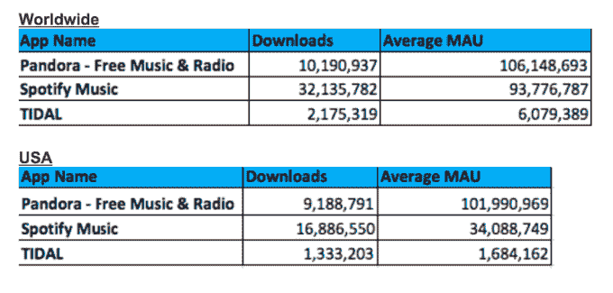

# Sprint 持有 Tidal 33%的股份，计划为其 4500 万用户提供流媒体音乐

> 原文：<https://web.archive.org/web/https://techcrunch.com/2017/01/23/sprint-takes-33-stake-in-tidal-plans-to-offer-it-to-its-45m-users/>

流媒体音乐行业的发展出现了一个有趣的转折。今天，[软银旗下的](https://web.archive.org/web/20221207161058/http://newsroom.sprint.com/news-releases/sprint-acquires-33-percent-of-tidal-and-creates-game-changing-partnership.htm) [Sprint](https://web.archive.org/web/20221207161058/http://sprint.com/) 宣布将收购[Tidal](https://web.archive.org/web/20221207161058/http://tidal.com/)33%的股份，这家流媒体音乐初创公司最初成立于挪威，被 Jay Z 收购了大部分股权，并于 2015 年重新推出，作为与 Spotify 和 Apple Music 等公司竞争的平台，提供高清音频服务，重点是流行艺术家的独家内容。

Sprint 表示，它计划向其移动用户提供这项服务，目前订阅和预付费用户的数量为 4500 万。“Tidal 及其艺术家将制作独家内容，只提供给 Sprint 的现有客户和新客户，”两家公司指出。

回想一下，Sprint 和 Tidal 在 2015 年首次开始合作，在 Tidal 重新启动时宣布了合作关系——尽管两家公司从未透露他们在一起做什么的细节，甚至[明确否认](https://web.archive.org/web/20221207161058/http://www.billboard.com/articles/business/6523868/jay-z-tidal-denies-softbank-investment-delists-nasdaq-stockholm)投资 Tidal。现在，Sprint 的首席执行官 Marcelo Claure 将加入 TIDAL 的董事会。

JAY Z 在一份声明中说:“Sprint 与我们一样，认为要彻底改变创意产业，让艺术家与他们的粉丝直接联系，并发挥他们最大的共同潜力。”“马塞洛马上就明白了我们的目标，我们很高兴能够为 Sprint 的 4500 万客户带来无与伦比的娱乐体验。”

股份的价值没有被披露。[全球音乐商业](https://web.archive.org/web/20221207161058/http://www.musicbusinessworldwide.com/tidal-sells-33-stake-for-200m-to-softbank-owned-us-telco-sprint/)报道其价值为 2 亿美元，对 Tidal 本身的估价为 6 亿美元。我们已经联系了 Sprint 对此发表评论，一位发言人只会说:“我们不提供财务数据。”

与此同时，如果你考虑到 Tidal 在由 [Jay-Z 和一个包括许多著名艺术家的股东财团](https://web.archive.org/web/20221207161058/https://beta.techcrunch.com/2015/03/30/jay-z-to-relaunch-his-new-tidal-music-service-today-with-madonna-kanye-beyonce-exclusives-in-tow/)重新推出时的报道估值[2.5 亿美元](https://web.archive.org/web/20221207161058/http://nypost.com/2015/04/01/sprint-softbank-purchase-stake-in-jay-zs-tidal/)，这部分股份价值约 8250 万美元。如果你考虑到三星[去年有传言](https://web.archive.org/web/20221207161058/http://variety.com/2016/digital/news/samsung-no-tidal-deal-1201723276/)打算以大约 1 亿美元的价格收购 Tidal，那就是 3300 万美元的股份。换句话说，这两个数字都比今天提到的 2 亿美元低得多。据报道，Tidal 还在与苹果和 Rhapsody 进行收购谈判。

该公司表示，Tidal 在超过 52 个国家直播，拥有 4250 多万首歌曲目录和 14 万个高质量视频。该公司与 Spotify 等其他流媒体服务的区别在于，它不提供免费服务。基本服务费用为每月 9.99 美元，更高级别的高清晰度音频质量费用为 19.99 美元。两者都配有 Tidal 专属的音乐。

目前还不清楚 Tidal 在明星云集的新所有权模式下表现如何，该平台的音乐艺术家也持有该服务的股份。

该公司[报告](https://web.archive.org/web/20221207161058/http://www.wsj.com/news/article_email/jay-zs-music-streaming-service-tidal-posts-huge-loss-1473778080-lMyQjAxMTA2NjExMjQxMzI2Wj)2015 年亏损 2800 万美元，几乎是 2014 年亏损的三倍(2016 年的数字尚未公布)。有很多关于有多少人在使用它的问题。

该公司在 2016 年 3 月宣称拥有 300 万用户。然而，它也一直在[起诉其前所有者](https://web.archive.org/web/20221207161058/https://www.bloomberg.com/news/articles/2016-03-31/jay-z-says-firm-that-sold-him-tidal-inflated-subscriber-numbers)夸大数字，同时[也被指控](https://web.archive.org/web/20221207161058/https://www.dn.no/staticprojects/special/2017/01/20/1100/musikk/project-panther/)夸大数字。例如，挪威报纸 Dagens Naerinsliv T7 上周的报道称，当 Tidal 报道 300 万用户时，它只有 85 万(120 万“激活账户”)。

与此同时， [Apptopia](https://web.archive.org/web/20221207161058/http://apptopia.com/) 向我们提供的统计数据显示，一项服务在使用方面远远落后于 Pandora 和 Spotify 等公司:

简而言之，从一个局外人的角度来看，Tidal 的书显得阴暗而凌乱——你对软银知道我们不知道的事情抱有希望/好奇。

无论如何，这项最新投资不仅将为 Tidal 注入现金——并可能带来数量大得多的用户——而且也表明 Sprint——像其他运营商一样——正在寻找使自己与众不同的方法。

Claure 在一份声明中说:“杰伊不仅看到了商业需求，也看到了文化需求，他全心全意地将 TIDAL 打造成为一个在质量和内容上无与伦比的世界级音乐流媒体平台。”“这些艺术家所有者带给粉丝的热情和奉献精神将使 Sprint 能够为新老客户提供独家内容和娱乐体验，这是其他服务无法做到的。”

移动运营商和音乐流媒体公司之间的合作通常是流媒体公司扩大用户群以及吸引更多用户加入提供服务的运营商的重要方式。其中有很多是伪造的，尤其是 Spotify。

事实上，早在 2014 年[Sprint 就宣布了自己与 Spotify](https://web.archive.org/web/20221207161058/https://community.spotify.com/t5/Spotify-Community-Blog/Say-hello-to-our-music-partnership-with-Sprint-US/ba-p/774631) 的合作协议，当你注册了 Sprint 的更高等级的移动服务时，免费提供 Spotify Premium 六个月(然后打折)。该交易现在仍在进行，尽管看起来 Sprint 不会像过去那样大力宣传它或与 Napster 的类似交易:

这位发言人说:“如果顾客选择 Spotify 和 Napster，我们将继续为这两家公司付费。”。“然而，今天与 TIDAL 的宣布代表了更广泛的合作伙伴关系，包括 Sprint 对该公司 33%的投资和 Sprint 客户无与伦比的体验。”

*更新了 Sprint 的回应和更多背景信息。*