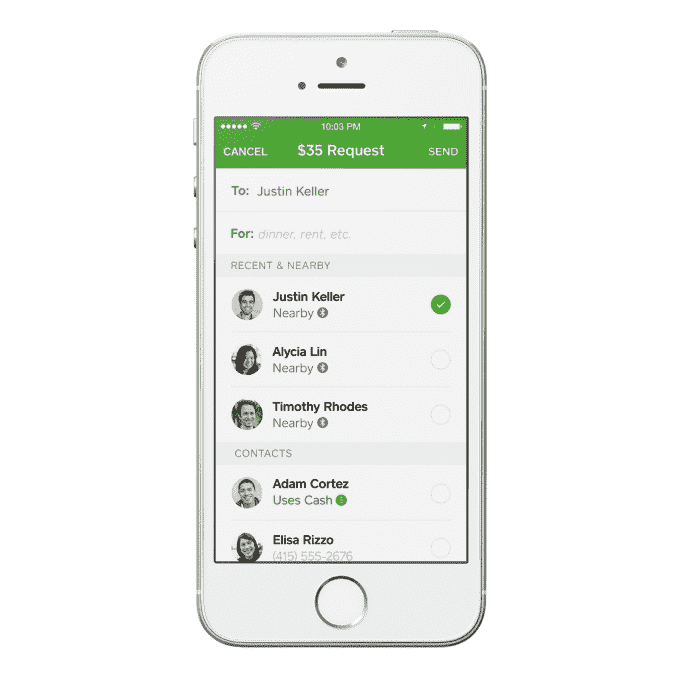

# iOS 版 Square Cash 现在允许您通过蓝牙向附近的朋友汇款 

> 原文：<https://web.archive.org/web/https://techcrunch.com/2014/10/07/square-cash-for-ios-now-lets-you-send-money-to-nearby-friends-via-bluetooth/>

# iOS 版 Square Cash 现在允许你通过蓝牙向附近的朋友汇款

支付公司的移动货币应用和 Venmo 的竞争对手 Square Cash 今天在 T2 推出了新的更新版本 T3，允许用户通过蓝牙低能耗(BLE)发送现金。该公司表示，这项名为“附近支付”的新功能可以在运行 iOS 8 的设备上运行，并为之前通过短信、手机号码或电子邮件发送资金的[方式提供了一种替代方式。](https://web.archive.org/web/20221226001530/https://techcrunch.com/2014/08/26/square-cash-2-0-adds-free-money-transfer-by-text-message-payment-notes-and-more/)

Cash 用户可以在更新后的应用程序中配置他们的附近可见性，以便他们仅对他们的联系人可见，或者对所有人可见。后者在较大的群体中更有意义——例如，当你在一张桌子上分摊账单时，你自己的地址簿中没有所有的聚会。

用于点对点支付的 Cash 应用程序最初是由 Square 的部分用户与该公司的旗舰应用程序和读卡器进行交互的方式产生的。也就是说，他们用 to 来分摊账单，或者在某类大宗团购后向朋友还钱。但有了现金，用户可以免费来回转账，而不用承担信用卡支付的相关费用。

一年前，Square Cash 正式推出了 T2，这是一款允许任何人通过电子邮件向联系人汇款的产品。有了现金，你可以在一分钟内建立账户，然后你汇来的钱会自动存入任何一个美国银行账户。(这些存款大多也是瞬间发生的。)去年，该公司还[收购了](https://web.archive.org/web/20221226001530/https://techcrunch.com/2013/12/11/square-acquires-evenly/)一家 Venmo 的竞争对手 equally。

这款应用在 iTunes 的金融类中排名很高，目前排在第 18 位。

Square Cash 在 iOS 和 Android 上都可用，但只有 iOS 应用程序(到目前为止)支持附近支付。