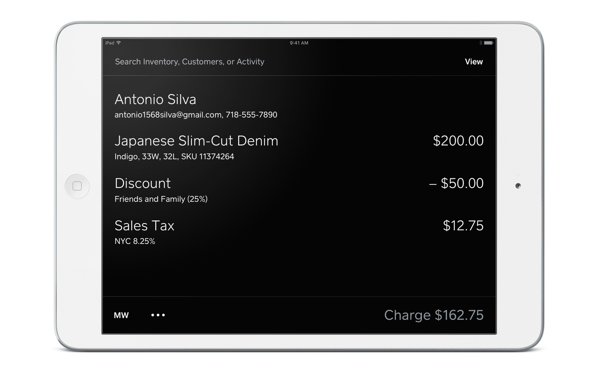
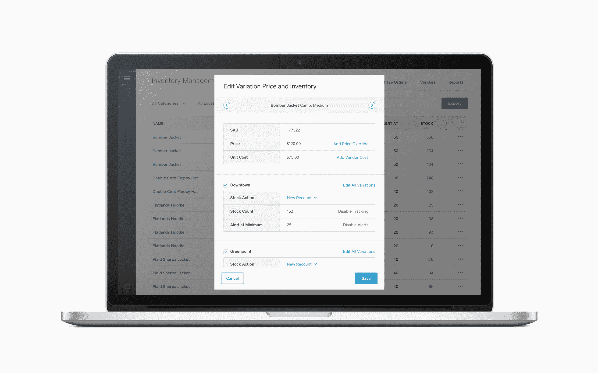

# Square for Retail 旨在成为大多数店主需要的唯一商店软件 

> 原文：<https://web.archive.org/web/https://techcrunch.com/2017/02/08/square-for-retail-aims-to-be-the-only-store-software-most-shop-owners-need/>

Square 今天推出了一种面向零售客户的新方法，这是一款全新的 [Square Retail](https://web.archive.org/web/20221208040150/https://squareup.com/pos/retail) 应用，它补充了一个全面的后端工具包，包括库存管理、客户关系管理和员工工具的完整覆盖。

新产品旨在真正为需要 square 阅读器和基本 Square 移动应用程序之外的商家和店主提供下一级零售解决方案。Square 的销售点负责人 Matthew O'Connor 向我解释说，该解决方案可以根据客户的需求进行扩展，但也可以服务于任何客户，从一个位置的商店到有多个店面和大量库存需要跟踪的商家。

“我们主要针对那些我们通常称之为‘所有者主导’的人，所以通常是由一个决策者来决定如何经营他们的业务。它将扩展到数百个位置，将扩展到数十万个 SKU 和商品。”

奥康纳说，目前，Square 这款产品瞄准的主要零售商类型是那些从事“成品”业务的零售商，这意味着人们已经包装了带有条形码的产品或物品，如衬衫和衣服，以及葡萄酒或游戏等。这些最适合它的库存管理系统，这是奥康纳和 Square 为我演示的，它拥有一个智能、干净、简单和直观的界面。

新的 Square Retail 应用程序非常注重搜索，通过界面顶部的统一搜索栏，您可以快速轻松地找到客户资料和库存中的任何商品。该应用程序还支持条形码扫描，以便在结账时快速构建客户的购物车，其所有功能都插入到一个新的广泛的后端，同样简单、干净且易于使用。

使用 Square 的新仪表板工具，商店老板和零售员工可以维护和浏览新的智能客户目录，该目录可以跟踪销售情况并建立购物者的档案，还可以包含曾帮助过他们的销售人员所做的笔记。该系统还可以根据购物习惯自动对客户进行分组，如果你是一家拥有活跃客户群的小商店，并且 CRM 不是你的主要关注点，这是一个很方便的功能。

库存管理也同样巧妙，如果一个店主有不止一个库存的话，实时单位计数可以跨地点进行调整。该系统还允许您请求将单位从一个位置转移到另一个位置，并通过允许您输入和跟踪您的采购订单，包括将发货标记为已收到，以自动将这些新项目加载到您的库存中，从而使接收变得容易。

该系统的最后一个组件是员工管理工具，它允许您为个人或组设置访问级别，这有助于确保您可以在多个商店中顺利运行整个系统。

Square 表示，它已经将整个系统设计成大多数人可以不费吹灰之力就学会并自学的东西，就像它最初让个体商户通过手机接收付款的方式一样。这个想法是创造一些轻量级但功能齐全的东西，然后以最低价格提供它——Square 要求每个注册者每月 60 美元来访问 total Square for Retail package。

当我问商店老板为什么会选择 Square Retail 而不是 Shopify 或 Revel 等竞争对手时，奥康纳说:“你可以使用集成支付、资本、退款保护和我们的分析。”。“我们从客户那里听到的最重要的事情之一是，他们确实想要一个一站式商店，他们想去一个他们觉得有人可以帮助他们经营业务的地方，而不得不与多个供应商和多人合作通常被认为是一个缺点。所以我认为最终它是你在 Square 上看到的所有东西，以及所有这些东西在后端一起工作、一起出现的事实。”

换句话说，Square 寄希望于其生态系统效应，这对于其目标客户群体来说是一个引人注目的优势，因为他们自己往往也肩负着很多责任。当他们需要依赖外部供应商时，他们通常更愿意与一家公司和联系人打交道。Square 对其零售方法的反思似乎是一个更有针对性和更彻底的计划，这预示着他们在这一领域的机会。