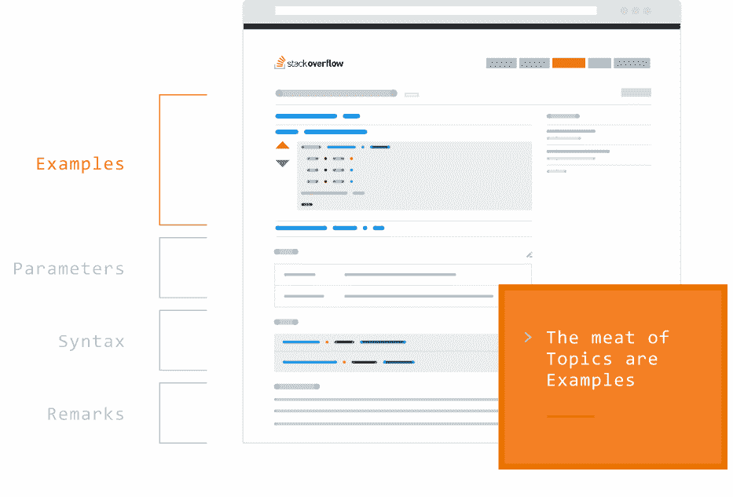

# Stack Overflow 超越问答，推出众包文档 

> 原文：<https://web.archive.org/web/https://techcrunch.com/2016/07/21/stack-overflow-goes-beyond-qas-and-launches-crowdsourced-documentation/>

# Stack Overflow 超越问答，推出众包文档

自 2008 年推出以来，Stack Overflow 已经成为讨论编程相关问题的首选社区。现在，该服务正在推出一个新产品，旨在利用其社区来建立一个同行评审的技术文档库。[堆栈溢出文档](https://web.archive.org/web/20221208111108/http://stackoverflow.com/tour/documentation)希望成为现有指令手册和类似资源的补充，甚至可能是替代。

Stack Overflow 副总裁 Jay Hanlon 在今天的公告中表示:“就像我们在问答中所做的那样，文档的目标是解决现实世界中的开发人员问题。“通过利用世界上所有优秀的编程知识，我们可以创造出比任何个人或团队自己更有用的东西。”

【T2

堆栈溢出团队告诉我，问答中的每个标签也可以是文档中的标签。目前该网站上有近 5 万个标签在使用。该团队还指出，用户将能够为语言功能和其他技术和产品编写文档。

该公司表示，堆栈溢出文档的重点将超越定义，并提供真实世界的例子。当您看到页面是如何组织的时，这一点就变得很明显了。首先是例子，然后是关于参数和语法的信息，在页面底部有附加的注释。

Stack Overflow 在去年秋天开始的私有测试版中植入了它的文档页面。值得注意的是，它没有从其他来源导入文档，而是依靠其社区从头开始创建所有这些内容。这对于该公司的问答产品非常有效，当你搜索任何与编程相关的问题时，它现在几乎不可避免地排在谷歌搜索结果的顶部。文档也有可能发生同样的情况。