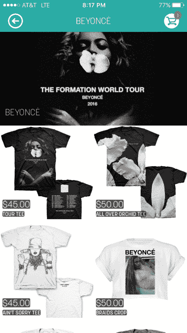
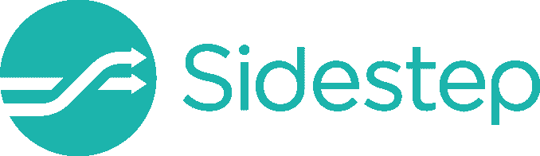
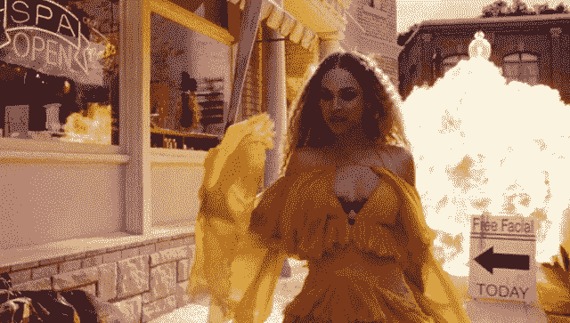

# 碧昂斯成为科技创业投资者

> 原文：<https://web.archive.org/web/https://techcrunch.com/2016/09/29/stackin-money-everywhere-she-goes/>

加入像史努比·道格、阿什顿·库彻和贾斯汀比伯这样的名人投资者的行列，贝伊女王将她的最高商业技能带到了科技世界。碧昂斯和她创办的管理公司 Parkwood Entertainment 已经投资了 15 万美元给 [Sidestep](https://web.archive.org/web/20230330172710/http://sidestepapp.com/) ，这是一款用于购买演唱会商品并在演唱会上排队取货的应用。

Sidestep 最初是从[开始为碧昂斯的世界巡演销售 t 恤和海报](https://web.archive.org/web/20230330172710/https://shopsidestep.com/shows/1204/artists/beyonce/products)的。但在看到其成功的两周之后，碧昂斯和帕克伍德投资了 Sidestep 的种子基金。

Sidestep 首席执行官埃里克·琼斯告诉我，他们“希望碧昂斯的巡演能够非常专注于技术”，并喜欢“一个小小的初创公司做世界上最大的巡演”这个想法。"

碧昂斯之前投资了 WTR 的西瓜饮料公司 WTRMLN。她被认为与榨汁机制造商 Juicero 有关系，尽管该公司拒绝谈论他们的关系。【更新:碧昂斯也帮助创办了[纯素食食品公司 22 天营养](https://web.archive.org/web/20230330172710/http://www.businessinsider.com/beyonce-22-days-nutrition-on-demand-vegan-meal-delivery-service-2015-2)。]她也是流媒体服务 Tidal 的股东，因为她同意让该公司提前获得她的音乐。不过，通过对 Sidestep 的投资，她可以直接帮助艺术家赚更多的钱。

希望从微薄的流媒体版税中发财的音乐人是在自欺欺人。真正的钱是利用流媒体成名，然后出售音乐会门票和商品。

但是由于长队，你知道，想要真正看到演出，许多人避免在音乐会上购买 t 恤和其他商品。这就是 Sidestep 介入的地方。

这家初创公司允许你在展会之前、期间甚至之后，通过其智能手机应用程序订购旅游商品。然后，你可以*绕过*merch 展台的队伍，在专门的取货点闪一下二维码，几秒钟内就能拿到你的商品。或者你可以让他们送货上门。这样，你就可以确保买到合适尺寸的任何你想要的东西，而不用担心浪费时间或卖光。

除了碧昂斯的装备，你还可以通过 Sidestep 从 Guns N' Roses、Fall Out Boy、Selena Gomez 和 Weezer 等艺术家那里购买 merch。这家初创公司为艺术家提供了大量关于谁在购买的数据，并向客户收取 10%的服务费。

Sidestep 已经从碧昂斯和其他投资者[T2 那里筹集了总计 170 万美元，这些投资者包括演员杰瑞德·莱托，前 Lady Gaga 经理特洛伊·卡特和跨文化风险投资公司，以及洛杉矶道奇队的前首席执行官。这款应用的销售额已经超过了 200 万美元，比去年增长了 10 倍。今年早些时候，该公司参加了 TechCrunch 的第一届也是未来的体育创业公司黑客马拉松](https://web.archive.org/web/20230330172710/https://www.crunchbase.com/organization/sidestep-2#/entity)。

Sidestep 将不得不与其他商品初创公司竞争，如类似亚马逊的网上商店 Merchbar 和 Yoshirt，后者让粉丝们设计带有乐队标志和照片的定制商品。有些人可能宁愿排队也不愿多付 10%的费用。但由于流媒体版税仍无法弥补专辑销量的下降，艺术家们将尽一切可能卖出更多衬衫，这些初创公司可能会蓬勃发展。

与此同时，像碧昂斯这样的顶级投资者将开始在硅谷积累资金，而不仅仅是在好莱坞。

