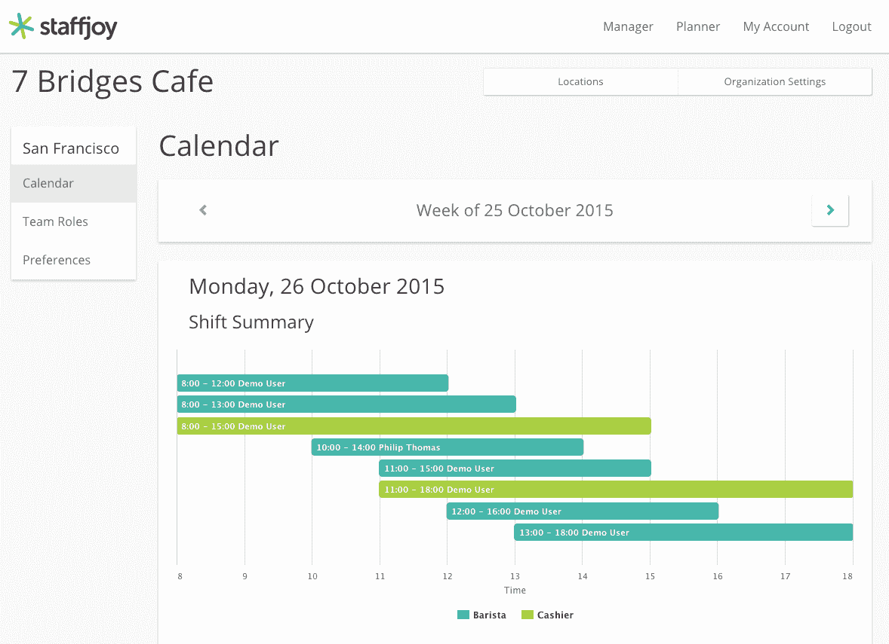

# Staffjoy 由 YC 奖学金发起，帮助企业实现劳动力调度自动化

> 原文：<https://web.archive.org/web/https://techcrunch.com/2015/10/22/staffjoy-launches-from-yc-fellowship-helping-businesses-automate-their-workforce-scheduling/>

在工作场所排班一直是一个困难、僵化的过程。平衡雇主和员工的需求始终是关键，但在确保企业人员配备合理的同时，让一切都井井有条，通常会给员工带来最大的不便。

Staffjoy 的目标是实现企业排班过程的自动化，以帮助管理人员更有效地工作，同时让员工在决定自己的时间表时有更多的自由。

Staffjoy 是首批推出 Y Combinator 新的[奖学金计划](https://web.archive.org/web/20230316054411/https://fellowship.ycombinator.com/)的公司之一。与 YC 的整个资助周期相比，该奖学金的运作方式有很大不同。在 8 周的时间里，这是一个短得多的项目，但最重要的一点是，研究员将从公司获得 1.2 万美元*的无股权*资助。该计划针对的是处于早期发展阶段的公司。

我有机会与 Staffjoy 的联合创始人安德鲁·赫斯(Andrew Hess)和菲利普·托马斯(Philip Thomas)就他们的产品进行了交谈，并观看了网络应用 live in action 的演示。

根据托马斯的说法，该应用程序主要专注于“在正确的时间拥有正确的人”的企业，但它优化员工体验的方式才是真正使 Staffjoy 独一无二的。

该应用程序通过最初让员工将他们每周的可用性输入到应用程序的计划组件中来有效地组织班次。然后，该应用程序会考虑员工是兼职还是全职，并允许他们指定他们希望在该周工作的适当小时数。

托马斯说:“最棒的是，(员工)可以通过一个易于使用的网络应用程序来选择他们想要的工作时间，这可以帮助他们轻松地申请可用的班次。”

根据托马斯的说法，在输入所有数据后，Staffjoy 的算法开始将所有员工的可用性分类为整齐的班次，以促进“工人的更高利用率”，并帮助经理“在正确的时间找到正确的人”。

Staffjoy 已经在几家企业测试了他们的产品，Thomas 说他们已经看到了一些非常惊人的结果。他举了一个例子，一家拥有约 50 名员工的企业使用 Staffjoy 的自动化调度工具，能够将年度劳动力成本降低 3 万美元。

该应用目前主要服务于按需经济中的企业，这似乎是一个天然的选择，但托马斯和赫斯告诉我，他们很快希望扩展到更传统的夫妻店使用他们的软件。

该团队似乎很清楚，像这样的企业可能会因为有太多可用的优化软件而陷入困境，并表示他们已经在展望未来，希望与其他工作场所应用程序建立合作伙伴关系，以便 Staffjoy 可以与其他服务巧妙地集成。

目前，该应用程序正在为只有几名员工的公司以及拥有数百名合同工的大型按需公司提供服务。他们现在服务的企业规模各不相同，这有助于他们了解哪种模式在更大范围内最有效。

对雇主来说，组织轮班可能是一项艰巨的任务，但 Staffjoy 希望通过自动化，他们可以为工人和经理提供更流畅的体验，不会让他们任何一方蒙在鼓里。