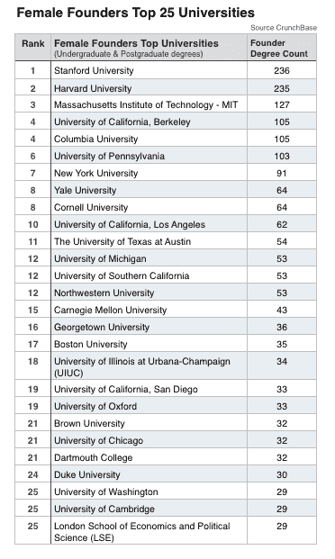
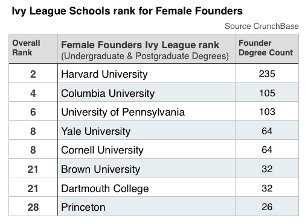
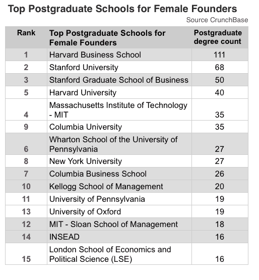
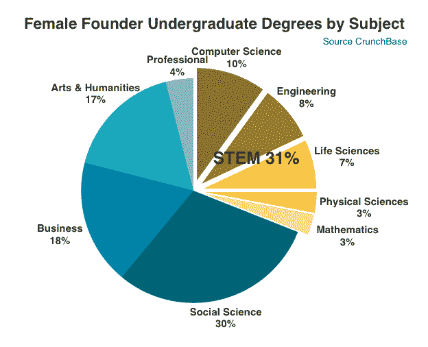
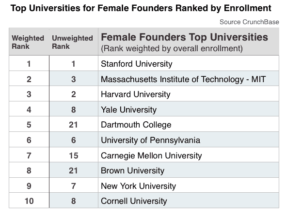

# CrunchBase 报道:哈佛、斯坦福和麻省理工学院位列女性创业者学校榜首

> 原文：<https://web.archive.org/web/https://techcrunch.com/2015/08/05/stanford-harvard-and-mit-top-the-list-of-schools-producing-female-founders/>

**编者按:***[*gene Teare*](https://web.archive.org/web/20230323153458/https://www.crunchbase.com/person/gene-teare)*([@ gene Teare](https://web.archive.org/web/20230323153458/https://twitter.com/geneteare))，一位曾经的女性创始人，主管 CrunchBase 创业计划和 CrunchBase 的数据工作。* [*奈德·德斯蒙德*](https://web.archive.org/web/20230323153458/https://techcrunch.com/author/ned-desmond/)*([@奈德·德斯蒙德](https://web.archive.org/web/20230323153458/https://twitter.com/neddesmond))是 TechCrunch 和 CrunchBase 的首席运营官。CrunchBase 的分析师科里·考克斯(Cory Cox)对此文有贡献。**

 ***CrunchBase 女性创始人研究(第二部分)**

今年 5 月，CrunchBase 发布了其关于女性创始人的[首份报告](https://web.archive.org/web/20230323153458/https://techcrunch.com/2015/05/26/female-founders-on-an-upward-trend-according-to-crunchbase/)，该报告发现，2009 年至 2014 年间，风投资助的公司中女性创始人的比例几乎翻了一番。在该报告的结论中，我们承诺深入挖掘 CrunchBase 数据，以更好地了解是什么推动了这一有利趋势。下一步，我们决定考察女性创始人的教育背景，以确定哪些大学和专业或研究生项目在女性创始人中最具代表性。

我们的数据样本由 CrunchBase 的 3616 名女性创始人组成，她们的公司自 2009 年以来获得了资金。(1)我们使用资金，无论是大还是小，作为一个粗略的质量过滤器，以确保我们的数据样本中的初创公司获得了一些牵引力。其中 72%的公司位于美国。必要时，我们的研究团队会填补女性创业者在教育细节方面的自我报告空白。在我们的数据集中，我们发现 99%的女性创始人已经完成了本科学位。

当我们统计每所大学的创始人数量时，我们决定将研究生学位和本科生学位放在一起。如果一个创始人拥有两所不同大学的学位——例如，哈佛大学的本科学位和斯坦福大学的研究生学位——我们会给每所大学一次学分。

正如你在下面的列表中所看到的，斯坦福大学和哈佛大学几乎不相上下，分别有 236 名和 235 名女性创始人。(令我们惊讶的是，这些创始人中只有 16 人声称拥有这两所大学的学位。)

麻省理工学院、加州大学伯克利分校和哥伦比亚大学位列第五。

这些排名没有根据每个机构的规模进行加权。如果我们考虑到这一点，排名会发生显著变化。(2)

这一排名引发了许多有趣的观察。这里有几个突出的例子。

*   排名前五的学校女性创始人仅占 15%左右。有很多大学培养了数量可观的女性创业者。
*   牛津大学、剑桥大学和伦敦政治经济学院这三所英国院校进入了前 25 名，尽管在我们的研究中，近四分之三的公司都位于美国。
*   以地区为基础，美国的东北部和西部地区。拥有名单上最多的学校(分别为 11 所和 6 所)，以及成为女性创始人的毕业生人数最多(分别为 913 人和 518 人)。伊利诺伊州是中西部的发动机，四所中西部学校中有三所进入前 25 名。中西部的学校显示，有 172 名女性毕业生后来成为了创始人。南部是最薄弱的地区，学校数量最少(3 所)，女性创始人毕业生最少(120 人)。
*   除了一所常青藤联盟大学外，其他大学都进入了前 25 名，下面是它们的排名。

**女性和男性创始人的顶级学校**

我们还观察了男性创始人就读的顶级学校之间的对比。毫无疑问，顶级商学院几乎是一样的。但正如你在下面看到的，在很多情况下，学校对女性创始人的排名比男性更靠前。纽约大学(7 比 15)和波士顿大学(17 比 25)是女性排名超过男性的两个强有力的例子，而密歇根大学、加州大学圣地亚哥分校、布朗大学、乔治敦大学和伦敦经济学院都进入了女性排名的前 25 名，但男性创始人没有进入前 25 名。

一个可能的解释是女生与男生的比例。在波士顿大学和纽约大学，女生占入学人数的 58%。在卡内基梅隆大学和麻省理工学院，这一比例正好相反，这两所学校都是 63%的男生。然而，麻省理工学院对男性和女性创始人的排名是一样的，而卡内基梅隆大学对男性排名第 10，对女性排名第 15。当我们对排名前 25 位的所有美国学校的男女比例进行平均时，结果是整整 50/50。

**研究生院和女性创始人**

我们还研究了女性创业者中的高级学位。我们的数据显示，47%的人拥有研究生学位。最常见的高级学位是工商管理硕士，有 19%的人持有。这与男性创始人的数据密切相关，其中 51%拥有研究生学位，21%拥有 MBA 学位。

就研究生项目而言，哈佛商学院显然是绝对的领先者，但考虑到 HBS 的招生人数是斯坦福商学院的两倍多，这两个顶级商学院的研究生项目表现接近。

然而，商学院教育并不一定胜过其他研究生学位。例如，斯坦福大学、哥伦比亚大学和麻省理工学院培养了更多来自非商业高等学位项目的女性创始人。另一方面，在哈佛和宾夕法尼亚大学，商学院毕业生的数量超过了其他研究生学位。

**MBA 项目突出显示*

**女性创始人和 CS、工程和 STEM 学位**

如果男性和女性创业者的研究生教育水平大致相当，我们想知道在本科专业方面是否有显著差异。

女性创始人在本科学习中获得的最高学位是社会科学(30%)、商业(18%)、艺术和人文科学(17%)、计算机科学(10%)和工程学(8%)。当我们按照 STEM 科目(科学、技术、工程和数学)与其他专业对数据进行分割时，我们发现 31%的女性创始人拥有 STEM 核心专业的本科学位。

当我们将这些数字与男性创始人进行对比时，出现了明显的差异。计算机科学(33%)和工程学(20%)是本科学位中的佼佼者，这意味着男性创始人拥有计算机科学学位的可能性是女性的三倍，拥有工程学学位的可能性略高于女性的两倍。从 STEM 的角度来看，63%的男性创始人拥有 STEM 学位，是女性比例的两倍多。

男性和女性企业家在教育背景上的显著差异无疑会引发讨论和各种各样的解读。根据数据显示的男性创始人的情况，似乎有理由认为，计算机科学、工程学和 STEM 学位是科技创业的一个强有力的先兆。另一方面，女性创始人拥有艺术和人文学位的可能性是男性的四倍(17%比 4%)，拥有社会科学学位的可能性是男性的两倍多(30%比 13%)。这可能表明，女性创始人找到创业灵感的方式比男性创始人更少。

很明显，科技创业公司需要技术专家，但创业公司也需要具有高度创造力、坚持不懈和洞察力的领导力，这不需要技术背景。随着女性创始人数量的增加，观察男性和女性创始人的教育背景如何变化将是一件有趣的事情。这个故事可能是一个趋同的故事:如今已经有 18%的男性和女性创始人在本科阶段学习商科。几乎可以肯定的是，STEM 教育中存在的差距将会缩小，但与此同时，得出这样的结论可能是错误的:随着时间的推移，女性创始人在成为企业家的道路上，必然会符合男性同龄人的教育背景。无论出现何种模式，这个故事都值得关注。

CrunchBase 将继续改进和挖掘女性创始人和教育相关的数据。我们认识到这种努力只是触及了表面。请提出您的问题，并在下面的评论中添加您的看法。

* * *

###### 关于数据——

1.  CrunchBase 中的数据来自社区、数据合作伙伴和我们自己的数据团队。我们在 CrunchBase 中有缺失的数据，没有创始人的公司和没有学位信息的创始人。对于女性创业者来说，1%的人缺少学位信息。我们通过自己的研究改进了这些数据，以帮助提高准确性。对于男性创业者，22%的人缺少学位信息。我们没有改进这个数据，因为男性的数据集要大得多，而且(我们希望)在统计学上更有效，尽管有差距。
2.  ###### 当我们用来自[【NCES】](https://web.archive.org/web/20230323153458/http://nces.ed.gov/ipeds/datacenter/InstitutionByName.aspx)国家教育统计中心的入学人数来衡量这一分析时，我们发现排名发生了变化。斯坦福大学名列榜首，麻省理工学院位居第二，哈佛大学位居第三。耶鲁和达特茅斯位列第五，击败了伯克利和哥伦比亚。

*