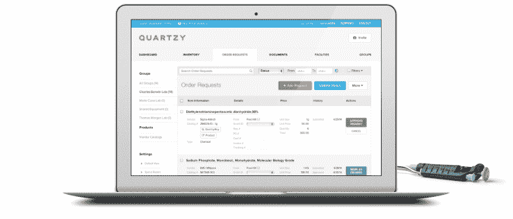

# 斯坦福大学与生命科学市场 Quartzy 合作开发校园实验室用品 

> 原文：<https://web.archive.org/web/https://techcrunch.com/2015/09/10/stanford-partners-with-life-sciences-marketplace-quartzy-for-all-lab-supplies/>

# 斯坦福大学与生命科学市场 Quartzy 合作购买校园实验室用品

Quartzy 是一个实验室用品市场，经常被不同大学的生命科学家使用，尤其是在 T2 斯坦福大学。学术机构今天正式宣布了这一关系。Quartzy 现在将部署在斯坦福校园的实验室中，以节省大学在实验室用品上的资金。

四年前，Y Combinator 推出的 Quartzy marketplace 为科学家提供了一种比较生命科学工具和设备价格的简单方法。联合创始人 Adam Regelmann 和 Jayant Kulkarni 在哥伦比亚大学进行他们自己的实验室研究时相遇。两人注意到缺乏供应链和管理工具来提高实验室流程的效率。

Quartzy 使用一个投标平台来帮助科学家从竞争供应商那里找到更便宜的产品。这家初创公司还提供实验室管理工具，旨在当供应减少时，让新订单变得容易。

这也有助于实验室避免繁琐的规章制度。美国联邦政府要求价格超过 3，000 美元的项目需要两次报价。Quartzy 投标平台自动生成来自多个供应商的竞争性报价，这将有望节省实验室的资金，而无需浪费时间获取这些报价。

Quartzy 认为，通过新的合作伙伴关系，它可以为斯坦福节省每年 1 亿美元的实验室用品支出。然而，创业公司不会靠为学术机构省钱来赚钱。相反，供应商向 Quartzy 支付购买产品的佣金。根据 Kulkarni 的说法，每个供应商的佣金率是相同的，因此不存在对某些供应商的偏见。

这个领域也没有太多竞争。[科学交流](https://web.archive.org/web/20221207100016/https://www.scienceexchange.com/?gclid=CM6x5NDZ6scCFQNsfgodIM8Bkw)通过提供实验外包而不是实验室自己使用的工具来帮助实验室省钱。 [HappiLabs](https://web.archive.org/web/20221207100016/http://www.happilabs.org/) 也提供实验室用品的价格比较，但是“实验室购物顾问”的收费是每月 250 美元起。

超过 10，000 个实验室和许多主要学术机构现在使用价格比较服务来节省，包括杜克大学、哈佛大学、麻省理工学院和现在斯坦福大学的校园范围。

Kulkarni 告诉 TechCrunch:“我们希望通过斯坦福大学产生的额外需求，在供应商方面达到临界质量。”“这将使平台和市场对其他实验室更有价值，并推动我们在美国其他大型机构的采用。”