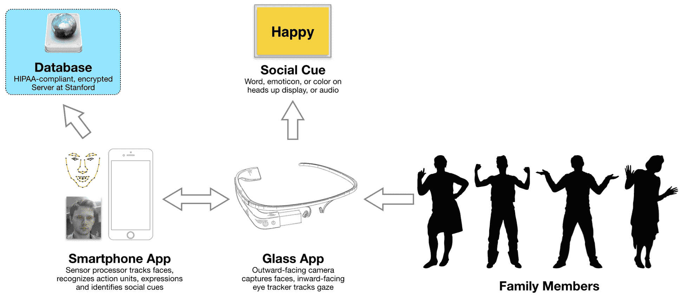

# 斯坦福大学研究人员用谷歌眼镜 TechCrunch 治疗自闭症

> 原文：<https://web.archive.org/web/https://techcrunch.com/2015/10/19/stanford-researchers-treat-autism-with-google-glass/>

随着谷歌[重新装备其眼镜实验](https://web.archive.org/web/20221207001926/https://beta.techcrunch.com/2015/07/09/google-glass-is-alive/)，斯坦福大学的研究人员正在使用该设备帮助自闭症儿童识别和分类情绪。

在斯坦福大学[行政大楼内的一间小办公室里，Catalin Voss 和 Nick Haber 正在将面部跟踪技术与机器学习结合起来，以建立自闭症的家庭治疗方法。斯坦福医学院](https://web.archive.org/web/20221207001926/http://www.stanford.edu/)[墙实验室](https://web.archive.org/web/20221207001926/http://wall-lab.stanford.edu/)的一部分[自闭症眼镜项目](https://web.archive.org/web/20221207001926/http://autismglass.stanford.edu/)，在周一早上启动了第二阶段的研究。

该软件使用机器学习进行特征提取，从面部检测沃斯所说的“动作单元”。

该项目的第二阶段是对 100 名儿童进行研究，调查该系统作为家庭自闭症治疗的可行性。自闭症眼镜项目的软件对设备指向的面部情绪进行分类，并立即给用户一个面部表情的读数。

然而，使用图像来为儿童翻译情感只是要跨越的第一个障碍。该团队面临的更大问题是，当孩子们不再使用设备时，确保设备的使用能够带来可衡量的学习。

“我们不希望这是一个假肢，”哈伯强调说。

为了理解这种离设备学习，该团队去年启动了该项目的第一阶段，包括 40 项研究，并在实验室进行。最初，这项研究受到限制，因为 Wall 实验室只能使用一台谷歌眼镜设备，但当谷歌捐赠了 35 台设备，以及今年 6 月初帕卡德基金会向该项目捐赠了 379，408 美元的赠款后，这种情况发生了变化。

![Screen_Shot_2014-09-15_at_5.27.53_PM[1]](img/58838b5f2afba4c00932e7947efc21c6.png)

沃斯说，在研究了儿童与电脑屏幕之间的互动后，该团队开始设计第二阶段，让儿童“与周围环境互动”。该团队选定了一款由麻省理工学院媒体实验室开发的名为“捕捉微笑”的游戏

在游戏中，孩子们戴上眼镜，寻找脸上有特定情绪的人。通过监测游戏中的表现以及结合视频分析和问卷调查，可以为每个研究参与者建立自闭症的“定量表型”，提供对他们自闭症身体表现的数学观察。

该团队监控游戏中的表现，并将他们的分析与视频分析和父母问卷相结合，为研究中的每个参与者建立一个自闭症的“定量表型”。通过长期跟踪，该团队可以展示他们的设备如何长期帮助改善情绪识别。

该研究的第二阶段将持续几个月，自闭症眼镜项目的独特技术将允许父母更多地参与治疗过程。

“你可以开始问这样的问题，孩子和妈妈说话的时间占多大比例，孩子看妈妈的时间占多大比例？”沃斯说。

尽管这项研究只要求儿童每天佩戴谷歌眼镜设备三次，每次 20 分钟，但分析儿童正在看的东西将有助于 Wall 实验室的研究人员更好地理解视觉参与如何在情绪检测过程中发挥作用。

尽管项目的第二阶段规模巨大，但这只是沃斯和他的团队迈出的第一步。沃尔解释说，研究人员需要收集临床数据，并从美国医学协会获得代码，然后这种疗法才能得到补偿，从而得到广泛应用。

沃尔希望，如果这项技术被验证为广泛的临床应用，该团队将实现他的目标，即拓宽自闭症治疗的瓶颈。虽然目前的研究只有 100 名参与者，但未来的工作将允许团队通过不断扩大的数据集来改进他们的软件和技术，这将是第一次。该项目从今天开始通过他们的网站接受申请加入该计划。

虽然这项技术可能还没有普及，但它已经出现在一个关于自闭症超级英雄的系列丛书中。在阿列克谢·拉塞尔的[“楚门·布拉德利”系列的第二本书中，主角收到了一副眼镜，让他能够“看到”情绪——这是对沃斯、哈伯和团队的有力致敬。](https://web.archive.org/web/20221207001926/http://www.jkp.com/trueman-bradley-aspie-detective.html)

“如果你仔细想想，”沃斯说，“我们所做的是给患有自闭症的孩子超能力。”