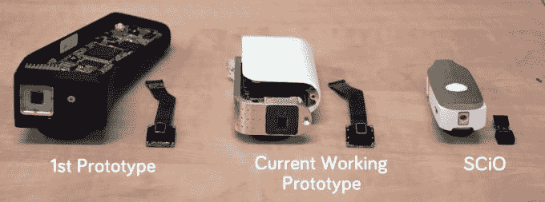

# 像星际迷航一样的分子食物扫描仪 SCiO 在 Kickstarter TechCrunch 上价值 200 万美元

> 原文：<https://web.archive.org/web/https://techcrunch.com/2014/06/03/star-trek-like-molecular-food-scanner-scio-tops-2-million-on-kickstarter/>

[消费物理学](https://web.archive.org/web/20221207172849/http://www.crunchbase.com/organization/consumer-physics)，一家总部位于特拉维夫的初创公司，推出了被称为“ [SCiO](https://web.archive.org/web/20221207172849/http://www.consumerphysics.com/myscio/) 的手持式分子食品扫描仪，现在已经通过[的 Kickstarter 活动](https://web.archive.org/web/20221207172849/https://www.kickstarter.com/projects/903107259/scio-your-sixth-sense-a-pocket-molecular-sensor-fo)获得了 200 万美元的众筹，还有 11 天。SCiO 基本上是一个袖珍光谱仪，告诉你你吃的东西的化学组成，包括卡路里、碳水化合物、糖等营养信息。超过 10，000 名支持者向这家初创公司捐款，该公司还获得了科斯拉风险投资公司、多夫·莫兰(Comingo 创始人、[闪存驱动器发明者](https://web.archive.org/web/20221207172849/http://en.wikipedia.org/wiki/Dov_Moran))和其他天使投资者的资助。

该公司此前还通过混合风险投资股权众筹平台 OurCrowd 筹集了资金。[根据 CrunchBase](https://web.archive.org/web/20221207172849/http://www.crunchbase.com/organization/consumer-physics) 的报道，消费者物理公司已经获得了 400 万美元的前期资金。[更新:该公司表示，实际上接近“超过 500 万美元”，但不会透露具体数字。]他们在 Kickstarter 上筹集额外资金还不到一个月。

我们第一次接触 SCiO 扫描仪是在今年的 TechCrunch Disrupt NY ' s Hardware Alley 上，当时首席执行官 Dror Sharon 正在演示一个原型。TechCrunch 自己的[约翰·比格斯甚至拿它来试转](https://web.archive.org/web/20221207172849/https://beta.techcrunch.com/video/scio-scanner-in-hardware-alley-tc-disrupt-ny-2014/518226601/)(见下面的视频)。

消费者市场对这种设备感兴趣的原因是它的成本和小尺寸。基本上来说，这是类似星际迷航的技术。Kickstarter 的支持者花了不到 200 美元购买了一台扫描仪或 DIY“制作工具包”。

通过 SCiO，用户将能够做一些事情，如扫描他们的食物，以查看卡路里含量，脂肪或糖含量，水果的成熟度，甚至食用油的纯度，或者药片(是的，它也可以处理非食品项目)的真假。

该设备本身包括一个照亮样品的光源和一个收集样品反射光的光谱仪(光学传感器)，这有助于确定物品的分子构成。

在扫描完有问题的物体后，该设备通过蓝牙与一个移动应用程序进行通信，该应用程序又将查找结果转发给一个基于云的服务进行审查。然后，应用程序会实时返回所请求的信息。

除了扫描仪本身，SCiO 还为开发人员提供了一个平台，他们可以使用其技术构建定制的应用程序。例如，消费者物理网站建议，开发人员可以教 SCiO 为那些自己制作精酿啤酒的人监控酿造过程的各个阶段，或者他们可以教它识别各种塑料以帮助回收。该公司设想未来扫描仪可用于测量一系列物品的属性，包括化妆品、衣服、植物、土壤、珠宝和宝石、皮革、橡胶、油、塑料等。

[有些人认为](https://web.archive.org/web/20221207172849/http://www.cnet.com.au/kickstarter-science-beware-the-marketing-hype-339347157.htm)随着 SCiO 的小型化，该公司为了尺寸牺牲了灵敏度——在某种程度上，这可能是真的。同样值得注意的是，扫描仪并不是用来预防过敏的医疗设备。

通过在 Kickstarter 上达到 200 万美元以上的积分，SCiO 现在已经成为该网站历史上第五大资金支持的技术活动，它仍然有近两周的时间。支持者中有 600 多名开发人员、黑客和制造商以及研究人员，他们已经注册利用 SCiO 平台构建自己的应用程序和外形。

现在达到了这个融资里程碑，消费者物理公司表示，它将向 Kickstarter 支持者终身免费提供 SCiO 的所有第一方开发的应用程序。