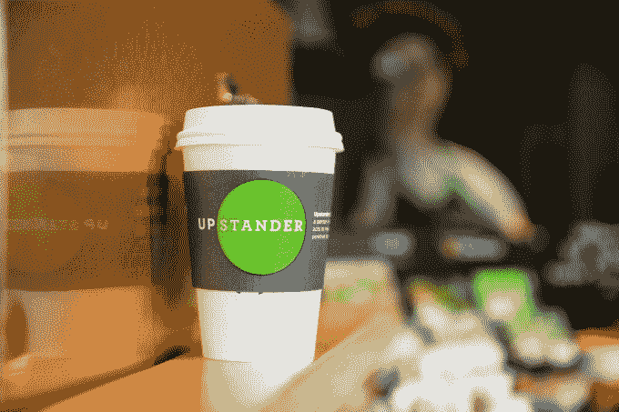
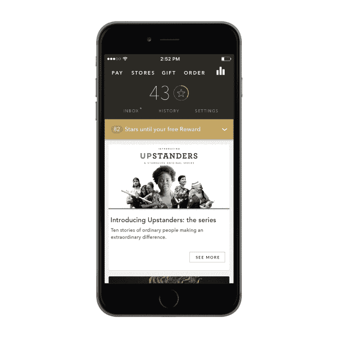

# 星巴克推出自己的原创内容系列“Upstanders”，包括视频和播客 

> 原文：<https://web.archive.org/web/https://techcrunch.com/2016/09/07/starbucks-debuts-its-own-original-content-series-upstanders-featuring-video-and-podcasts/>

如今，星巴克正在成为一家媒体公司。今天早上，该公司首次推出了名为“暴发户”的原创内容系列，旨在在我们的国家需要提醒我们的核心价值观的时候，用同情、公民和文明的故事激励美国人。该系列以播客、文字和视频为特色，将通过星巴克的移动应用程序、[在线](https://web.archive.org/web/20230130100805/https://upstanders.starbucks.com/)和公司的店内数字网络进行传播。

该系列共有 10 集，由星巴克董事长兼首席执行官霍华德·舒尔茨和星巴克执行制片人兼《华盛顿邮报》前高级编辑拉吉夫·钱德拉塞卡兰共同编写和制作

《T4》曾报道过该公司进军媒体的计划，当时钱德拉塞卡兰离开了报纸，以便在星巴克总部所在地西雅图成立一家新的制作公司。星巴克没有投资该公司，但支持解决社会问题的精选项目。

2016 年 9 月 6 日周二拍摄的星巴克 Upstanders 杯套。(约书亚·特鲁希略，星巴克)

舒尔茨在关于新系列的一份声明中说:“我们问自己，上市公司的角色和责任是什么，作为公民，我们如何在需要更多乐观主义、同情心、同情心和领导力的时候催化希望。”“这个系列中的暴发户是鼓舞人心的个人，他们的行动是美国精神的象征，也是当今全国对话中缺失的东西。我们内心一直都是讲故事的人，需要听到更多这样的故事。我们正在利用我们的规模尽可能广泛地分享它们。”

[gallery ids="1381149，1381151，1381150，1381152"]

当然，星巴克对向顾客提供一系列数字内容并不陌生。

该公司[去年与流媒体音乐服务 Spotify](https://web.archive.org/web/20230130100805/https://techcrunch.com/2015/05/18/spotify-inks-deal-with-starbucks-putting-customers-in-charge-of-in-store-music/)合作，允许客户影响店内播放的音乐，以及[将这些歌曲保存到你自己的 Spotify 播放列表](https://web.archive.org/web/20230130100805/https://techcrunch.com/2016/01/19/starbucks-now-lets-you-save-the-songs-you-heard-in-store-to-spotify/)。它还[与谷歌](https://web.archive.org/web/20230130100805/https://news.starbucks.com/news/starbucks-teams-up-with-google-to-bring-next-generation-wi-fi-experience-to)合作，为其店内 Wi-Fi 和数字网络提供动力，其特色是来自各种合作伙伴的内容。星巴克品牌多年来一直在店内推广电影、书籍和音乐。

然而，像这样的零售商跳入原创内容仍然是不寻常的——这涉及制作自己的媒体并为该媒体发展观众。毕竟，这个系列不是咖啡广告。星巴克表示，这是一系列“被传统新闻机构忽视”的故事

钱德拉塞卡兰解释说:“当我们打开新闻或者浏览我们的社交媒体时，我们被不和谐和功能障碍的故事淹没了。”。“但美国不仅仅如此。在全国各地的城镇，都有人勇敢、无私、合作、深思熟虑地创造积极的变化。”

至少星巴克已经有办法将这些新内容分发给观众。

几乎每一个去星巴克的人都跳上了免费的无线网络，它有一个可以通过它的数字网络营销的专属受众；如今，它的移动应用程序定期推出，用于销售点的移动支付、卡管理、忠诚度奖励和移动订购。

整个月，星巴克还将在孟菲斯、达拉斯、迪尔菲尔德、佛罗里达州和华盛顿特区等特定市场举办当地市政厅活动，宣传新系列。在钱德拉塞卡兰的领导下，这些活动将邀请当地公民和民间组织参加，并将重点关注我们如何做更多的事来为我们的社区创造积极的变化。

至于这个系列本身，“暴发户”包括十个故事，涉及无家可归、食物浪费、警察的角色、自闭症、受伤的战士、贫困、对穆斯林的敌意等主题。每个星期，每个故事的音频版本都可以通过 Upstanders 网站下载，也可以在 iTunes 上以播客的形式发布。这些音频版本的特点是舒尔茨和钱德拉塞卡兰讨论当前的插曲，并分享他们自己的个人反思。

该网站还包括由 Fotition 发起的一项名为[的社交活动，该活动鼓励访问者提名他们社区中有影响力的其他人，并上传他们自己的照片来加入这项活动。TurboVote 也是网站的特色，帮助访问者在五分钟内注册投票。](https://web.archive.org/web/20230130100805/https://campaigns.fotition.com/c/upstanders/#/)

完整的 Upstanders 剧集列表如下:

> **[街对面的清真寺](https://web.archive.org/web/20230130100805/https://news.starbucks.com/news/upstanders-the-mosque-across-the-street)** :当一个伊斯兰教中心购买了田纳西州孟菲斯一座教堂对面的一块土地时，当地穆斯林社区预料到了敌意。史蒂夫·斯通牧师有别的想法。
> 
> 打破监狱管道:苏珊·伯顿在狱中度过了几年，她决心通过给其他有前科的女性一个远离毒品、酒精和虐待关系的地方来阻止她们重返监狱。她已经帮助了数百人开始新的生活。
> 
> 人人有家:面对不断增长的无家可归人口，犹他州改变了为街头流浪者提供庇护所的方式。在劳埃德·彭德尔顿的领导下，该州的长期无家可归人口减少了 91%。
> 
> 每个学生都有奖学金:在密歇根州的鲍德温，大多数高中毕业生都没有机会上大学——直到当地居民做了一件了不起的事情:他们联合起来，筹集了足够的钱为每个学生提供奖学金。
> 
> 杀死焚化炉的孩子们:17 岁的黛蒂·沃特福德决定为她的社区挺身而出，反对建造焚化炉，这导致了一系列不可思议的事件，震惊了她的邻居和所有与这个项目有关的人。
> 
> **[饥饿黑客](https://web.archive.org/web/20230130100805/https://news.starbucks.com/news/upstanders-the-hunger-hack)** :在美国，40%的食物供应被浪费了。大学生玛丽亚·罗斯·贝尔丁创造了一个基于网络的解决方案，每年可以节省数万磅的食物。
> 
> 善解人意的警察学院:苏珊·拉尔正在改变华盛顿州警察的培训方式。她希望他们成为社区的守护者，而不是让他们做好向犯罪开战的准备。
> 
> :约翰·德瑞开始为他患有自闭症的儿子安德鲁找工作。他的旅程让他开了一家洗车店，那里 85%的员工都患有自闭症——而且生意兴隆。
> 
> **[一个勇士的锻炼](https://web.archive.org/web/20230130100805/https://news.starbucks.com/news/upstanders-a-warriors-workout)** :前职业橄榄球运动员大卫·沃博拉放弃了一份收入丰厚的私人训练工作，去和受伤的勇士一起工作。他的锻炼给他们带来了新的力量和灵感。
> 
> **[建筑房屋。营造生活:罗伯特·克拉克在监狱里度过了他的青少年时代，之后他改变了自己的生活。现在，他致力于帮助纽瓦克的高危青年做同样的事情，带领他们为贫困家庭建造房屋。](https://web.archive.org/web/20230130100805/https://news.starbucks.com/news/upstanders-building-homes-building-lives)**