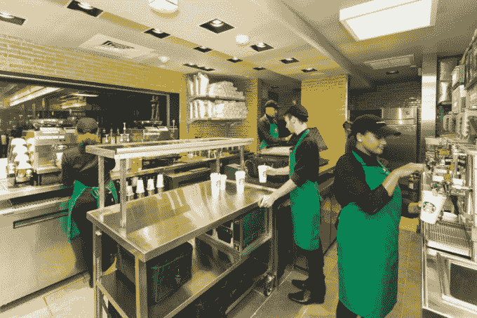

# 星巴克在纽约帝国大厦启动绿色围裙送货服务试点测试 

> 原文：<https://web.archive.org/web/https://techcrunch.com/2015/10/13/starbucks-launches-pilot-test-of-its-own-green-apron-delivery-service-starting-in-new-yorks-empire-state-building/>

# 星巴克在纽约帝国大厦开始试行绿色围裙送货服务

从今天开始，星巴克开始对自己的送货服务进行试点测试。该公司首次在纽约帝国大厦推出绿色围裙送货服务，在那里它可以尝试向大楼内的 1.2 万多名工作人员提供食品和饮料，并承诺在 30 分钟内到达。该公司表示，具体而言，该公司正专注于学习如何根据数量和离大楼内卸货地点的距离来处理订单。

一旦完善，绿色围裙送货服务模式可能会在未来推广到其他建筑，甚至密集的城市地区的更广阔的区域，尽管星巴克尚未宣布这方面的计划。然而，该公司已经投资了指向更大目标的技术。

例如，绿色围裙的顾客可以通过一个专门的网站订购精选的食品和饮料，他们还可以通知咖啡师他们的送货地点，比如他们的接待处，甚至只是大楼里的一个会面地点。

然后，订单会在大楼里指定的厨房里准备好。然而，这个厨房不对其他顾客或参观大楼的游客开放。它只是作为快递服务的总部。星巴克表示，其他顾客将可以从大堂的快递店点餐，或者去附近 34 街大堂的咖啡馆。

该公司指出，它选择帝国大厦进行绿色停机坪的第一次测试，因为它的“繁忙的工作环境”有大量的租户。随着绿色停机坪的上线，目前 75 个办公楼层有 150 个租户。

当然，这并不是星巴克进军快递业的唯一尝试。该公司今年早些时候宣布，它将与快递服务公司 Postmates 合作，为客户提供送货服务，今年晚些时候将在西雅图开始首次送货试点。在这种情况下，客户将能够通过星巴克移动应用程序订购，以便像往常一样使用他们的星巴克卡并积累奖励，然后派遣 Postmates 司机来收取他们的订单。

星巴克对测试不同类型的商店模式也不陌生，无论是以小批量咖啡为特色的[专卖店](https://web.archive.org/web/20221129050935/https://news.starbucks.com/news/first-reserve-store-in-Mexico)、[移动卡车](https://web.archive.org/web/20221129050935/https://news.starbucks.com/news/starbucks-tests-mobile-trucks-on-three-college-campuses-this-fall)、[快递店](https://web.archive.org/web/20221129050935/https://news.starbucks.com/news/NY-express-format-store)、[火车上的商店](https://web.archive.org/web/20221129050935/https://news.starbucks.com/news/all-aboard-the-first-starbucks-on-a-train-with-sbb)等等。

但对该公司来说，提供送货服务仍是一种新的尝试。迄今为止，它一直专注于开发其移动订单支付平台，该平台现已在美国、T2 和伦敦上线。

可以说，这是建立送货服务的第一步——通过旗舰移动应用程序中的集成订购系统处理订单的方式。但现在，星巴克必须专注于提供热饮和食品的物流，包括如何处理订单量，如何保持食物的热度，如何满足 30 分钟的送货时限等。

星巴克早些时候在[说](https://web.archive.org/web/20221129050935/http://www.geekwire.com/2015/for-coffee-delivery-starbucks-will-use-postmates-in-seattle-and-baristas-in-new-york-city/)它对提供送货服务很有热情，但是承认它在这个过程中没有像在移动点餐中那样走得那么远。