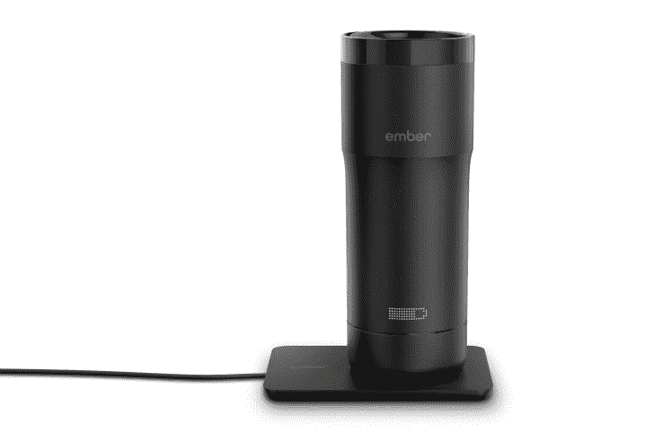

# 星巴克现在出售余烬温控杯

> 原文：<https://web.archive.org/web/https://techcrunch.com/2016/11/22/starbucks-starts-selling-ember-mugs-which-keep-your-drink-at-a-steady-temp-for-hours/>

# 星巴克开始销售灰烬杯，这种杯子可以让你的饮料在几个小时内保持稳定的温度

去年， [Ember Technologies，Inc.](https://web.archive.org/web/20230405091753/https://embertech.com/) 在 [Indiegogo](https://web.archive.org/web/20230405091753/https://www.indiegogo.com/projects/ember-temperature-adjustable-mug#/) 上发起了一项众筹活动，旨在打造一款能让热饮保持最佳啜饮温度的马克杯。到目前为止，它已经卖出了 4000 台这样的设备。

对于这家初创公司来说，一个惊喜是，[星巴克公司](https://web.archive.org/web/20230405091753/https://www.starbucks.com/about-us/company-information)已经开始在美国大部分地区的商店和网上销售[余烬温控杯](https://web.archive.org/web/20230405091753/https://store.starbucks.com/products/ember-temperature-control-mug-12-fl-oz-011072501/)，售价 149.95 美元。

Ember 首席执行官 Clay Alexander 说，无论是咖啡、可可还是茶，热饮通常都是在华氏 160 度左右准备和供应的，这也是咖啡馆和餐馆通常为他们提供的服务。然而，人们喜欢喝接近 130 度的热饮料。

常见的热水瓶具有简单的隔热功能，但它们受热不均匀，并且在灼热时不能冷却饮料，导致大量舌头烧焦。亚历山大说，Ember 利用内部的半导体将饮料加热到理想温度，并保持几个小时。

*余烬温控保温杯的充电底座。*

开箱后，Ember 马克杯需要充电一次。然后就可以使用了。有一个可选的移动应用程序可以与马克杯配合使用。底部的刻度盘允许用户在杯子上设置他们喜欢的温度。除此之外，没有按钮或移动部件。

亚历山大说，在星巴克销售他们的产品并不容易。咖啡巨头有严格的产品评估和测试流程，包括安全、质量和咖啡品尝测试，以及对希望与星巴克合作的初创公司的审计。

亚历山大告诉 TechCrunch，这笔交易是在他的董事会和投资者的帮助下才发生的。与设计顾问[弹药](https://web.archive.org/web/20230405091753/https://www.crunchbase.com/organization/ammunition-group#/entity)合作也没有坏处。

Ember 已经从名人投资者那里筹集了资金，包括黛米·洛瓦托、尼克和乔·乔纳斯以及 DJ 卡斯卡德等人。

其他温控产品正在使用 Ember 的专利系统进行开发。这家初创公司希望人们能够加热或冷却各种液体，而不需要任何冰或明火。亚历山大说，所以请继续关注温控奶瓶、上菜等。