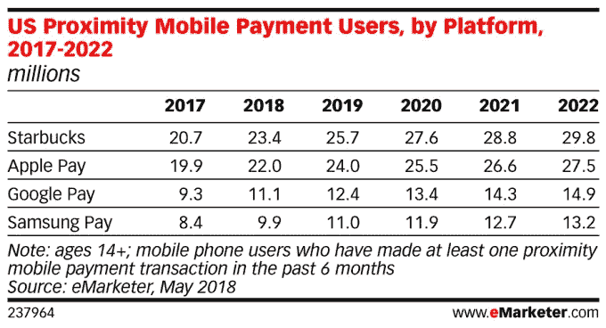
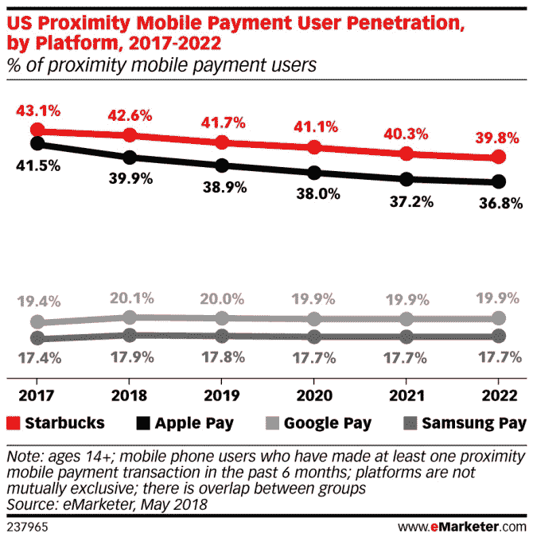

# 星巴克的移动支付服务略微超过了苹果的 

> 原文：<https://web.archive.org/web/https://techcrunch.com/2018/05/22/starbuckss-mobile-payment-service-is-slightly-outpacing-apples/>

人们真的喜欢更快地得到他们的咖啡。根据 eMarketer 今天早上发布的一份新报告，自 2011 年开始运营自己的移动支付服务的星巴克是移动支付用户的市场领导者，击败了 Apple Pay、Google Pay 和 Samsung Pay。然而，星巴克对 Apple Pay 的领先优势只是很小的一点——2017 年，它有 2070 万美国用户，而 Apple Pay 只有 1970 万。这一差距今年将保持在较小的水平，2340 万人使用星巴克的移动支付，而 2200 万人使用 Apple Pay。

星巴克移动支付服务的广泛采用不仅是因为基于条形码的支付系统提供的速度和便利，还因为支付与忠诚度挂钩，星巴克应用程序是客户可以监控和管理他们的卡余额和“星级奖励”的地方此外，星巴克的优势在于能够在其所有门店提供一致的支付体验——消费者对他们是否可以使用其移动支付服务从来没有疑问。他们知道他们可以。

其他移动近距离支付服务没有同样的优势，因为许多零售商仍然没有提供支持 Apple Pay 和 Google Pay 等点击支付服务的支付终端。

根据 eMarketer 的预测，2340 万 14 岁及以上的人将至少每六个月使用星巴克应用进行一次销售点购买，相比之下，2200 万人将使用 Apple Pay，1110 万人将使用 Google Pay，990 万人将使用 Samsung Pay。

这些数字将在 2022 年全面增加，但排名将保持不变——届时星巴克的用户数为 2980 万，而 Apple Pay 的用户数为 2750 万。

然而，这一预测似乎忽略了 Apple Pay 最近扩展的影响，Apple Pay 将允许用户通过 iMessage 向朋友付款。当你收到这笔钱时，它会被添加到你 iPhone 钱包中的 Apple Pay 现金卡中，然后可以在商店、应用程序或在线使用。这个最大的消息平台之一的内置支付服务可能会促使更多用户采用 Apple Pay，即使他们之前没有这样做。

另一个注意事项:似乎哪些服务比其他服务更受欢迎也与它们存在的时间长短有关。

Apple Pay 先于三星和谷歌支付推出，目前已被超过一半的美国商家接受。Google Pay 并没有被广泛接受，但它预装在安卓系统上，这将有助于它的发展。eMarketer 表示，与此同时，就用户而言，Samsung Pay 的采用率最低，但最被商家接受。

各种支付服务的排名并不是 eMarketer 新报告中唯一值得注意的发现。

分析师还发现，今年，超过 25%的 14 岁及以上的美国智能手机用户将首次至少每六个月使用一次移动支付服务。该公司估计，到 2018 年底，支付用户数量将增长 14.5%，达到 5500 万。

但在未来几年，这四大服务在移动支付领域的份额将会下降，尽管它们的用户数量在增长。这是因为他们将面临来自其他新支付应用的日益激烈的竞争，包括来自商家自身的竞争。

“零售商越来越多地创建自己的支付应用，这使他们能够捕捉关于用户的宝贵数据。eMarketer 预测分析师辛迪·刘(Cindy Liu)说:“他们还可以增加奖励和津贴来提高客户忠诚度。

eMarketer 的[预测](https://web.archive.org/web/20221205143250/https://content-na1.emarketer.com/starbucks-app-leads-mobile-payment-competitors) (paywalled)基于对第三方数据的分析，包括 Forrester、Juniper Research 和 Crone Consulting 对美国移动支付用户的数据。

*注:发布后进行了更新，以澄清该数据主要针对美国移动用户*