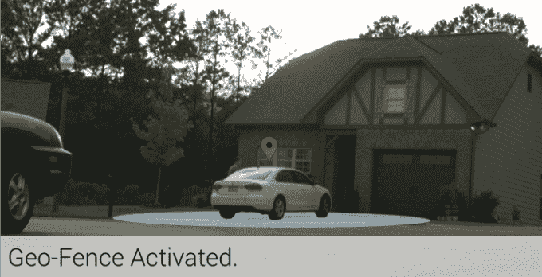

# 海星旨在通过提醒父母注意留在车内的儿童来防止意外中暑死亡

> 原文：<https://web.archive.org/web/https://techcrunch.com/2014/08/29/starfish-aims-to-prevent-accidental-heatstroke-deaths-by-alerting-parents-to-children-left-in-cars/>

初为人父母的人害怕他们会以某种方式意外伤害他们的孩子——他们会把孩子摔下来，或者撞到孩子头上奇怪的柔软部位。或者，他们可能会忘记把婴儿放在他们的背上睡觉，他们会死于婴儿猝死综合症。现在，一种新的创业公司和“婴儿科技”设备迎合了这些恐惧，出售各种产品，从婴儿可穿戴设备和床传感器到 T2 花式监视器，这些产品把婴儿当作另一个需要分析和优化的设备。

最新的旨在让忧心忡忡的父母掏钱的玩意儿是[海星](https://web.archive.org/web/20221006184130/https://www.kickstarter.com/projects/mattbsheets/starfish)，这是一款智能汽车座椅传感器，它与你的智能手机相连，如果你把宝宝忘在车里了，它会提醒你。

我们都听说过那些恐怖的故事:劳累过度的父母忘记把孩子送到日托所，有时仅仅是因为例行公事的改变。

这些婴儿因中暑而死亡，在气温飙升时被困在车里数小时。

这是真正的噩梦。

[Starfish](https://web.archive.org/web/20221006184130/https://www.kickstarter.com/projects/mattbsheets/starfish) ，现在已经在 Kickstarter 上筹集了 13000 美元，目标是 15000 美元，想要提供一种“安全网”。

该设备是一个小型、圆形、重量激活的传感器，当你没有带孩子离开汽车时，它会通知你的智能手机。它可以用自粘胶带粘在儿童汽车座椅下面。然后，它在车辆周围设置一个大约 20 英尺的“地理围栏”。如果你带着还在座位上的婴儿离开地理围栏，你会通过你的 iPhone 或 Android 收到通知。

如果您在 5 分钟后没有回应，您的紧急联系人也会收到通知。

这样做的目的是防止这些意外死亡，这些意外死亡不是来自父母的故意疏忽，而是由那些犯了错误的好父母造成的。

“众所周知，这是最近的热门话题，因为在美国平均每年有 40 名儿童死于车内高温，”创始人 Matthew Sheets 解释道(希望不是双关语)。Sheets 是阿拉巴马州一所学术医疗中心的企业软件开发人员，他说他的经历教会了他技术如何改善生活，甚至拯救生命。

“对我来说，这是我不能袖手旁观和观看的东西。我也意识到，这种悲剧可能发生在任何人身上，也确实发生在任何人身上，”他继续说道。“每个人都想成为好父母，但我们的产品是一个很好的支持。”

这可能是真的，但也值得指出的是，它实际上发生在 T2 的几率非常低。在这 40 个孩子中(根据非营利组织 KidsAndCars.org 的说法，严格来说是 38 个[，只有一定比例的孩子——看起来大约一半](https://web.archive.org/web/20221006184130/http://www.kidsandcars.org/heatstroke.html)——被父母意外遗弃。在其他情况下，可能是故意过失，[杀人](https://web.archive.org/web/20221006184130/http://www.nydailynews.com/news/national/warrant-shows-georgia-man-back-car-toddler-died-backseat-article-1.1843382)，或者，[如 NHTSA 曾经指出的](https://web.archive.org/web/20221006184130/http://www.nhtsa.gov/people/injury/enforce/childrenandcars/pages/unattend-hotcars.htm#ref26)，孩子在家长不知情的情况下爬进未上锁的车辆，然后不小心锁上车门出不来的情况。

或者换句话说，一个人被闪电击中的几率更大，这也是每年超过 200 人受伤的原因。

当然，这并不是要淡化这个问题，或者最小化这个错误导致一个孩子死亡的悲剧。然而，基于小工具的解决方案可能不是必需的。相反，美国卫生与公众服务部鼓励家长们“T2”在锁门之前先看看

一个与 T4 相关的宣传活动正在努力提供安全提示，运行公益广告，向日托中心分发材料，甚至提供窗户贴花。这项运动的根本是让父母在下车时把寻找婴儿作为日常工作的一部分，以及其他正常的任务，如拿走你的物品和锁上门。

但是对于那些喜欢用技术手段来消除恐惧的人来说，这只海星在 Kickstarter 页面上卖 40 美元。