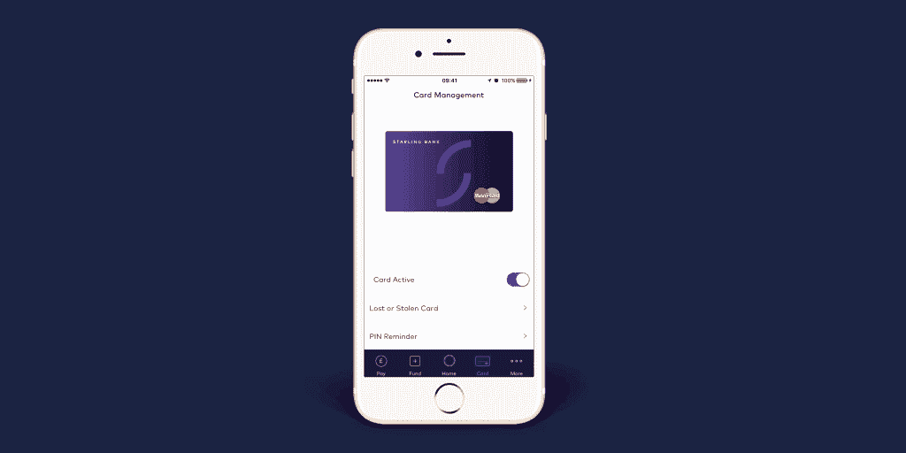

# Starling Bank 是一家纯数字的英国挑战者银行，推出 beta 

> 原文：<https://web.archive.org/web/https://techcrunch.com/2017/03/16/starling-bank-a-digital-only-uk-challenger-bank-launches-beta/>

斯塔林银行(Starling Bank)是英国众多纯数字银行或所谓的“挑战者”银行之一，它将推出一款应用程序的测试版，为其经常账户提供支持，这是该应用程序首次在与该公司关系密切的极少数私人测试者之外提供。那些已经在测试等候名单上的人将从今天开始被邀请进入该应用程序。

Starling Bank 应用程序最初面向 iOS，月底将推出 Android 测试版，它允许你注册一个完整的经常账户，这要归功于它在 7 月份发放的受限银行牌照。一旦你的账户被批准，包括通过应用程序拍摄你的护照或驾驶执照，你就会获得一张斯特林银行万事达借记卡，可以在英国和国外使用。

您还可以设置定期支付(即使用账号和分类代码的直接借记)，并在账户中进行一次性支付，包括通过[更快的支付网络](https://web.archive.org/web/20230402181310/http://uk.businessinsider.com/starling-bank-is-first-challenger-bank-to-join-faster-payments-2017-1?r=US&IR=T)。

此外，与大量其他新生的挑战者银行或新银行应用程序(即，在没有实际经营银行/持有银行牌照的情况下提供经常账户体验的金融科技初创公司)类似，Starling Bank 应用程序让你可以实时查看你的经常账户活动，这是大多数传统银行都失败或失败的尝试。它采用推送通知和“Starling Pulse”的形式，这是一种显示您所有账户活动的实时反馈。

Starling Bank UI 的另一个有趣的方面是你保护应用程序的方式，我已经玩了一会儿了。除了被要求提供一个 6-10 位数字的密码之外，你还被要求录制一段简短的视频信息，让你读出一个特定的短语。这家初创公司告诉我，如果你发现自己被这款应用拒之门外，这将被用于“生物识别”的目的。

“我们决定直接建立完整的活期账户，而不是绕道先建立一张预付卡，”斯特林银行创始人安妮·博登昨天在一次电话中告诉我，当时我与[的竞争对手 Monzo](https://web.archive.org/web/20230402181310/https://techcrunch.com/2016/08/26/monzo/) 进行了明显的比较，后者去年 3 月在[公测中推出了应用程序](https://web.archive.org/web/20230402181310/https://techcrunch.com/2016/03/17/open-for-spending/)，但要到今年夏天晚些时候才会推出活期账户。

“我们想把我们所有的精力和创造力投入到生产能提供你需要的所有服务的东西上，而不仅仅是一张卡片，”Boden 说。“此外，我们还可以做更多的事情，因为我们自己开发了技术。”

Starling Bank 宣布与货币兑换公司 TransferWise 合作，这是 challenger bank 更广泛战略的一部分，旨在在应用程序中提供一个额外的金融服务市场。这也是 Monzo 和许多其他金融科技初创公司[追求的想法，它们希望通过让你将一个应用程序与你使用或需要的所有金融服务和产品连接起来，成为你金融生活的中心。](https://web.archive.org/web/20230402181310/https://techcrunch.com/2016/11/03/this-is-bud/)

“我想我三年前就开始谈论市场和银行业了，”斯特林银行的创始人笑着说。“我的职业生涯是在银行业，我在许多银行工作过，这些银行认为自己是为所有客户提供所有产品的最佳提供商……‘销售一个活期账户，交叉销售这项服务或那项服务。’但是现在顾客变得更加成熟，他们喜欢自己做决定，并且有一系列的产品可供选择。"

相反，Starling 决定做一件“非常非常好”的事情，那就是提供一个经常账户，一个非常依赖技术的产品。“我们将与其他产品、其他供应商共存，”她说。例如，除了货币兑换之外，这可能包括抵押贷款。

“世界在变化，有一个由创新和有创造力的金融科技机构组成的生态系统。我们将成为这个生态系统的中心，将客户与合适合作伙伴的合适产品联系起来。”

这家初创公司还支持所谓的“开放银行业务”，欧盟和英国政府已经立法强制所有银行最终都要这么做，博登对此表示支持。为了抢先一步，斯特林银行基于其即将推出的经常账户开放 API，将在下个月举行第一次黑客马拉松。

最后，我问为什么 Starling 需要成为一家银行，当这么多的创新仅仅是建立在现有的银行轨道上是可能的。答案？这是商业模式，笨蛋。

“我们可以应对金融科技市场上发生的所有重大事件，但我们也有一个可持续的收入模式……我们将吸收存款，并借出一部分作为透支，”博登说。“我们不会因为你透支(隐性收费)而惩罚你。这一切都是为了透明和公平。”