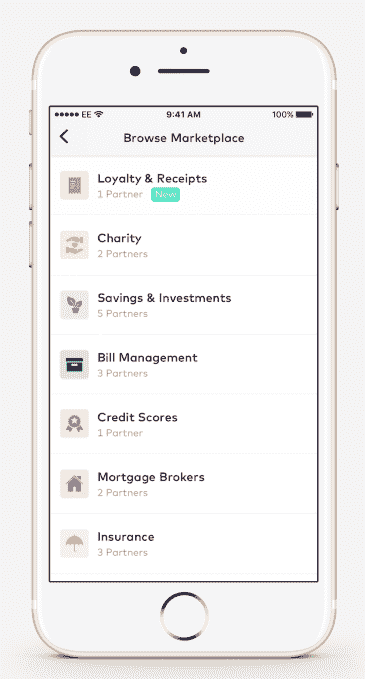

# Starling Bank 推出 Marketplace，整合明细收据并奖励初创企业 Flux 

> 原文：<https://web.archive.org/web/https://techcrunch.com/2017/09/12/starling-bank-marketplace/>

金融科技初创公司长期以来一直支持市场银行(Marketplace banking)，即你的银行将在自己的应用程序中为你提供各种第三方货币相关应用程序和服务，而英国和欧盟即将分别出台的开放银行/PSD2 立法将使第三方应用程序集成成为不可避免的现实。许多挑战者银行正滑向冰球要去的地方，包括总部设在伦敦的斯塔林银行，它今天推出了斯塔林市场。

Starling Marketplace 被纯数字的挑战者银行(challenger bank)宣传为银行业的新概念，将其他金融科技提供商的产品(以及未来的“生活方式产品”，因为几乎每个企业都想跳上开放的银行列车)放在 Starling 应用程序中的“易于浏览的生态系统”中。

合作公司通过 challenger bank 的开放银行兼容 API 与 Starling Bank 集成，尽管正如我将在下面解释的那样，集成比简单地利用这些 API 更深入，任何第三方开发者一旦通过审查，都有可能做到这一点。

Starling Marketplace 中加入的第一家金融科技公司，也是我们可能会看到的最深度整合的一个例子，是总部位于伦敦的项目收据和奖励初创公司 [Flux](https://web.archive.org/web/20221207235358/https://www.tryflux.com/) 。该公司由 Tom Reay、Matty Cusden-Ross 和 Veronique barb OSA[创办，他们都是 Revolut](https://web.archive.org/web/20221207235358/https://beta.techcrunch.com/2017/04/24/flux/) 的早期员工，该公司建立了一个软件平台，弥合了商家的销售点(POS)系统捕获的明细收据数据与银行对账单或移动银行应用程序上通常显示的少量信息之间的差距。

Starling integration 看到，当顾客在 Flux 的任何零售合作伙伴使用 Starling 卡付款时，Flux 会向 Starling 应用程序发送实时*明细*收据，目前包括英国和 Bel-Air 的所有 111 家 EAT 商店。最早在下周，Flux 还将使 Starling 用户能够通过对 Flux 支持的购买进行现金返还来获得自动忠诚度积分，而无需纸质优惠券。斯特林银行的用户将需要从斯特林应用程序的市场部分激活 Flux，以立即链接他们的卡。

“这是我们第一次本地集成，你可以从应用程序中打开 Flux，也是我们第一次全面的银行合作，”Flux 的 Cusden-Ross 告诉 TechCrunch。“Starling 客户应该打开 Flux，因为我们将帮助他们最终摆脱钱包中的纸质收据和纸质会员卡，而不会要求他们下载或设置任何额外的内容。我们还认为，Starling 的客户对实时跟踪他们的财务生活特别感兴趣，并且会同意，如今通过小纸片来准确跟踪我们购买的东西的唯一方式是疯狂的。

Starling 的 Flux 整合框架是“第一个全面的银行合作伙伴关系”，这是指 Flux [最初是与竞争对手 challenger bank Monzo](https://web.archive.org/web/20221207235358/https://beta.techcrunch.com/2017/04/24/flux/) 一起推出的，但只是在非常有限的试点中，限制了可以激活的用户数量，因为 Monzo 准备好了自己的 API 和市场银行服务。

“我们的用户对我们的体验非常积极，并推动我们的口碑注册成为 sky-rocket，他们都耐心地在等待名单上，我们正在与 Monzo 合作，以了解下一步的时间表。Cusden-Ross 解释说:“Monzo 的 on-boarding 体验也是一个试点版本，用户目前通过我们的网站进行 on-boarding，而不是在 Monzo 中进行。

在与 Starling Bank 首席平台官 Megan Caywood 的通话中，她解释说，当 Starling 用户选择激活该功能时，Flux 合作伙伴关系可以在 Starling 应用程序中显示更多详细的消费数据，以便在支持 Flux 的商家进行购买。默认情况下，Starling 用户可以看到零售商的名称、消费金额、日期和位置(配有地图)，但 Flux 还可以显示购买的商品、增值税和任何可用的忠诚度印花。

进一步缩小，凯伍德说 Starling 第三方集成分为三类。Flux 和该银行即将与 TransferWise 建立的合作伙伴关系是 Starling 应用程序集成的最深层类型的例子，但并不典型。

相反，虽然它们可以通过 Starling 应用程序中类似于应用程序商店的东西被发现和授权，但大多数市场应用程序只会以仪表板或“小部件”的形式发回和显示有限的数据(我的话，不是凯伍德的话)。如果我理解正确的话，在某些情况下，这种权衡减少了 Starling 的监管负担，更重要的是，这是阻止 Starling 应用变得臃肿的一个很好的妥协。

第三类集成是简单使用 Starling API 的应用程序。目前，这些应用包括 Tail、[、我最近报道的初创公司](https://web.archive.org/web/20221207235358/https://beta.techcrunch.com/2017/08/14/tail-at/)或 roundups 应用 Moneybox，它们使用 API 来验证、访问和构建你 Starling 银行账户数据和功能的各个级别，当然是在你许可的情况下。

“TransferWise 将是光谱的一端，被深度集成，而 Moneybox 是光谱的另一端，他们只是集成了我们的 API，但没有出现在 Starling 中，”Caywood 告诉我。“该应用程序的市场部分是一个混合体，其中一个应用程序集成了我们的 API，我们集成了他们的 API，因此用户可以通过 Starling 应用程序找到他们并连接到他们，并在 Starling 中有一个仪表板提供概览”。

与此同时，我听说 Flux 已经关闭了由 PROfounders 领导的 150 万美元的种子基金。我还了解到，已经投资了币云、Azimo 等其他金融科技公司的 Anthemis 参与了该轮融资。