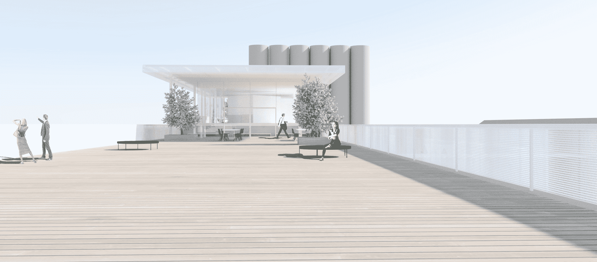

# 初创企业 hub builder 工厂计划在里斯本建立庞大的新园区 

> 原文：<https://web.archive.org/web/https://techcrunch.com/2017/07/25/startup-hub-builder-factory-plans-gargantuan-new-campus-in-lisbon/>

今年[里斯本一路高歌猛进](https://web.archive.org/web/20221025222242/https://beta.techcrunch.com/2017/02/14/in-2016-lisbon-fired-up-its-startup-engines-2017-will-hear-them-roar/)，Uniplaces、Aptoide、Farfetch、Seedrs 和 Unbabel 等知名初创公司将葡萄牙首都推上了地图。大型年度创业会议[网络峰会](https://web.archive.org/web/20221025222242/http://websummit.com/)于去年举行，有 53，000 人参加，企业家和投资者越来越将这座城市视为同样廉价的柏林的可行替代选择，特别是因为政府允许现有企业搬迁到那里享受 10 年免税待遇。

但那又怎样，对吗？每个城市都有自己的创业公司和冠军。然而，这一次有所不同。城市现在不仅仅是在创业公司上竞争，而是在创业中心和集群上竞争。还有什么比将初创公司集中在巨大的、类似校园的设施中更有效率呢？因此，[站 F](https://web.archive.org/web/20221025222242/https://stationf.co/) 最近以[对其巨大的空间](https://web.archive.org/web/20221025222242/https://beta.techcrunch.com/2017/07/08/inside-station-f-the-startup-megacampus-that-just-opened-in-paris/)大张旗鼓。

现在，这就是轮毂建造者工厂在柏林的大型面粉厂所做的事情，现在是 Soundcloud 和其他公司的所在地。这个城市的另一个类似项目也在继续。但是现在它打算在里斯本做一些彻底的大事。

毫不奇怪，里斯本现在已经吸引了一批国际房地产开发商，如 Factory 和 partner ls cher & bck Mann，来增加这一势头。这座城市仍有大片未开发地区。

因此，在初创企业葡京银行的支持下，里斯本市政厅与工厂签订了合同，与他们合作在里斯本的一个新兴社区 Beato 开展一个大规模的新项目，该社区以其工业遗产而闻名，已经是一个大型创意社区和精酿啤酒的所在地。

这座城市的项目被称为 Criativo do Beato 中心，现在将挑战巴黎的 F 站，成为世界上最大的创业园区。

我们来看看数字。

F 站有 366，000 平方英尺或 34，000 平方米。

但 Hub Criativo do Beato 计划仅在第一阶段就规划 35，000 平方米。在第二阶段几乎翻了一番。换句话说，在完工时，它将有大约 100，000 平方米，从而完全使 F 站和许多其他类似的项目相形见绌。我想莫斯科附近的斯科尔科沃可能会被认为更大，但他们也在那里做核能和太空，所以与纯科技初创公司非常不同。

他们究竟是从哪里获得这些空间的？这个 20 层的建筑群将坐落在以前为里斯本的军队和政府运作服务的食品生产设施上。萨拉扎独裁统治结束后，这座城市明智地将这个巨大的工业遗产遗址保护得很好。但是它已经几十年没有运行了——直到现在。

4 月份，我参观了这个巨大的工地，在那里，工厂团队将翻修一座 11，000 平方米(118，000 平方英尺)的建筑，该建筑位于建筑群的边缘，可以看到塔古斯河。而且很大。非常大。此外，它将保留许多独特的空间建筑元素。有人想要巨大的面包烤箱吗？

Factory 是首批支持里斯本市长费尔南多·梅迪纳(Fernando Medina)投资和振兴该地区的参与者之一，他还支持将里斯本老城区与北部的商业博览区连接起来的愿景。麦地那认为“这是自 1998 年世博会以来该市最雄心勃勃的综合开发项目之一”，正是这一项目让里斯本在当时声名大噪。

工厂尚未宣布其主要租户，但梅赛德斯据信正在谈判将一个创新团队转移到 Beato，这是一个来自 Web Summit 的团队。

在最初阶段，将会有多达 500 名技术人员的办公室。此外，该建筑将举办几个活动空间，屋顶露台，健身房和工厂自己的咖啡馆和精酿啤酒吧，[研发](https://web.archive.org/web/20221025222242/https://www.facebook.com/rdsiliconallee/)。

自 2012 年以来，工厂团队已经在柏林建立了两个创业园区，并吸引了一些公司，如 Soundcloud、Twitter、HERE、6Wunderkinder、The Family、Stripe、优步、Zendesk、Point Nine Capital 和其他几家公司在他们的空间内运营。建筑师 Julian Breinersdorfer 曾与工厂一起设计了他们之前的两栋建筑，他将再次为工厂工作。

在离开他们的第一个园区后，创始工厂团队[最近从各种投资者那里筹集了一轮投资](https://web.archive.org/web/20221025222242/https://beta.techcrunch.com/2017/03/06/factory-raises-another-e1m-to-go-up-against-the-weworks-of-the-world/)，包括 Round Hill Capital、500 Startups、Elkstone Capital 以及天使投资人 Matthias Ummenhofer 和 Christian Reber。

因此，虽然 F 站可能在 2017 年 7 月成为[世界上最大的创业园区](https://web.archive.org/web/20221025222242/https://beta.techcrunch.com/2016/12/05/with-station-f-paris-will-have-the-worlds-biggest-startup-campus/)，但在推出一个月后，它将被另一个以 F 开头的园区超越…