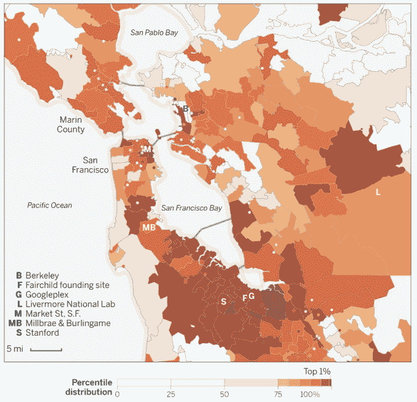

# 初创公司，富人的游戏

> 原文：<https://web.archive.org/web/https://techcrunch.com/2015/02/08/startups-a-rich-mans-game/>

尽管有硅谷的回音室，对于员工来说，创业仍然是最危险的职业活动之一。工作压力很容易导致[倦怠](https://web.archive.org/web/20230326215305/https://medium.com/backchannel/how-i-f-ed-up-in-ycombinator-35a19e7ace68)或[持久的心理健康问题](https://web.archive.org/web/20230326215305/https://techcrunch.com/2014/06/14/we-need-to-talk-about-depression/)。尽管失败在某些方面受到称赞，但它仍然经常损害创始人未来的职业前景。

但是建立一个新公司的最大风险几乎肯定是财务上的。除了在创业公司工作时工资损失的机会成本，还有一个严重的负担，就是在加速器或风险资本家进来并投入一些资本之前，增加公司的早期支出。创始人吹牛是一种常见的方式，谈论他们背负着 2 万美元的信用卡债务，以实现他们的梦想。

[本周关于脆饼干的混乱只是关于获得创业机会的长期斗争的最新一集。到目前为止，这场战争主要集中在女性和少数族裔身上，但当涉及到初创企业创始人时，关于金融不平等的讨论要少得多。](https://web.archive.org/web/20230326215305/https://techcrunch.com/2015/02/07/a-word-on-the-crunchies/)

创始人的精英背景众所周知，艾琳·李对独角兽的分析也强调了这一点。正如她所写的，“绝大多数联合创始人都毕业于名牌大学……我们名单中超过三分之二的人至少有一名联合创始人毕业于‘前 10 名学校’。"

常春藤覆盖的背景也许是风险资本家在讨论创始人时总是如此痴迷于“喧嚣”的一个原因。你知道谁有骗局吗？不能在星期五休息放松的人，因为否则他们将付不起房租。对于世界上最养尊处优的员工来说，我们现在有一个专门学习如何工作的会议应该不会感到惊讶。

当然，问题在于经济增长已经今非昔比。为每个人提供工作和工资的制造工厂已经被不进则退的知识经济所取代。创业是美国为数不多的快速经济增长的途径之一，但它的入口大多被那些最能受益的人挡住了。

这个问题来自于本周发布的两份报告，分别关于硅谷的现状和城市创造高增长创业公司的能力。非盈利性地区论坛“合资硅谷”发布了其年度[硅谷指数](https://web.archive.org/web/20230326215305/http://siliconvalleyindicators.org/) ( [PDF 版](https://web.archive.org/web/20230326215305/http://www.jointventure.org/images/stories/pdf/index2015.pdf))，其中有几十个表格和图表分析了该地区的人口统计和就业情况。

引起我注意的部分与收入有关。对于硅谷的 technorati 来说，收入一直在快速增长，该地区的中位数首次超过 10 万美元，自 2010 年以来增长了约 10%。不幸的是，这种慷慨并没有惠及该地区的其他国家。正如该报告所指出的，“在 2013 年至 2014 年期间，除了两个医疗服务职业之外，几乎所有主要职业群体的通胀调整后工资中位数都有所下降”。一些职业，比如服务业，在过去的五年里下降了 10%以上。

当我们把这些数字按职业质量分类时，证据就更加明显了。在硅谷，从事报告定义的顶层工作的人收入为 118，651 美元，而第三层工作的人收入为 26，847 美元。旧金山的不平等程度略低，两个数字越来越接近，这是高密度城市地区的典型现象。

考虑到过去几年关于不平等的新闻报道，这些数字应该不会令人惊讶。本周发布的另一份报告让它们变得更有意思，也应该让那些对让所有人都能创业感兴趣的人特别关注。

麻省理工学院创业研究人员 Jorge Guzman 和 Scott Stern 于本周发布了一项关于邮政编码为 T7 的创业质量的研究。他们希望开发一个预测模型，利用公司名称和公司是否在特拉华州注册等可用数据，预测一个地区的高增长创业公司数量。不出所料，他们发现硅谷大部分地区的创业质量明显高于加州的其他地方。

《科学》杂志上 Guzman 和 Stern 研究的按邮政编码排列的企业家素质图。

然而，引起我注意的是，创业地图与湾区的不平等是多么相似。这种相关性甚至在旧金山也很适用，那里最富裕的社区已经迅速成为创业的温床，而最贫穷的社区仍然远离经济增长的潜力。虽然因果关系在这里很难证明，但有一点似乎很清楚，带领我们走向未来的公司正在远离那些最需要未来到来的人。

我不仅仅担心在这些经济不景气的地区缺乏创业公司意味着就业机会更少。我最担心的是，与这些地区隔绝的初创公司没有什么动力为居住在这些地区的人们提供服务。优步和鱼子酱被发明于三藩市是有原因的。直到现在，我们才开始关注更多的基本问题，如收入保障，像 Activehours 这样的初创公司，甚至试图帮助小时工履行他们的财务义务。

我理解创业公司做出这些选择的所有原因。他们需要雇佣创业员工，尤其是工程师，而这些人只居住在该地区的几个邮政编码区。我明白学术背景很重要，初创企业本质上需要最优秀的人才才能获得成功。这些评论非常合理，但是我们很容易忽视一个几乎完全棘手的问题，而不是去解决它。

对于一个经常谈论授权用户的地区来说，也许是时候我们开始思考如何授权给各个收入阶层的创始人了。我们的行业喜欢精英主义和任人唯贤，但我们怎么能确定我们没有把下一个伟大的创始人落下呢？世界上最有价值的公司是由一个大学辍学生创办的，他缺乏我们今天经常看到的财富。我们不能错过下一次。