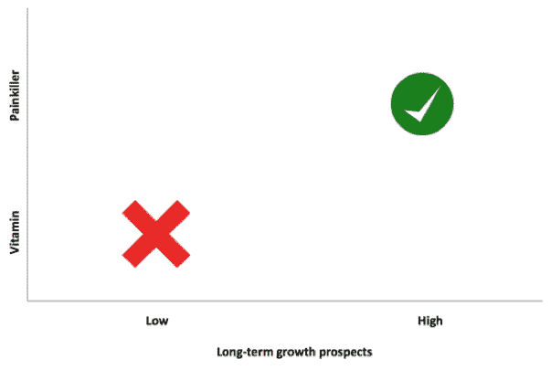
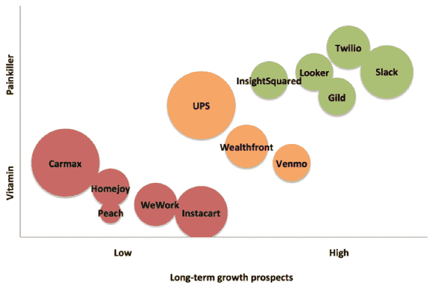

# 创业公司出售给其他创业公司:纸牌屋？

> 原文：<https://web.archive.org/web/https://techcrunch.com/2016/02/11/startups-selling-to-other-startups-a-house-of-cards/>

巴斯蒂安·詹玛特撰稿人

巴斯蒂亚安·詹玛特是

[DataFox](https://web.archive.org/web/20230316161011/http://datafox.com/)

.

俗话说，“不要把所有的鸡蛋放在一个篮子里”。好吧，如果你在经营一家向其他创业公司销售产品的创业公司，你可能会把所有的鸡蛋放在一个搅拌机里。

客户是其他早期 B2B 公司的 B2B 公司将自己置于双重风险中:不仅初创公司本质上容易失败，而且如果客户群容易受到市场修正的影响，具有强大基本面的早期公司仍可能步履蹒跚。

抵御衰退对 B2B 初创公司来说并不容易，但随着对科技泡沫的担忧加剧，这对公司的生存可能是必要的。

## 不久前的一个警示故事

早在 2000 年，主要出售给其他初创公司的国际房地产公司 Regus PLC 的估值飙升至 30 多亿美元。然后，网络泡沫破裂，其客户群似乎在一夜之间蒸发了。该公司申请了第 11 章破产保护，现在——15 年后——其市值仍未达到世纪之交的最高水平。

当然，自 2000 年以来，时代已经发生了变化。上网人数是 T4 的 11 倍，电子商务从占美国零售总支出的 0.6%增长到 7%，大型科技公司坐拥大量现金。但是，取决于你卖给谁，当回调开始时(如果还没有开始)，你可能会有风险。

## 衰退中的 B2B 创业公司会发生什么

很多人都在谈论风险投资环境即将面临的厄运；[同意](https://web.archive.org/web/20230316161011/http://www.businessinsider.com/blood-in-the-water-90-of-the-billion-dollar-unicorn-startups-are-in-trouble-2016-1)、[不同意](https://web.archive.org/web/20230316161011/http://www.geektime.com/2015/11/10/according-to-ben-horowitz-there-is-no-tech-bubble/)的人——但有一点是肯定的:我们的风险资本融资额处于 15 年来的最高水平，有很多传言称 2016 年将会更加平静。

> 创业公司更多地谈论他们的成功，而不是失败。

如果启动资金在一段时间内减少，估值重新设定，会发生什么？许多种子期前的创始人将需要找到“正常”的工作，许多种子期创业公司将倒闭，一批 A 轮创业公司将步履蹒跚，一些 B 轮公司将紧缩开支，等等。但是事情是这样的:*财务状况良好的稳定企业将会持续下去*。阶段越晚或越接近盈利，公司越有可能生存下来。

## 我如何让我的企业免受经济衰退的影响

当资金流枯竭时，许多公司通过控制可避免的支出来勉强维持运营。他们将取消他们的办公空间、午餐承办商、健康保险——可能还有他们的[销售智能平台](https://web.archive.org/web/20230316161011/http://www.datafox.com/product)。作为 SaaS 的首席执行官，我有许多风险投资支持的客户，我需要了解这些潜在的主要风险。更重要的是，我必须确保我们的客户群能够度过低迷时期。

我的投资银行经验开始发挥作用，我设计了一个快速而粗略的框架来计算我们来自不同客户和潜在客户的收入有多大风险。我们应该尝试更多地接触哪些初创公司，我们应该从哪些公司确保我们的多元化？我的目标并不是指出我认为可能会陷入困境的企业。祝每一个创业公司都好。但我希望这可能有助于像我这样的创始人找到一个健康且不受经济衰退影响的客户组合。

换句话说，确保你不是雷格斯，而且雷格斯不是你唯一的顾客。

## 框架

也许真正严格的分析应该包括找出在每个融资阶段或规模下，按行业或商业模式划分的创业公司“死亡”的百分比。然后，我们可以努力避免过度暴露于失败率特别高的部分。不幸的是，创业公司对他们的成功比他们的失败更加直言不讳，所以这个数据不存在。

在没有这些数据的情况下，对于我自己的分析，我想出了这些成功率和失败率的试探法。我对一家公司长期实力的预测基于两个因素:

*   **维生素或止痛药:**这种产品是简单的好吃，还是解决了[燃烧的需要](https://web.archive.org/web/20230316161011/http://www.slideshare.net/gzicherm/nir-eyal-hookedatgsummit)？
*   **客户长期增长前景:**公司的客户(不仅仅是公司本身)有增长空间吗？

我将更详细地对这两个因素进行评分。

## 维生素还是止痛药？

当资金枯竭时，被视为维生素的产品将很快失去客户。不管怎样，是止痛药留住了付费顾客。为了确定一家初创公司是提供维生素还是止痛药，我考察了三个标准:

*   **节约成本:**该产品是否为客户节约了大量成本？例如，与拥有自己的服务器相比，亚马逊网络服务(AWS)为我们节省了大量资金。
*   **收入驱动:**产品是否对客户的收入产生了有意义的影响？销售分析公司 InsightSquared 和商业智能公司 Looker 都帮助他们的客户更有效地运营销售和整体业务，从而带来明显的收入增长。
*   **粘:**产品难去除吗？Gild，一个招聘和申请人跟踪软件；eShares，提供数字股票证书；工资单供应商 Gusto 和一体化人力资源平台 Zenefits 都是粘性的 B2B 产品，已经在公司的运营中根深蒂固，因此很难取代。

诚然，第二个标准更适用于 B2B 公司，而不是 B2C 公司，但我认为这是公平的；伟大的消费产品，虽然非常有价值和/或令人上瘾，但在艰难时期可能会被抛弃。此外，第三个标准可能有利于拥有非常强大品牌的消费品。伟大的产品既有粘性，又能节约成本或创收。以下是几个例子:

*   AWS 除了为我们节省大量资金之外，还非常棘手——换一家不同的云提供商是件痛苦的事情。
*   Twilio 是一个用于商务电话和文本功能的 API，与自己建立电话基础设施相比，它为公司节省了大量资金，而且一旦集成，很难被取代。

另一方面:

*   一个寻找律师的在线市场 UpCounsel 提供了很大的成本节约，但是还没有想出如何避免被规避。因此，它不是很粘(还没有！).
*   企业餐饮公司 ZeroCater 是一个不错的选择，粘性不是很强。在经济低迷时期，免费午餐是可能会被取消一段时间的福利之一。通过长期订阅、规模经济和辅助服务，像 ZeroCater 这样的公司随着时间的推移会变得更粘，更像止痛药。

## 客户长期增长前景

那些生产止痛药的公司更有可能度过低迷期。接下来，我想估计每个初创公司在未来会变得有多大，有多持久。我根据两个标准给每家公司的“长期增长前景”打分:

*   **增量可寻址市场:**客户可以扩大多少？换句话说，市场上还有多少机会可以捕捉？
*   **接近盈利:**客户离盈利有多近？同样，B2B 公司比 B2C 公司得分高，我认为这是有充分理由的——卖给另一家 B2B 公司[比卖给一家面向消费者、没有明确收入来源的初创公司更稳定。](https://web.archive.org/web/20230316161011/http://www.wsj.com/articles/now-worth-10-billion-is-wework-a-2000-redux-1436910924)

移动支付平台 Venmo 和杂货即服务 Instacart 在增量可寻址市场上得分很高，因为它们是大众市场产品。优步是另一个例子；他们是 Twilio 的早期客户，也是后者发展的主要推动力。另一方面，像 UPS 和 CarMax 这样的大型老牌公司可能是很好的客户——就商标和收入潜力而言——但它们不太可能像优步对 Twilio 那样推动你的初创公司增长。

> 随着风险投资的潜在调整，考虑你的客户组合变得越来越重要。

就盈利能力而言，前面提到的 Looker 是一家 SaaS 公司，我猜它拥有健康的 LTV/CAC。通往盈利的道路是明确的，尽管经常被故意拖延以换取增长。我希望 DataFox 拥有这样的客户。不过 Instacart 呢？远没有盈利，因此客户风险更大。在其他条件相同的情况下，我希望找到有明确盈利途径的潜在客户。

在下面的图表中，你会看到我提到的一些例子。挑剔的读者会注意到，我的框架倾向于后 B 轮企业 SaaS 公司；对我的世界观来说，我觉得那很合适。一旦一家公司接近初始规模，SaaS 的失败率会如此之低是有原因的。

我猜这就是私募股权投资者寻找多元化客户群的原因；过度依赖一个客户或一类客户是危险的。

## 警告，警告，警告

有如此多不同类型的公司和如此多的因素影响着每家公司的成功概率。我用这个基本框架的目的不是给公司打分。如果我真的能选出赢家，我会创办一家风险投资公司！相反，我想教育 B2B 创始人——包括我自己。

## 这个框架如何推动我们的产品开发

不言而喻，我使用相同的记分卡来衡量 DataFox。我们花了一段时间才做到这一点，但我们选择的许多产品都是为了既节约成本又创收:

*   节约成本:使用 DataFox，销售代表可以减少 75%的客户调查时间。即使资金紧张，这种可论证的价值也是难以辩驳的。
*   收入驱动因素:我们能够首先提醒我们的客户新的机会，并帮助他们在个人层面上参与进来，从而达成更多的交易。同样，我们可以指出一个数字，向客户展示我们如何增加了他们的收入。
*   粘性:对于我们 web 应用程序的间歇用户来说，在可怕的情况下关掉我们并不困难。在过去的一年里，我们开发了 Salesforce 集成和 API 一贯的用户现在会发现没有 DataFox 很难工作。
*   增量可寻址市场:虽然我们最初的目标是金融服务，但随着我们从客户那里了解的越来越多，我们的客户组合和重点转移到了销售、营销和其他潜在客户大量使用的案例，如增长股票。这些市场规模庞大，尚未开发。
*   接近盈利能力:我们的大部分客户是金融服务公司和 B2B 公司。我们相对确定的是，凭借他们强劲的财务状况，即使在经济低迷时期，他们也将继续生存下去。

12 个月前，我们可能是一家风险很大的公司，但通过转向止痛药产品和健康的客户群，我们正在保护自己免受经济低迷的影响。

## 构建您的抗衰退客户组合

许多初创公司作为天生的早期采用者，正在推动其他初创公司的发展。随着风险投资的潜在调整，考虑你的客户组合变得越来越重要。仍然有足够的时间来确保你不会被堆在一个大而脆弱的纸牌屋里。

如果你正在寻找更多的后 B 轮 SaaS 公司，开始多样化你的客户群，[这个列表](https://web.archive.org/web/20230316161011/https://datafox.co/lists/datafox-public/post-series-b-saas-companies)是一个很好的起点。