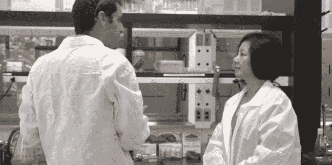

# StartX 和 QB3 在帕洛阿尔托开设生物技术实验室 

> 原文：<https://web.archive.org/web/https://techcrunch.com/2014/08/27/startx-and-qb3-open-a-biotech-lab-in-palo-alto/>

# StartX 和 QB3 在帕洛阿尔托开设了一个生物技术实验室

从斯坦福大学分离出来的非营利加速器项目 StartX ，正与加州大学专注于分子生物学研究的机构 [QB3](https://web.archive.org/web/20221006184638/http://qb3.org/) 联合开设一个生物技术实验室。StartX-QB3 实验室由一个 2000 英尺的实验室空间组成，与位于帕洛阿尔托的 StartX 办公室的其余部分相连。该实验室为分子生物学初创公司和早期硬件初创公司提供有用的设备。

StartX 表示，其项目中的大多数初创公司可以获得大约 10 万美元的资源，包括办公场所、法律和网络服务以及财政援助。使用我们采访的生物技术实验室的初创公司表示，他们得到的甚至更多，因为他们采访的湾区实验室每月收取数千美元的费用，并因更少的实验室空间而获得股权。

工作空间一次可以容纳多达 20 家生物技术初创公司，5 家初创公司将在启动时占用实验室。

生物技术初创公司不能像硅谷的大多数公司一样，只靠笔记本电脑就能启动并运行。他们需要使用昂贵的设备进行测试，以获得更准确的结果并保证他们的研究人员的安全。

提供设备和经验丰富的生物技术创始人(如 StartX-QB3 创始人 [Andrew Lee](https://web.archive.org/web/20221006184638/http://www.sctheranostics.com/about/) )使得他们起步的成本更低，年轻的创始人更有可能发现早期的错误并建立可行的公司。

在 StartX 校友中，StartX Med 毕业生公司在筹集资本方面的表现优于一般的 StartX 公司。自 2009 年以来(但在今年夏天的那批公司之前)，共有 160 家公司通过了 StartX，其中 45 家通过了 StartX 的 Med 公司筹集了 1.33 亿美元，而它们总共筹集了 3.49 亿美元。通过向未来的公司提供免费的设备和指导，StartX Med 的批次可以在毕业后表现得更好，因为他们可以花更少的钱在早期取得更大的进步。