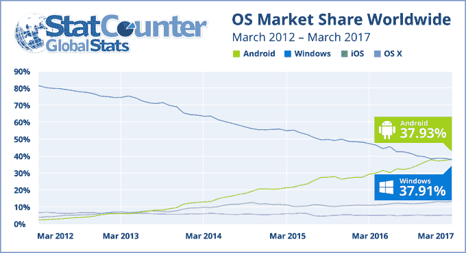
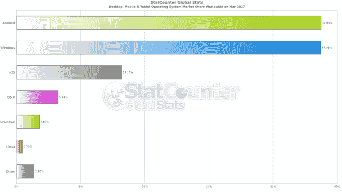

# 报告:Android 取代 Windows 成为互联网上最常用的操作系统

> 原文：<https://web.archive.org/web/https://techcrunch.com/2017/04/03/statcounter-android-windows/>

# 报告:Android 取代 Windows 成为互联网上最常用的操作系统

就互联网和应用程序而言，移动设备如今与台式机一样重要，甚至更重要。一份报告称，谷歌的 Android 已经取代 Windows 成为互联网上使用最多的操作系统，这一消息清楚地提醒了人们这一点。

网络分析公司 StatCounter 的研究发现，Android 在互联网使用中的份额首次超过了 Windows。2017 年 3 月，Android 用户占 StatCounter 网络活动的 37.93%，而微软操作系统的比例为 37.91%。这肯定是一个很小的差距——它指的是*使用*而不一定是*用户*——但它标志着一个显著的转折点，在过去几年里这是不可避免的。

StatCounter 的调查结果基于 250 万个网站，据称这些网站每月的页面访问量超过 150 亿次，该公司跟踪了这两种操作系统的使用随着时间的推移逐渐趋同的情况。这张图表凸显了微软未能挑战其命运多舛的 Windows Phone 平台。

> StatCounter:基于操作系统匹配的互联网使用情况，2012-2017 年 3 月

有趣的是，对于苹果来说，转变发生在前段时间。在 2017 年 3 月期间，苹果的移动用户(iOS)在互联网上的活跃程度接近其台式机用户(OSX)的三倍。

> StatCounter:2017 年 3 月基于操作系统的互联网使用情况

更广泛的 Android-Windows 趋势已经明显存在一段时间了。Windows 主导了，并将继续主导台式机市场，但全球 PC 销量在过去五年中[下降](https://web.archive.org/web/20230405094829/http://www.gartner.com/newsroom/id/3568420)至[与 2008 年](https://web.archive.org/web/20230405094829/https://qz.com/908201/worldwide-pc-sales-are-exactly-where-they-were-in-2008/)相同的水平。相比之下，[智能手机的销量持续增长](https://web.archive.org/web/20230405094829/https://www.strategyanalytics.com/strategy-analytics/blogs/devices/smartphones/smart-phones/2017/03/10/global-smartphone-sales-to-grow-7-yoy-in-2017)，安卓是全球大部分互联网用户的操作系统。像印度这样的新兴市场增长最快。在那里，[苹果增加了它的销量](https://web.archive.org/web/20230405094829/http://mashable.com/2017/01/31/apple-earnings-iphone-record-break/)，但是[仍然是一个小众玩家](https://web.archive.org/web/20230405094829/https://techcrunch.com/2017/01/24/samsung-and-china-domination/)，安卓占据了智能手机 90%以上的份额。

虽然在美国等西方市场，iOS 和 Android 之间的平衡更加平衡，但来自亚洲、非洲、中东和拉丁美洲等地区的新互联网用户的涌入已经使天平向有利于 Android 的方向倾斜。事实上，上周发布的一份 StatCounter 报告显示，在印度(79%)、印度尼西亚(72%)和中国(57%)等国家，手机占据了互联网使用的绝大部分，而在美国(37%)、英国(35%)和德国(30%)等市场，台式机仍然占据主导地位。

这些数字表明，开发者的全球收入发生了一些变化，中国取代美国成为全球最赚钱的 iOS 应用市场，但尽管用户基数更大，Android 仍然落后。

[App Annie 最近的一份报告](https://web.archive.org/web/20230405094829/https://techcrunch.com/2017/01/17/app-downloads-up-15-percent-in-2016-revenue-up-40-percent-thanks-to-china/)发现，在 2016 年的 900 亿次应用下载中，iOS 占了 250 亿次，Android 占了剩余部分。然而，在 iOS 和 Android 应用商店支付给出版商的 350 亿美元中，iOS 应用占据了大部分。

不过，这种情况可能很快就会改变。再次感谢其在新兴世界的巨大主导地位， [App Annie 预测【2017 年可能是 Android 应用收入首次超过 iOS 的一年。这将是另一个重要的里程碑。](https://web.archive.org/web/20230405094829/https://techcrunch.com/2017/03/29/app-annie-android-to-top-ios-in-app-store-revenue-this-year/)