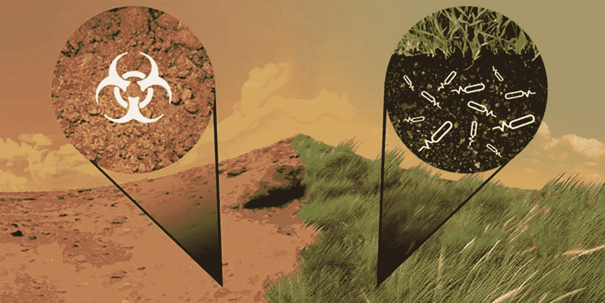
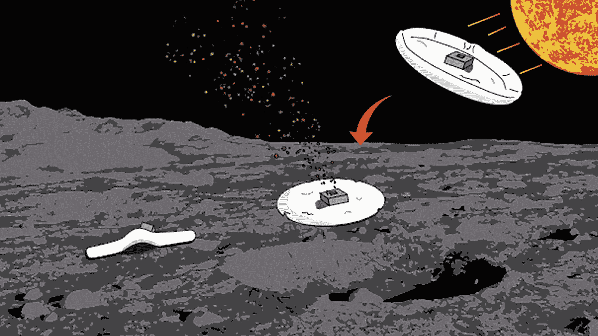
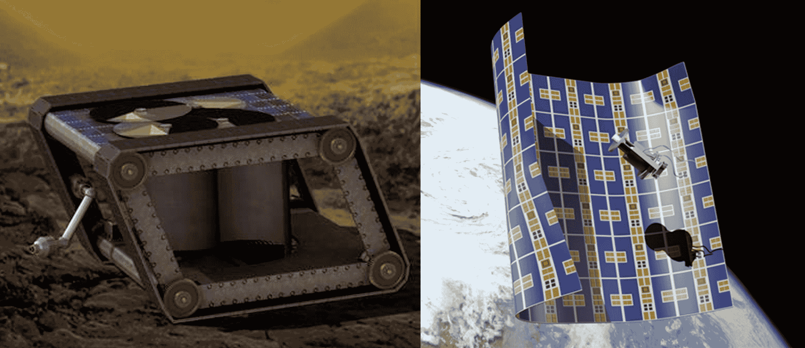
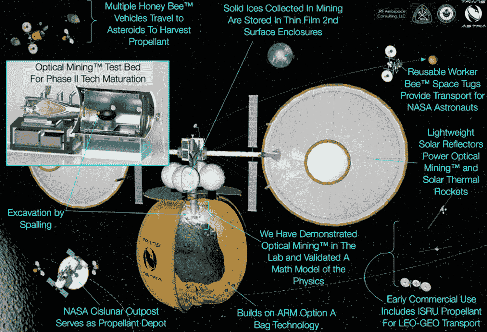

# 恒星回声，金星自动机和更多获得美国宇航局月球拍摄基金 

> 原文：<https://web.archive.org/web/https://techcrunch.com/2017/04/06/stellar-echoes-venusian-automatons-and-more-gain-nasa-moonshot-funding/>

美国宇航局已经宣布了最近一轮高度实验性项目的接受者，它认为这些项目有望获得足够的资金。这些美国宇航局的创新先进概念并不能保证完全成功，而是一种低风险、高潜在回报的登月计划——他们希望前者多于后者的科幻小说。

这些奖项是经常出现的，分为第一阶段和第二阶段:第一阶段的项目或多或少处于概念阶段，将在 9 个月内获得大约 125，000 美元，看看它们是否可行，基本上是从“可能可行”到“应该可行”第二阶段的项目得到一个更灵活的数额，但在 2 年内多达 50 万美元，看看如何从“应该工作”到“工作”

完整的奖项列表可以在[这里](https://web.archive.org/web/20221221181644/https://www.nasa.gov/directorates/spacetech/niac/2017_Phase_I_Phase_II)找到，但是我选择了几个我认为特别有希望的。

#### 第一阶段:

[火星农业合成生物学](https://web.archive.org/web/20221221181644/https://www.nasa.gov/directorates/spacetech/niac/2017_Phase_I_Phase_II/Mars_Soil_Agriculture)提出改造极端微生物，并将其部署到火星表面，在那里，它们将理想地为土壤解毒，并从本质上为地球式农业施肥。如果他们能找到一种可以在那里生存的生物(不像听起来那么疯狂)，并让它努力工作，以达到除了痕迹效果之外的任何效果，这并不是一个疯狂的想法。如果没人介意用转基因生物殖民地球的想法。

[星际先驱任务的激光推进](https://web.archive.org/web/20221221181644/https://www.nasa.gov/directorates/spacetech/niac/2017_Phase_I_Phase_II/Propulsion_Architecture_for_Interstellar_Precursor_Missions)是一个已经存在了一段时间的想法:本质上，给一艘飞船装备一个离子推进器，在上面安装一些太阳能电池板，然后用强大的激光轰击它。有点像增压的[太阳能帆船](https://web.archive.org/web/20221221181644/http://www.nbcnews.com/science/space/lightsail-wakes-gets-set-spread-solar-sails-n370206)。当然，该项目“假定”存在一个巨大的太空激光器，效率是我们今天两倍的太阳能电池板，以及一个“大约是当前最先进水平 20 倍”的推进系统，所以不要屏住呼吸。

[有效区域软体机器人](https://web.archive.org/web/20221221181644/https://www.nasa.gov/directorates/spacetech/niac/2017_Phase_I_Phase_II/Area_of_Effect_Soft_bots)是为了在“碎石堆”小行星上运行，这就像它们听起来的那样。这些柔软的机器人会在表面上扑腾，并以不会导致它们陷入碎片或被卡住的方式移动；与此同时，他们可以抓取样本并进行测试，或者将它们发射到一个等待中的轨道飞行器上。

萨特调查表明，与其试图用价值百万美元的镜头在我们自己的轨道上追踪近地物体，为什么不去太空，从那里用更便宜的设备去做呢？带有现成(什么架子，他们不说)多镜头系统的立方体卫星将在一个大约 0.95 AU 的大椭圆中占据彼此 120 度的位置，观察柯伊伯带并跟踪他们看到的一切。

#### 第二阶段:

AREE 和布兰工艺。

[极端环境下的自动漫游车](https://web.archive.org/web/20221221181644/https://www.nasa.gov/directorates/spacetech/niac/2017_Phase_I_Phase_II/Automaton_Rover_Extreme_Environments)试图解决像金星这样的高压、高辐射行星表面烧毁电子设备的问题。[苏联的 Venera 和 Vega 飞船](https://web.archive.org/web/20221221181644/http://mentallandscape.com/V_Venus.htm)最多只持续了一两个小时。AREE 的解决方案？不再有电子产品。完全移除电子设备——或者至少尽可能多的移除——让这个东西几乎全是机械的。该项目“将蒸汽朋克与太空探索结合在一起”，这让人很难说不。

[Brane Craft](https://web.archive.org/web/20221221181644/https://www.nasa.gov/directorates/spacetech/niac/2017_Phase_I_Phase_II/Brane_Craft_Phase_II) 是我们实际上在去年[看到的项目](https://web.archive.org/web/20221221181644/https://techcrunch.com/2016/04/12/nasa-selects-13-early-stage-high-concept-moonshots-for-100k-funding-each/)的第一阶段。这种超薄(mem- *brane* 航天器将被部署成打，每一片都将包裹住轨道碎片，并将其拖下来，在重返大气层时烧掉。第二阶段，该团队着眼于实际薄膜电子设备、机制和电源解决方案的实验室测试。

他们已经注册了一些东西。

[用于可持续探索的光学采矿](https://web.archive.org/web/20221221181644/https://www.nasa.gov/directorates/spacetech/niac/2017_Phase_I_Phase_II/Sustainable_Human_Exploration)是一个雄心勃勃的概念，通过这个概念，“工蜂太空拖船”将不断收获小行星他们会在袋子里捕获一块小的太空岩石，用集中的太阳能使其爆炸，释放出可用的水、氧气和碳氢化合物。只要停在母舰旁边(方便地位于地球和月球之间的拉格朗日点)就能得到补给。

[系外行星的恒星回波成像](https://web.archive.org/web/20221221181644/https://www.nasa.gov/directorates/spacetech/niac/2017_Phase_I_Phase_II/Stellar_Echo_Imaging_Exoplanets)是 2016 期的另一个幸存者；它依赖于遥远的太阳系中的行星如何反射其太阳的波动辐射场的微小变化。随着时间的推移，通过许多读数(而不是试图从我们看到的非常有限的光线中获得快照)，应该有可能在“大陆水平”上描绘这些行星，即能够区分不同的主要区域。第二阶段将着眼于硬件实现，并尝试完成路线图。

祝所有 NIACs 好运——希望我们下次能看到他们中的一些人。