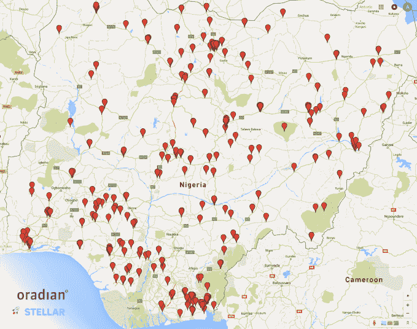

# Stellar 与 Oradian 合作，为尼日利亚带来即时汇款 

> 原文：<https://web.archive.org/web/https://techcrunch.com/2016/02/02/stellar-partners-with-oradian-to-bring-instant-money-transfer-to-nigeria/>

# Stellar 与 Oradian 合作，为尼日利亚提供即时汇款服务

Stripe 支持的开源支付网络 Stellar 以与 Oradian 合作的形式启动了其首次重大整合，Oradian 是一家向发展中国家的小额金融机构(MFI)出售基于云的软件的公司。

[作为复习](https://web.archive.org/web/20230212130657/https://techcrunch.com/2014/07/31/stripe-backs-non-profit-decentralized-payment-network-stellar-from-mt-goxs-original-creator/)，Stellar 是一个非营利基金会，目标是连接全球不同的金融系统。由 Mt. Gox 的最初创建者发起，Stellar 首先通过向任何在线注册的人公开分发流明(该平台的数字货币)而推出。

然而，该平台后来将重点转移到促进现有货币的兑换上，实质上成为了一个开源的 [SWIFT](https://web.archive.org/web/20230212130657/https://en.wikipedia.org/wiki/Society_for_Worldwide_Interbank_Financial_Telecommunication) 。

在第一次真实测试中，Stellar 决定解决一个非常现实的问题——尼日利亚农村的资金转移。今天，该基金会宣布在 Oradian 内部推出一个基于 Stellar 平台的新支付转移网络。

通过将 Stellar 平台集成到他们的核心软件中，Oradian 将允许 30 万尼日利亚人通过 Stellar 网络在小额金融机构之间廉价转账。

Stellar 的执行董事乔伊斯·金(Joyce Kim)解释说，这次合作将为尼日利亚带来第一个实时汇款网络。“随着 Oradian 的整合，以前主要依靠现金进出村庄的社区现在可以即时、安全地转移资金，无论他们身在何处”。

 *参与新方案启动的所有小额金融机构分支机构的地图*

那么为什么是尼日利亚呢？该基金会解释说，尼日利亚不仅拥有非洲最大的经济体，而且拥有最多的人口。但是，尽管有这些数字，这个国家仍然在经济上与世界其他地区隔绝。

因此，虽然该计划最初侧重于在国内转移资金，但其最终目标是允许安全和负担得起的跨境汇款，所有这些都在恒星网络之上。