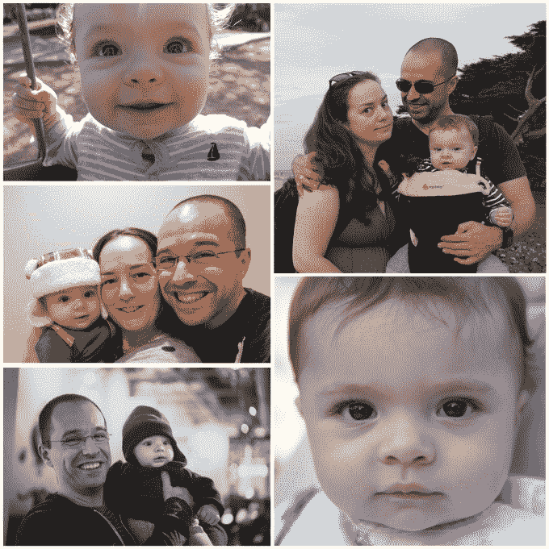
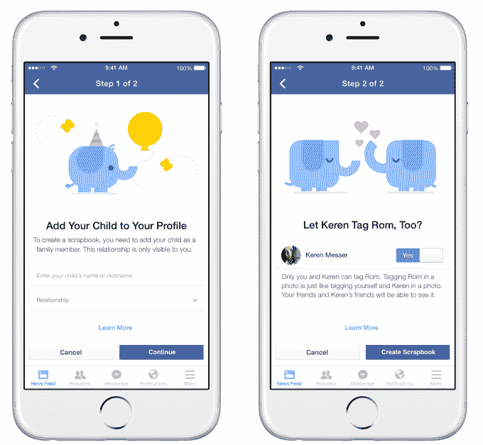
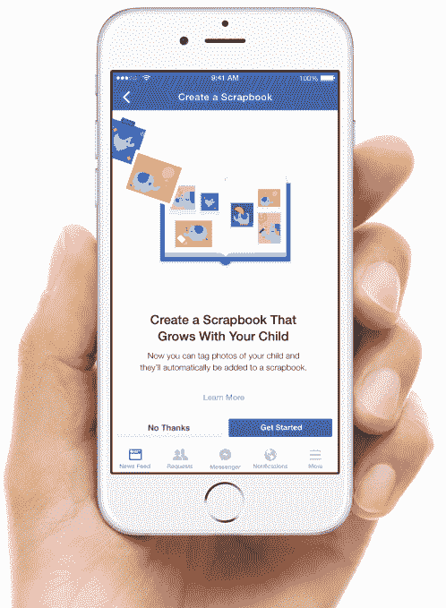

# 脸书的新照片“剪贴簿”让父母给孩子一个正式的存在

> 原文：<https://web.archive.org/web/https://techcrunch.com/2015/03/31/step-1-identify-baby-photo-step-2-hide-baby-photos/>

13 岁以下的儿童第一次被允许正式出现在脸书。他们仍然不能拥有个人资料，但他们的父母现在可以给他们(或宠物)的照片贴上标签，创建一个“剪贴簿”这使得父母可以在一个集中的地方收集他们的婴儿、幼儿或青少年的照片，并与朋友或亲人分享。剪贴簿将首先在美国的 iOS、Android 和桌面上推出。

脸书告诉我，它正在研究如何让父母在孩子 13 岁时将剪贴簿的控制权交给他们，并可以合法加入脸书。如果你讨厌看到婴儿照片，给父母一个识别他们的方法可能是脸书从你的饲料中隐藏他们的第一步。

## 将突发行为转化为产品

见见罗。Rom 是由脸书剪贴簿产品经理丹巴拉克和他的联合创始人(妻子)推出的一个跳跃的男婴。巴拉克想要一个更好的方法来编辑他上传到脸书的所有 Rom 的照片，所以他创建了一个。

“在 Rom 出生之前，我就开始看到一些为人父母的朋友添加他们孩子的照片，并给他们的伴侣加标签，”Barak 说。这是一个聪明的黑客。通过在孩子的照片中给伴侣添加标签，父母可以立即通知他们的另一半他们上传了一张照片，让伴侣的朋友可以看到，并在伴侣个人资料的“我的照片”部分创建一个位置来查找这些照片。

巴拉克说:“我们询问并采访了一些父母，发现在脸书(美国)上分享孩子照片的伴侣中有 65%这样做。

所以，就像 Twitter 把“RT:”变成了 retweet 按钮一样，Barak 利用了标记技术的所有好处，并把它们放进了脸书的剪贴簿。

## 如何做剪贴簿

[vimeo = https://vimeo . com/123670090]

要创建一个剪贴簿，人们将能够进入他们的个人资料的“关于”部分，然后是“家庭和关系”选项卡。在那里，他们将看到从头开始制作剪贴簿或为现有的孩子制作剪贴簿的选项。这让他们确立了自己作为父母的身份，并为他们的孩子创造了一个虚幻的存在(这有广告定位的分支，我将在后面讨论)。

巴拉克告诉我，在家庭成员选择器中有一个复活节彩蛋，可以用来制作剪贴簿，让你选择为你的宠物制作一个。

接下来，你会看到一个可爱的动画视频，讲述剪贴簿是如何工作的，由一只名叫艾莉的小象主演。然后，您将选择是否与您的伴侣共同拥有剪贴簿，这意味着他们也可以标记您孩子的照片，获得有关这些标记的通知，将照片默认为对他们的朋友可见，以及更改剪贴簿的隐私设置。

一旦剪贴簿制作完成，父母就会看到贴有他们或他们伴侣标签的照片，并可以点击识别哪些照片上有他们的小宝贝(尽管没有针对孩子的面部检测，因为那会令人毛骨悚然)。然后，剪贴簿就变成了一个特殊的收集其他相册的孩子的照片。父母也可以在其他人的照片中标记他们的孩子，如果这些照片的隐私设置发生变化，他们会收到通知。

从那时起，如果他们想给别人看他们孩子的照片，他们会把它们都放在一个地方。巴拉克说，几年后，脸书希望让青少年拥有自己的剪贴簿。

“每个在脸书的人都应该控制自己的身份，”巴拉克说。所以如果他们没有被他们的中学朋友嘲笑，巴拉克告诉我，“这是他们的隐私，他们可以做任何他们想做的事情。如果他们想删除它，他们可以，或者他们可以让它更加公开。”

脸书剪贴簿产品经理丹巴拉克

## 一旦你知道什么是婴儿照片…

巴拉克说，脸书希望“尽早发送[剪贴簿],并从父母那里获得反馈”,因此产品中将有一个突出的链接，用于向公司发送评论。脸书计划添加的一个功能是订阅按钮，每当有照片被添加到孩子的剪贴簿，像祖父母这样的亲人都会收到通知。

但是提前发货也有风险。对于有继子女和继父母的混合家庭，脸书还没有想出一种优雅的方式让剪贴簿工作。最多有两个人可以拥有一本剪贴簿，这些人必须在脸书上有正式的关系(除了共同拥有一只宠物的朋友的“家庭伙伴关系”)。离婚的父母总是可以开始各自的剪贴簿，但有一些潜在的情绪压力，即使巴拉克说:“我们不会通过任何判断。”

让父母自己出去可能对脸书的生意有好处，尽管巴拉克说“这从来就不是一种激励。这是我和宝宝一起做的宝宝项目。”不过，要使用剪贴簿，你必须将自己列为家长，这向脸书的广告商发出了信号，他们可能想以你为目标推出玩具或童装广告。

从好的一面来看，那些鄙视在脸书上看婴儿照片的人可能是幸运的。当我问脸书是否可以使用剪贴簿标签来识别哪些照片中有孩子，这样就可以隐藏这些照片，不让那些从来不看、不喜欢或评论它们的人看到，他承认，“这是我们想过的事情。”