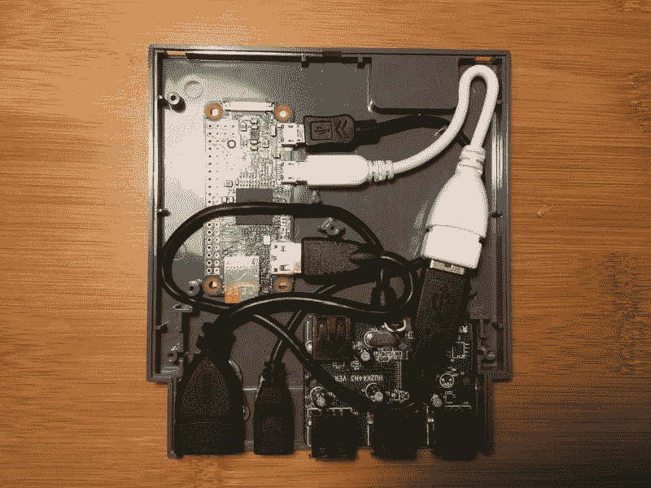

# 将一个树莓派粘在任天堂的盒子里，享受一些复古的 DIY 乐趣

> 原文：<https://web.archive.org/web/https://techcrunch.com/2016/09/22/stick-a-raspberry-pi-into-a-nintendo-cartridge-for-some-retro-diy-fun/>

# 将一个树莓派粘在任天堂的盒子里，来点复古的 DIY 乐趣

在一次特别聪明但极具破坏性的黑客攻击中，一位名为扎克的制造商清除了一个 [NES 墨盒](https://web.archive.org/web/20230323163258/https://howchoo.com/g/mti0oge5nzk/pi-cart-a-raspberry-pi-retro-gaming-rig-in-an-nes-cartridge)的内脏，并插入了一个[树莓 Pi Zero](https://web.archive.org/web/20230323163258/https://www.adafruit.com/category/105?gclid=CjwKEAjwgo6_BRC32q6_5s2R-R8SJAB7hTG-a8s8-V_2I5Kdi13_f6mbmHoEXfHHFZbUWS12ubhL4BoC8DHw_wcB) 和一个亚马逊 USB 集线器，以创建最终的复古 NES 模拟器。它甚至可以放回原来的袖子里，便于存放。

这个项目出奇的简单。你真正需要做的就是打开弹壳，把零件放好。接下来只需要把它合上，插上电源。它没有互联网连接，但你可以轻松地添加一个 Wi-Fi 适配器来上网。

该项目使用多平台游戏模拟器 [RetroPie](https://web.archive.org/web/20230323163258/https://howchoo.com/g/n2qyzdk5zdm/build-your-own-raspberry-pi-retro-gaming-rig) ，并由插入电源的迷你 USB 电缆供电。

扎克写道:

The 基础我称之为圆周率推车(伟大的名字，嗯？)包括一个 Raspberry Pi Zero、一个旧 NES 墨盒、一个小 USB 集线器和各种大小的适配器。除非你想变得狡猾或者在适配器上节省一些钱，否则不需要焊接。

我真正想看到的是有人真的把一个树莓派连接到一个真正的 PCB 盒上，这样你就可以把一个新的大脑放进原来的 NES 里。然而，由此产生的嵌合体可能是令人厌恶的，所以这个想法可能更好一点。