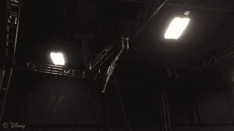

# Stickman 是迪士尼新推出的无头杂技机器人 

> 原文：<https://web.archive.org/web/https://techcrunch.com/2018/05/22/stickman-is-disneys-new-headless-acrobatic-robot/>

# Stickman 是迪士尼新推出的无头杂技机器人

迪士尼研究团队总能提供引人入胜(即使不总是特别有用)的实验。带上[斯蒂克曼](https://web.archive.org/web/20221208211249/https://www.disneyresearch.com/publication/stickman/)。这个机器人本质上是一个长长的肢体，能够做一些很酷的杂技动作。

该系统在博士题为“迈向人类规模的杂技机器人”的新论文中有详细介绍，它有两个自由度和一个钟摆，在绳子上摆动后，它用来将自己发射到空中。这个相对简单的机器人可以折叠，在空中翻筋斗，然后降落在下面的垫子上。

这些天线由内置的激光测距仪和六轴惯性测量单元(陀螺仪/加速度计组合)执行，它在飞行中计算其位置并相应地调整其位置。

[https://web.archive.org/web/20221208211249if_/https://www.youtube.com/embed/MFtNcGnroa8?feature=oembed](https://web.archive.org/web/20221208211249if_/https://www.youtube.com/embed/MFtNcGnroa8?feature=oembed)

视频

“Stickman 使用一组非常有限的传感和驱动能力来模仿人类表演者的行为，”该团队在论文中写道。它能通过改变初始方向和抱膝、松手和松手的时间来成功地表演几种不同的翻筋斗特技

该团队表示，他们将继续对机器人进行实验，试图在未来创造更复杂的特技。除此之外没有关于未来计划的消息，但是对于这个无头的机器人杂技演员来说，天空似乎是极限。