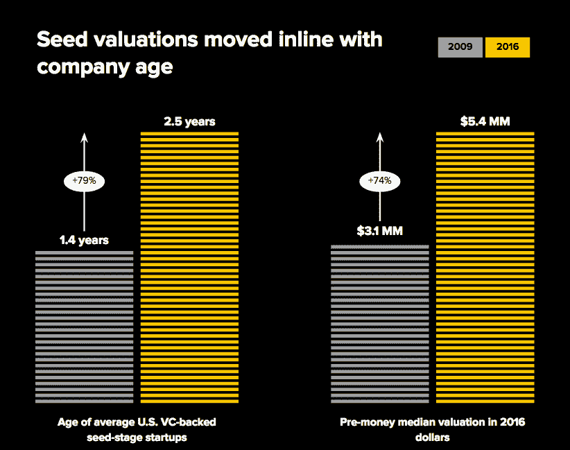

# (仍然)是 seed TechCrunch 的好时机

> 原文：<https://web.archive.org/web/https://techcrunch.com/2017/01/24/still-a-good-time-for-seed/>

More posts by this contributor

我和一位对风险投资领域感兴趣的经济学家朋友一起吃汉堡。我们就风险投资的发展方向交换了意见，尤其是在我花费时间的最初阶段。

“种子投资正在发生变化。如果你把它归结为经济学 101，这个市场会是什么样子？”他问。"谁将成为赢家和输家？"

他的问题引起了我内心经济学书呆子的共鸣。

从那以后，我一直在思考这个问题，我相信种子投资市场仍然很有吸引力。这篇文章探讨了这个问题。

## 种子投资市场

供求关系决定了这里的规则。优质新创公司的数量决定了供给。可用于种子投资的资本决定了需求。简单来说，供需相交的均衡就是典型种子轮的估值(即价格)。种子投资者是这个市场的买家。随着供给和需求的增加，市场变得更加健康和活跃。

**均衡估值稳定且有吸引力**

供给和需求相遇的地方，当然是市场价格——或者在风险投资的情况下，是一轮投资的估值。那么这种均衡在哪里解决呢？

这可能会让你吃惊:估值比许多人意识到的要稳定得多。

尽管种子的平均估值随着时间的推移有所上升，但这并没有描绘出一幅有用的画面。原因是“种子期”的定义变了。与几年前的种子阶段投资相比，如今的种子投资正在变成更成熟、更有价值的公司。

从 2009 年到 2016 年，美国风投支持的种子期创业公司的平均年龄增长了 79%，而以 2016 年美元计算的前值估值增长了 74%。在这些年里，种子轮的平均规模增加了两倍(见这里的数据)。

今天的种子投资是过去的 A 轮公司。种子公司已经开始将这种差距制度化。这些种子期前交易的价格在 200 万到 500 万美元之间，这是所有种子期交易的典型价格。

因此，种子阶段的定义蠕变解释了大部分估值变化。

在同样的几年里，天使投资、种子期前和种子期交易的数量增加了大约 6 倍。在美国，2016 年前三个季度约有 2，500 笔首轮融资前交易。

> 在过去的十年里，创业者的资源爆炸式增长。

通常情况下，交易量的增加会让我担心——让我质疑市场中是否存在非理性繁荣。我知道一些聪明人已经注意到了这一点。

但在我看来，估值的相对稳定性表明，市场正在以一种实际上健康的方式扩张。换句话说，供给和需求同步增加。虽然市场变得更加强劲和活跃，但估值保持稳定。

今天有很多进行重大投资的机会。也就是说，今天的种子投资者需要聪明谨慎。他们需要看到和选择最好的公司，他们需要支付适当的估值。在任一方面都做不到的公司将会失败。

这是怎么回事？供给和需求是如何以大致相似的方式扩张的？让我们来看看每一个。

**种子期创业公司的供应增加**

尽管一般来说新公司的数量在下降，但对于那些吸引投资者回来的创业公司来说，情况正好相反。

成为一名创业企业家变得越来越有吸引力。比以往任何时候都有更多的学生追求创业——在哈佛商学院，28%的应届毕业生在三年内创办了公司，比三年前毕业的人数的四倍还多[。我相信，职业生涯中期的专业人士离开去创业也是如此。](https://web.archive.org/web/20221210032726/http://poetsandquants.com/2016/06/26/mba-employment-reports-understate-startup-mania/)

创始人也可以获得更多支持。在过去的十年里，创业者的资源爆炸式增长，几乎任何公司建设主题的专业知识都很容易获得。加速器和类似的项目继续增长、改进和扩散，正如为创业者量身定制的合作空间一样。

> Seed 并没有比其他创业阶段增长得更快。

开源软件、开发者平台和云服务器继续使得在 T2 创办一家科技创业公司比以往任何时候都更便宜、更容易。

一些可靠的“种子前”公司已经出现，在公司建立的生命周期中更早地支持创始人。投资人在这个最早阶段的专业化为他们合作的创始人提供了相关的支持。

最后，[新的创业活动中心](https://web.archive.org/web/20221210032726/https://www.brookings.edu/research/accelerating-growth-startup-accelerator-programs-in-the-united-states/)继续发展。在创新的“二线城市”进行融资比以往任何时候都容易。我相信许多最激动人心的机会都在这些新兴的中心。我大约一半的投资在湾区或纽约市以外。

**种子期投资需求增加**

对种子阶段投资的需求持续增长。随着其他收益来源的减少，这种[只会在长期](https://web.archive.org/web/20221210032726/http://www.mckinsey.com/industries/private-equity-and-principal-investors/our-insights/why-investors-may-need-to-lower-their-sights)中增加。有限合伙人(“有限合伙人”)寻求种子作为分散投资组合和赚取更高回报的一种方式。

种子投资带来高回报——不管是贝塔还是阿尔法。几乎在每一个时间跨度内，早期风险企业的表现都优于上市股票，而且往往是戏剧性的。早期风险投资的 30 年回报率比公开指数高出约 2.5 倍。最近的指标也是如此，比如三年回报率。种子阶段就像传统的早期风险投资，beta 更高。

人们越来越关注这一资产类别。第一代公司证明了种子模型的有效性(如闸门、小写、首轮资本、基线)。他们取得了惊人的成绩:[2016 年 Midas 榜单前三名投资者中的两位](https://web.archive.org/web/20221210032726/http://www.forbes.com/midas/list/)史蒂夫·安德森和克里斯·萨卡凭借种子基金赢得了一席之地。这种模式的成功导致了新种子基金和专注于种子的组合基金的兴起。机构有限合伙人经常告诉我，他们正在寻找“种子”

种子期投资者的质量每年都在提高。公司已经扩散、制度化和成熟。新的普通合伙人带来了创新和新的视角。随着时间的推移，适者生存，这些[新公司将带来行业 40-70%的回报。](https://web.archive.org/web/20221210032726/https://40926u2govf9kuqen1ndit018su-wpengine.netdna-ssl.com/wp-content/uploads/2015/11/Venture-Capital-Disrupts-Venture-Capital.pdf)

还有一个事实可能会让你吃惊:种子期的增长速度并不比其他创业阶段快。相反，它与风险投资的整体增长保持同步。

虽然机构种子投资者的数量激增，但在过去五年中，进入种子的风险资金份额保持稳定，平均每季度 3.9%。

在这个投资阶段，当更多的美元进入风险投资时，公司的扩散是自然的增长路径。这不同于后期投资，在后期投资中，当行业增长时，单个公司会扩大管理下的资产。

种子投资的长期均衡有许多较小的公司。成功的种子基金相对较早地限制了它们的规模和准入。当更多的资金进入这个领域时(以绝对美元计算)，它们通常会进入新的基金。

对有限合伙人来说，公司的扩张是棘手的。种子基金通常会在早期限制其基金的规模，以保持强劲的表现。试图等到第三或第四只基金进入的有限合伙人可能会发现自己在种子资产类别中面临挑战。

## 三层含义

创始人和投资者可以从这里学到三点:

1.  现在仍然是成为风险投资支持的企业家的大好时机
2.  总是有空间给新的、智能的、种子阶段的 GPs 带来新的方法
3.  聪明的有限合伙人会关注种子基金，以寻找下一个有针对性的机会

数据来源:Switch Ventures、第一共和国银行、普华永道、PitchBook。

*感谢 PitchBook 为本次分析挖掘新的数据。感谢朋友们提供的评论，以及米歇尔坦德勒，谁特别奠定了这一点。