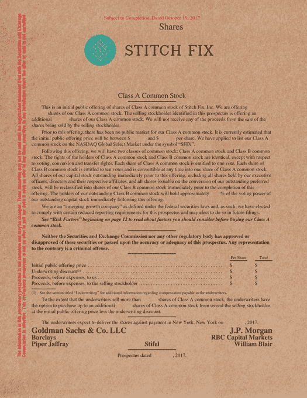

# Stitch Fix 已经申请首次公开募股，数字看起来不错

> 原文：<https://web.archive.org/web/https://techcrunch.com/2017/10/19/stitch-fix-has-filed-for-an-ipo/>

Stitch Fix 已经申请上市，最终揭示了这家初创公司的财务实力，这将是对寻求上市的现代电子商务企业的一次考验——这些数字看起来相当不错！

让我们从利润开始:除了过去两个季度，Stitch Fix 公布了连续六个季度的*正净收入*。我们谈论了很多计划上市的公司，它们显示出相当一致(甚至不断增加)的亏损，但 Stitch Fix 看起来像是一家实际上成功建立了健康业务的公司。该公司最终在过去两个季度亏损，但即使如此，其亏损也在逐季减少——今年第二季度该公司仅亏损约 450 万美元。

让我们开始吧！

(上面有一个快速说明:Stitch Fix 认为其 2017 财年始于 2016 年 7 月，而上面的图表是根据日期标记的，Q2 2017 意味着截至今年 7 月的季度。)

所以，如我们所见，利润！Stitch Fix 是电子商务上的一个现代旋转，该公司收集你的兴趣和关于你个人风格的信息，然后提供一堆选项给你。你可以挑选你想买的商品，以及你想退货的商品，从理论上讲，这种产品有助于消除人们在网上购物时对选择的焦虑。Stitch Fix 并没有在亚马逊上四处点击，而是试图了解你喜欢什么，并在你面前贴上一堆选项，同时让你很容易购买。

TechCrunch 月份报道称，[公司已经秘密申请上市](https://web.archive.org/web/20230316225130/https://techcrunch.com/2017/07/28/stitch-fix-has-confidentially-filed-for-an-ipo/)。Stitch Fix 是 Le Tote、MM.LaFleur 等创业公司“先试后买”浪潮的一部分。因此，很自然，这是一个竞争激烈的领域——最明显的是亚马逊。该公司正在试验最近推出的 Prime 衣柜(T7 ),该公司因将其视为机会的细分市场而闻名。正如我们所见，Stitch Fix 暴露了一个在 2016 年 7 月 30 日至 2017 年 7 月 30 日期间运营率接近 10 亿美元的业务。

Stitch Fix 于 2011 年在首席执行官 Katrina Lake 位于马萨诸塞州的公寓中成立，其财务状况清楚地揭示了一个大规模的业务，该业务继续有条不紊地扩大规模，同时保持其燃烧得到控制。根据 PitchBook 的数据，2014 年的最后一轮融资对该公司的估值为 3.0931 亿美元，人们普遍认为这是今年的一次大型消费者 IPO。

对于 Benchmark Capital 和 Baseline Ventures 来说，这次 IPO 也将是另一个相当大的胜利，这两家公司都持有该公司 25%以上的股份。光速风险投资伙伴拥有该公司 11.8%的股份，而莱克拥有该公司 16.6%的所有权。然而，非常值得注意的是，Stitch Fix 在其整个生命周期中只筹集了 4250 万美元的风险融资。

这是完整的限额表:

我们不会深究*所有的*风险因素，但 Stitch Fix 作为一家电子商务初创公司和一个围绕时尚打造的品牌，处于一种独特的地位。因此，它面临着一系列非常独特的挑战，其中之一就是跟上现代时尚潮流。以下是其中一个风险因素:

> ***我们必须成功把握服装趋势和不断变化的消费者偏好。***
> 
> 我们的成功在很大程度上取决于我们识别服装趋势、预测和衡量客户品味以及及时提供满足客户需求的商品的能力。然而，我们许多购买决策的准备时间可能会使我们难以对新的或不断变化的服装趋势或客户对我们的商品采购员选择的商品的接受程度做出快速反应。我们通常会在预期销售之前签订采购合同，通常是在客户购买确认服装趋势之前。过去，我们并不总能准确预测客户的偏好和对我们商品的接受程度。此外，我们使用我们的数据科学来预测客户的偏好和衡量对我们商品的需求，但不能保证我们的数据科学和算法能够准确预测客户的需求和口味。如果我们对我们提供的商品的市场判断错误，或者未能把握趋势并向客户提供有吸引力的商品，我们的销售额将会下降，我们的经营业绩将会受到不利影响。

Stitch Fix 的下一步将是在未来几周首次公开募股之前，开始说服投资者购买股票。高盛再次在令人垂涎的首次公开募股的“领先左派”位置上运行节目，该公司将在纳斯达克上市。股票代码: **SFIX** 。

与此同时，我们将留给你它的招股说明书，它显然是通过 Instagram 滤镜拍摄的:

