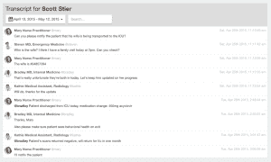

# 医疗保健信息缝合松弛

> 原文：<https://web.archive.org/web/https://techcrunch.com/2015/09/21/stitch-is-slack-for-healthcare-messaging/>

[医疗保健提供商的中央信息中心 Stitch](https://web.archive.org/web/20230323125835/http://www.teamstitch.com/) 今天在 Disrupt 上发布，以减少美国医院每年因通信中断而浪费的[110 亿美元](https://web.archive.org/web/20230323125835/http://www.healthitoutcomes.com/doc/billion-wasted-annually-due-to-inefficient-communication-technology-0001)。

你可以认为 Stitch 是医疗保健行业的一个懈怠，只是渠道是围绕单个患者而不是团队或部门组织的。当病人入住时，前台可以建立一个通道并提醒工作人员。医生、技术人员和护士在诊断患者时，可以在频道中共享扫描、测试结果和观察结果。

Stitch 没有与 Dropbox、Github 或 Giphy 集成，而是与电子健康记录集成，以获取受保护的健康信息。它符合 HIPAA 标准，可通过桌面和移动设备访问。

虽然对病人来说不一定是显而易见的，但在医院或医疗机构的幕后有许多活动部件。不仅有不同类型的医生、技术人员和医疗保健提供者治疗一个病人，而且这些团队轮班工作。这意味着一个住院病人很可能由许多不同的医疗保健提供者治疗，而这些提供者中的每一个每天可能要看 20 或 30 个不同的病人。

Stitch 的联合创始人巴拉特·基拉鲁(Bharat Kilaru)说:“在生死关头，你需要知道另一个人明白了你的意思。"直到现在，除了寻呼机和电话，还没有真正好的替代品."

Stitch 不仅使这个过程更有组织性，而且它记录了所有交流的内容，这样医生就有记录可以参考。

“这些人并不经常发电子邮件，他们只是拿起电话分享超级关键的信息，”基拉鲁说。“所有这些都丢失了，因为没有办法存档或搜索它们。”

仅搜索功能就有能力彻底改变患者的治疗方式。即使一名医生刚刚开始轮班，并且第一次治疗一名现有的患者，她也可以访问之前发生的每一次讨论。

如果有紧急情况，她可以快速搜索病人的日志，而不是拿起电话去追踪两小时前回家的另一位医生。

Stitch 今天免费发布基础应用。对于额外的功能，如电子医疗记录集成，Stitch 每月向每个提供商收取 40 美元，尽管这并不是医生开始使用这项服务的必要条件。

“任何医院管理者都会告诉你，沟通障碍是他们面临的一个问题，”联合创始人乔纳森·温斯坦说。“无论是因为等待时间过长而影响患者满意度，还是因为沟通中断而导致错误，医院都会受到影响。”

作为 Y Combinator 2015 年夏季班的毕业生，Stitch 已经在三所大学诊所进行了试验，目前有数百名提供商在使用这项服务。

[gallery ids="1212641，1213405，1213404，1213403，1213402，1213394"]