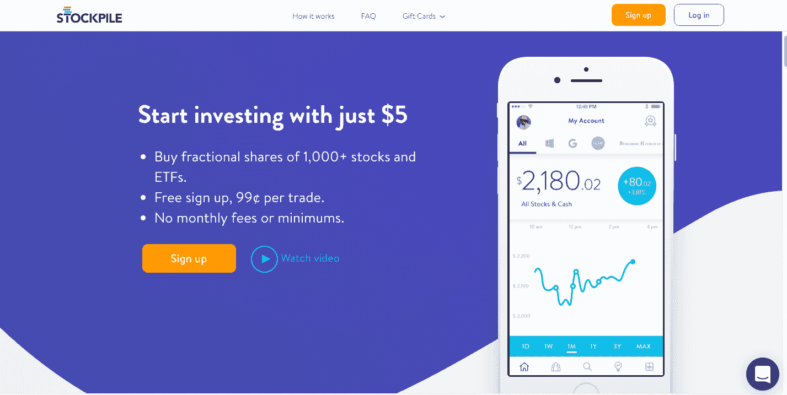

# share 筹集了 3000 万美元来推广部分股票投资 

> 原文：<https://web.archive.org/web/https://techcrunch.com/2017/09/28/stockpile-raises-30-million-to-popularize-fractional-share-investing/>

向主流投资者提供零股投资的初创经纪公司 storage 已经筹集了 3000 万美元来继续其使命。

该公司获得了由富达支持的八路风险投资公司的最新现金注入，此外还有传统的风险投资基金，如梅菲尔德、阿伯风险投资公司、汉娜风险投资公司、王风险投资公司等。

storage 的创始人兼首席执行官阿维·乐乐(Avi Lele)在一份声明中表示:“我们的使命是让每个人——尤其是年轻的首次投资者——为他们的未来储蓄和投资变得简单。”“零股让市场投资变得有趣、简单和个性化。即使只有几美元的人也可以购买像亚马逊或 Alphabet 这样最受欢迎的品牌的股票，这些品牌目前的股价接近 1000 美元。

乐乐认为，直接投资于公司，而不是购买交易所交易基金的部分股份(这是 Motif、Betterment 和 Wealthfront 等服务提供的)，对投资者来说更有吸引力。

storage 用户可以在网上或使用该公司的 iPhone 或 Android 应用程序开设账户。该账户可以免费开立，但交易费用为 99 美分。

使用该应用程序浏览潜在投资相对容易。一旦用户下载了这款应用，就可以在“娱乐”、“儿童”、“科技”和“食品”等类别下浏览潜在投资。该应用列出了用户可能熟悉的潜在品牌，并将该品牌与其母公司关联起来，而不是将潜在的股票购买行为组织在公司下。

这意味着，如果用户喜欢“吉普”品牌，他们可以搜索该品牌，然后选择购买菲亚特股票，而不必知道该品牌属于菲亚特。

该公司在其学习部分提供了一些股票市场的基本信息(实际上只是一些常见金融术语的定义以及一些关于股票股息和收益报告语言的奥秘)。

不过，投资者使用库存基本上是靠自己。它只比在比赛中挑选一匹马好一点点，因为一个赌徒喜欢这个名字。这款应用让用户很大程度上依靠他们对公司品牌的感觉来指导他们做出投资决定。

每笔交易 99 美分，这是一个比罗宾汉更昂贵的选择，更容易的入职流程，更复杂的股票交易更少的花哨功能。

对于那些真正想管理自己的钱并通过股市投资创造价值的人来说，这可能也不太好。为此，人们可能会因为一项为他们提供多样化投资组合的服务而过得更好。如果用户想在没有太多信息的情况下在市场上赌博，那么 storage 可能是可以使用的应用程序。

它成功吸引了大牌投资者和大量资金(该公司 1500 万美元的前一轮投资者包括 Arbor Ventures、斯坦福大学和阿什顿·库彻)。

根据该公司的一份声明，新的融资将使该公司能够向更多的千禧一代推广其产品。和新的投资公司八道，吹捧该公司的能力船上新客户。

“stock 在吸引下一代投资者方面取得了巨大成功，”八路公司的大卫·米尔斯坦在一份声明中说。“他们的创新方法揭开了股票投资的神秘面纱，并向所有人开放。他们把股市放在了礼品卡上。”

即将加入该公司董事会的米尔斯坦没有说明，对于购买股票的投资者来说，把股票放在礼品卡上是好事还是坏事。