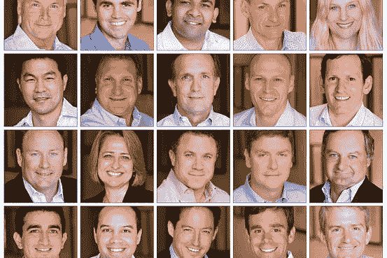

# 顶级后期团队 TechCrunch 表示，不要再听银行家的话，上市吧

> 原文：<https://web.archive.org/web/https://techcrunch.com/2016/08/15/stop-listening-to-your-bankers-and-go-public-says-top-late-stage-team/>

在 22 年的历史中，科技交叉风险投资通过投资相对未被发现但成熟的公司，已经成为一个主要的投资发电站；购买风险投资支持的公司的大量股份；以及收购 TCV 认为被低估的上市科技公司的股票。

这家总部位于帕洛阿尔托的公司做得如此之好，以至于它刚刚用 25 亿美元完成了它的第九只基金[。它现在还在纽约(2005 年开业)和伦敦(2011 年开业)设有办事处。](https://web.archive.org/web/20221206081218/http://www.nytimes.com/2016/08/02/technology/new-fund-from-technology-crossover-ventures-draws-2-5-billion.html?_r=0)

上周晚些时候，在旧金山的一家小酒馆喝咖啡时，我与 TCV 的创始普通合伙人杰伊·霍格和普通合伙人伍迪·马歇尔坐在一起，谈论该公司的一些最新热门产品，其中包括[最近收购的](https://web.archive.org/web/20221206081218/http://fortune.com/2016/07/19/unilever-buys-dollar-shave-club-for-1-billion/) Dollar Shave Club 和 LinkedIn，TCV 在 2 月份收购了它们的部分股票，当时它们的股价[暴跌](https://web.archive.org/web/20221206081218/http://money.cnn.com/2016/02/05/technology/linkedin-stock/)40%以上。

我们还谈到了为什么共同基金公司(TCV 有时会与它们在交易中竞争)不能成为优秀的私人公司股东，以及投资银行家的坏建议是什么，他们大多告诉公司要等到 2017 年才能上市。下面是我们的聊天记录，根据长度进行了编辑。

**TC:自从在伦敦开设办事处以来，你已经在欧洲投资了大约 7 亿美元，包括 Spotify 和 World Remit 的交易。那可是一大笔资本。**

JH:在伦敦、柏林和斯堪的纳维亚国家，我们看到了很多活动，我们认为最好在准本地办公室观看。

WM:在欧洲，投资者大多处于早期阶段，要么是收购，要么是自称成长型股票投资者的人，但实际上是在做带着大量债务的成长型收购交易。就初创公司可以花在产品、销售、技术和营销上的少数股权投资而言，我们没有太多(竞争)。

TC:其他美国公司呢？Insight Venture Partners 不是在欧洲做了很多交易吗？

WM: Insight 在纽约的一个办公室做全球范围内的所有事情。我们相当活跃，所以我们不一定喜欢当游客。我们喜欢成为当地社区的一部分，所以我们觉得在地上插上我们的旗帜并雇佣当地人是很重要的。

你最近的投资之一是投资总部位于巴黎的下一代音乐公司的[相信数码公司。关于你的风格，那笔交易](https://web.archive.org/web/20221206081218/http://www.believedigital.ca/)告诉了我们什么？

WM:这是一个不断增长、盈利的业务，已经达到了相当大的规模，拥有数百名员工。我们的共同投资者是两家小型法国基金，我们是融资中最大也是唯一的投资者，这很典型。此外，该公司已经存在了足够长的时间，一些基金将会考虑出售一些股票。我们的大多数交易都是一级和二级股权的混合。

你投资的五家公司今年已经被出售，包括数据营销公司 Merkle，该公司刚刚向电通出售了多数股权。你还投资了 LinkedIn，结果对你很有利。

JH:我们没有看到(微软收购)的到来；这是一个惊喜。但如果你要配置一美元，为什么不同时考虑上市公司和私人公司，然后评估，“嗯，这个看起来估值很高，但另一个打了 70%的折扣，”只要你有正确的洞察力。公共市场往往会在季度基础上反应过度。

**TC:为什么没有更多的风险基金投资于折价上市的公司，尤其是考虑到今年早些时候许多公司都遭受了重创？我的理解是，大多数公司在这里或那里做这些交易并没有受到限制。**

JH:总的来说，这是因为我们所有人的(大学、捐赠基金和其他)资金来源都想把我们看作是分散的(群体)。要么是“我在投资一个私人经理人”，要么是“我在投资一个公共经理人”所以这不是一件容易的事。

WM:也很难。很多时候你无法获得完美的信息。这是一个不同的过程。但是你的私人活动会影响你的公共活动，反之亦然。即使我们不打算在公开市场上配置资金，我们也可能比大多数私人投资者花更多的时间听季度电话会议，因为当你想到勤奋时，那是一些最好的信息。你可以花数十亿美元购买[重新包装的情报],或者只是上网看看你想看的任何电话。所有伟大的趋势和客户数据都在那里。

**TC:你提到你购买了一级和二级混合股权。你能谈谈你看到的一些折扣吗？**

WM:从什么？这取决于最后一轮和最后一轮的结构。很多人说过，“远离独角兽。”但是有很多伟大的公司都在寻求融资。也许[他们的最后一轮]很奢侈[所以现在的价格]也许有一点点上涨或下跌，但与此同时，自最后一轮以来，业务已经实质上执行。因此，尽管(估值)相似，但你的市盈率是一半，因为业务已经翻倍。你必须在相对的基础上看待这些机会。

**TC:近年来，共同基金已经进入了你的业务。我仍然看到它们在后期交易中到处出现。**

WM:有时我们看不到任何人。有时，如果有更正式的流程，我们会这么做。今年早些时候，我们看了一笔交易，我们认为折扣是合适的，其中一个 T Rowes 或 Fidelitys 做了一轮平坦的。但你通常会看到贝利·吉福兹和贝莱德的攻击性行为较少。你肯定会看到人们撤回投资，并重新评估他们已经下的赌注。

公开地重新估价，我认为这让这些经理支持的一些公司感到惊讶。

JH:如果我们听到一家公司正在与 T Rowe、Fidelity 和 BlackRock 洽谈，我理解这是为什么。该公司可能想要一个高价格和一个快速的过程。但我们(知道)或许应该把时间花在别的地方。句号。

(共同基金)正在购买(私人股权)，这样它们就能以 IPO 价格获得更低的成本，等等。但一旦(他们投资组合中的公司)表现不如竞争对手，这种活动就会停止。这些私人投资必须有相应的回报。如果他们高买低卖，那就不好了。

你认为会对这些经理采取行动吗？

JH:共同基金和对冲基金的人过去曾因估值问题被起诉过。即使只占你活动的 5%，随着(大街上的人)进出你的基金，你的(净资产值)也是一个非常重要的指标。这些投资者在买入，认为估值(他们在任何一个时刻支付的价格)是正确的。

WM:这些家伙中的一些人，他们有很深的口袋，但他们有时会有鳄鱼的手臂。管理团队开始说，“我明白了。”

除了你的交易，沃尔玛刚刚支付了[33 亿美元的现金和股票](https://web.archive.org/web/20221206081218/http://www.wsj.com/articles/wal-mart-to-acquire-jet-com-for-3-3-billion-in-cash-stock-1470659763)收购电子零售商 Jet。你认为那笔交易怎么样？ **他们刚刚为 Jet 创始人马克·洛尔支付了数十亿美元吗？**

JH:嗯，你可以看到他已经签了五年了，所以有一部分价值是:马克可以帮助我们与亚马逊一对一地竞争。价值的一部分是底层指标。这似乎是一个向前倾斜的价格标签；如果我是那笔交易的投资者，我会非常高兴。

TC:为什么 IPO 数量仍然如此之少？

JH:坦白地说，我很困惑。今年已经有 6 家科技公司 IPO 了？有记录以来最糟糕的一年是 2009 年，有 8 宗 IPO，但那是在全球金融危机之后。

我们的人数极低，部分原因是银行家建议公司等待，(告诉他们)大选后，不确定性将会减少，2017 年将是伟大的一年。我认为这是共识。

从你的语气来看，你似乎不同意这个共识。你是在告诉你的投资组合公司现在就出去吗？

JH:是的。即使在去年，我们也只有三家(投资组合公司上市)，总共只有 22 家公司。在市场触及高点、利率为零、企业增长良好的情况下，这有点令人困惑。我不确定银行家为何如此犹豫不决。

不管怎样，如果你是一家公司董事会的投资者，你需要独立思考。从现在起 6 个月或 12 个月内，投资者的估值可能会与今天完全不同。现在，银行家们告诉公司即使没有增长也要盈利，因为“这是市场想要的。”好吧，这是个坏建议。我们的工作是理清所有这些，确保公司做出正确的取舍。

我真的想知道是否某些公司已经错过了他们的机会，包括你的投资组合。

JH:我想我会把前提弹回来。上市只是战斗的一部分。在首次公开募股中，你出售的是公司 5%到 10%的股份。如果你打算在 IPO 后拥有 90%到 95%的股份，你不应该关心 IPO 价格。你应该非常关心上市公司一年、两年、三年、四年后的生活。

就错过时机而言，如果你上市了，但六个月后你就破产了，这对所有人来说都是一件非常不愉快的事情，尤其是对首席执行官来说。我不太相信 windows。你总是必须在下一个行动中再投资，以维持你的成长。如果你认为你错过了机会，那就是说你的好日子已经过去了。