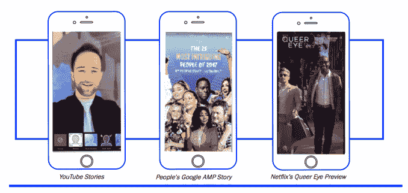
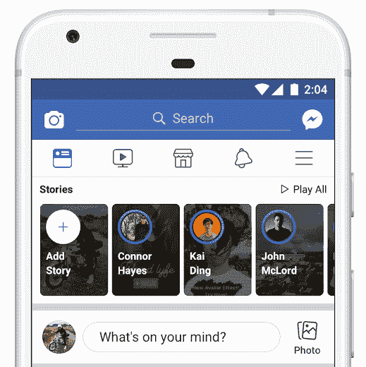
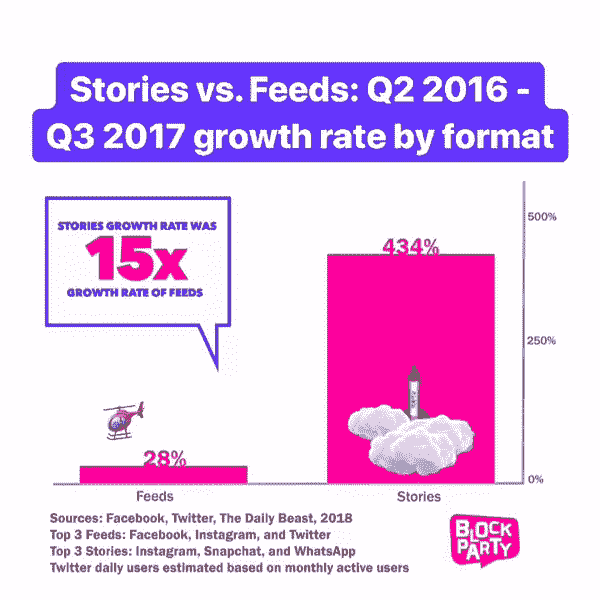

# 故事即将超越饲料分享。现在怎么办？

> 原文：<https://web.archive.org/web/https://techcrunch.com/2018/05/02/stories-are-about-to-surpass-feed-sharing-now-what/>

我们正处于视觉传播时代的风口浪尖。根据咨询公司 Block Party 的数据，自 2016 年初以来，故事创作和消费增长了 842%。Snapchat、Instagram、WhatsApp、脸书和 Messenger 上的近 10 亿个账户现在都在制作和观看这些垂直的、短暂的幻灯片。昨天，脸书首席产品官 Chris Cox 展示了一张图表，详细说明了“Stories 格式如何在明年某个时候超越 feeds，成为人们与朋友分享事情的主要方式。”

这种媒介转变的影响是巨大的。用户现在考虑如何美化每一刻，并将其添加到他们一天的叙述中。社交媒体平台正在碾压他们的旧设计，以突出相机和人们的故事。广告客户必须重新思考他们的信息，不是作为标题、正文和链接，而是作为背景、覆盖和一种即使观众不点击也不会消失的感觉。

WhatsApp 的故事现在拥有超过 4.5 亿的日用户。Instagram 的用户超过了 [3 亿。Facebook Messenger 在 9 月份拥有了 7000 万用户(T4)。Snapchat 作为一个整体刚刚达到](https://web.archive.org/web/20230329232052/https://techcrunch.com/2017/11/01/instagram-whatsapp-vs-snapchat/)[1.91 亿，](https://web.archive.org/web/20230329232052/https://techcrunch.com/2018/05/01/snapchat-q1-2018-earnings/)其中约 1.5 亿使用故事根据[区块党](https://web.archive.org/web/20230329232052/http://www.weareblockparty.com/)。拥有 9.7 亿账户，这是未来的模式。Block Party 计算出，从 2016 年 Q2 到 2017 年第三季度，故事的增长速度比提要快 15 倍。这还不包括谷歌新闻的新[AMP Stories](https://web.archive.org/web/20230329232052/https://techcrunch.com/2018/02/13/google-takes-amp-beyond-basic-posts-with-its-new-story-format/)、移动电影预览的[网飞故事](https://web.archive.org/web/20230329232052/https://techcrunch.com/2018/04/19/netflix-launches-30-second-preview-videos-on-mobile/)以及 YouTube 的新故事专题。

脸书首席执行官马克·扎克伯格甚至在上周的收益电话会议上承认，该公司正专注于“确保广告在故事中像在提要中一样好。如果我们做得不好，那么随着更多的分享转向故事，这可能会损害我们的业务。”当被问及时，脸书证实，它现在正致力于脸书故事的货币化。

## 从发明到标准

“他们值得所有的荣誉”， [Instagram 首席执行官凯文·斯特罗姆告诉我](https://web.archive.org/web/20230329232052/https://techcrunch.com/2016/08/02/silicon-copy/)关于 Snapchat，当时他自己的应用程序推出了它的克隆故事。随着 Snapchat 首席执行官埃文·斯皮格尔和他的团队[通过镜头](https://web.archive.org/web/20230329232052/https://techcrunch.com/2018/02/12/snapchat-book/)的 10 秒钟消失的消息，重新想象脸书新闻。但是它们已经发展成为从别人的角度看待生活的主导方式。正如脸书和 Twitter 采用 FriendFeed，并通过相关性排序、字符限制和各种嵌入式媒体对其进行改进一样，Stories 格式仍在不断完善。“这是关于一种格式，以及你如何把它带到一个网络上，并把你自己的旋转放在上面”Systrom 接着说。

Snapchat 正试图弄清楚来自朋友和专业创作者的故事是否应该分开，是否应该按照相关性或 T2 倒序排序。Instagram 和脸书[正在向来自 Spotify 等第三方应用](https://web.archive.org/web/20230329232052/https://techcrunch.com/2018/05/01/stories-platform/)的帖子开放故事，这使它们成为发现音乐的一个很好的方式。WhatsApp 正在挑战故事的工程极限，想办法让高带宽视频在发展中国家的慢速网络上播放。

Messenger 正在[将摄像头](https://web.archive.org/web/20230329232052/https://techcrunch.com/2018/05/01/facebook-messenger-translation/)从导航菜单移到顶部角落，并作为[观看从](https://web.archive.org/web/20230329232052/https://techcrunch.com/2017/11/13/rip-direct-and-messenger-day/)脸书和 Instagram 分享的故事的地方(尽管你也可以在那里发帖)。与此同时，Messenger 正在[融合增强现实、商业和故事](https://web.archive.org/web/20230329232052/https://techcrunch.com/2018/05/01/facebook-messenger-translation/)，因此用户可以在 AR 中预览产品，然后分享或购买它们。Instagram 创建了一个 [Stories carousel ad](https://web.archive.org/web/20230329232052/https://techcrunch.com/2018/02/01/instagrams-carousel-ad-format-is-coming-to-instagram-stories/) ,让企业分享三张照片或视频的幻灯片，以串联起一个故事。也许最能说明问题的是，脸书正在为其新闻订阅测试一个新的 post composer，它实际上显示了一个活动的相机和相机胶卷预览，以迫使你分享故事，而不是文本状态。拒绝潮流的公司可能会被甩在后面。

## 社交媒体基石

正如我两年前写的那样，当时 Snapchat 是唯一有故事的应用:

“社交媒体创造了一个窗口，通过它你的朋友可以观察你的生活。然而，大多数社交网络并不是这样设计的，因为电话、屏幕尺寸、相机和移动网络连接都不足以构建一个透明的门户。

推特上的所有文字就像是透过栅栏的缝隙在窥视。旁边有很多裂缝，但没有一个让你看到完整的故事。脸书几乎是一片空白。它就像一个被混凝土包围的小牢房窗户。Instagram 是我们最接近的东西。就像一扇古雅的客厅窗户，你只能看到他们想让你看到的干净漂亮的部分。

Snapchat 是进入某人生活的落地窗观景台。它看到了人类发明的每一种交流方式:视频、音频、文本、符号和图画。除了虚拟现实和 360°视频——两者都很难在旅途中捕捉或观看——很难想象社交媒体会从这里发展到哪里。“事实证明，在接下来的两年里，社交媒体不会发展，而是会向故事靠拢。

接下来是一场竞赛，争夺更多的装饰、更多的增强现实、更多的开发人员，以及超越原生应用程序并进入网络其余部分的更多可扩展性。在我们完全停止使用手机之前，我们可能会看到大部分分享被私人信息和广播故事所分割。

然而，媒体对文化来说是一把双刃剑。虽然这是一种更生动的分享和产生共鸣的方式，但它们也威胁着生活的商品化。当 Instagram 推出 Stories 时，Systrom 说这是因为否则你“只能看到精彩部分”。

但他淡化了这样一种媒体，它捕捉的不仅仅是亮点，还会迫使世界各地的人们用他们的拍照手机打断任何美丽的场景或一阵笑声或安静的停顿。我们从人们每天拍摄和分享一次或几次变成了持续不断。事实上，人们计划他们的活动不仅仅是围绕一个完美的目的地，而是将他们的整个旅程变成成功的剧场。

如果故事是我们最喜欢的新工具，我们必须学会明智地运用它们。有时候一段回忆比一个观众更有价值。当记录是对的时候，不要妨碍别人的体验。在故事拍摄完成后，回到那一刻，把字幕和装饰留到休息时间。故事是社交媒体的基石。没有比这更丰富的分享方式了，所以它们还会存在一段时间。我们最好学会优雅地共处。