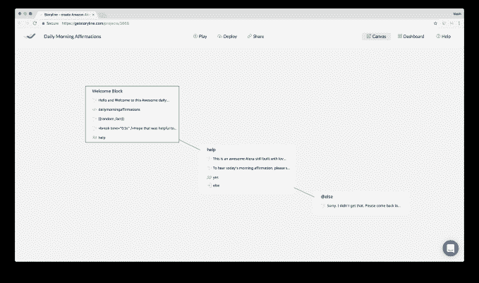
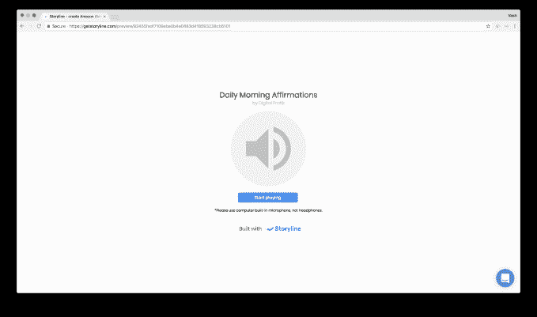

# 故事情节让您无需编码即可构建和发布 Alexa 技能 

> 原文：<https://web.archive.org/web/https://techcrunch.com/2018/02/02/storyline-lets-you-build-and-publish-alexa-skills-without-coding/>

三千九百万美国人现在拥有智能扬声器设备，但语音应用生态系统仍在发展中。虽然今天的 Alexa】有超过 25，000 种可用的技能，但许多公司尚未为该平台建立一种技能，或者只提供一种非常基本的技能，但效果并不好。这就是创业公司[故事情节](https://web.archive.org/web/20221204064340/https://getstoryline.com/)的由来。该公司正在提供一个易于使用的拖放式可视化界面，用于构建亚马逊 Alexa 技能，不需要你具备编码知识。

正如该公司所描述的那样，他们正在构建“Weebly for voice apps”——这是指拖放式网站构建平台，现在这是一种非开发人员无需代码即可创建网站的流行方式。

故事情节由[瓦西里·辛卡兰卡](https://web.archive.org/web/20221204064340/https://www.linkedin.com/in/flreln/) (CEO)和[马](https://web.archive.org/web/20221204064340/https://www.linkedin.com/in/maxim-abramchuck-9945bba0/) [ksim](https://web.archive.org/web/20221204064340/https://www.linkedin.com/in/maxim-abramchuck-9945bba0/) [阿布拉姆丘克](https://web.archive.org/web/20221204064340/https://www.linkedin.com/in/maxim-abramchuck-9945bba0/) (CTO)于 2017 年 9 月共同创立。这两个人来自白俄罗斯，之前经营着一家软件开发公司，为他们的客户开发基于聊天的应用，包括聊天机器人和语音应用。

瓦西里解释说，他们的工作让他们想出了故事情节。

“我们意识到创建对话式应用存在巨大困难，”他说。“我们了解到有创造力的人和内容创作者并不真的擅长写代码。这是主要的见解。”

该公司的目标是那些希望通过 Alexa 以及后来的 Google Home 等语音平台接触客户(或者出版商的读者)的品牌、企业和个人。

该软件本身被设计得非常简单，可用于创建自定义技能或 Flash 简报。

瓦西里指出，最基本的技能只需要五到七分钟。

要开始故事情节，你注册一个帐户，然后点击你想要建立的技能类型 Flash 简报或自定义技能。然后，您提供一些基本信息，如技能的名称和语言，它启动到一个画布中，您可以在这里开始创建技能的对话工作流。

[https://web.archive.org/web/20221204064340if_/https://www.youtube.com/embed/HwdEMna_IG0?feature=oembed](https://web.archive.org/web/20221204064340if_/https://www.youtube.com/embed/HwdEMna_IG0?feature=oembed)

视频

在这里，您将看到一个块，您可以点击它并通过输入您自己的文本进行定制。这将是你的语音应用程序启动时说的第一句话，比如“你好，欢迎来到…”后面跟着应用程序的名称。

您可以在屏幕左侧的面板中编辑此文本块和其他文本块，而 Storyline 则在右侧呈现对话流程的可视概览。

在编辑面板中，你继续点击其他按钮来添加更多的语音交互——像技能会问的其他问题，用户的反应，以及 Alexa 对这些的回复。

这些项目中的每一个都连接到主屏幕上的一个文本块，就像一个排序的流程图。你也可以配置技能在用户说出意想不到的话时应该如何反应。

完成后，您可以通过点击“播放”在浏览器中测试该技能这样，你可以听到技能听起来如何，并测试各种用户反应。

一旦对您的技能感到满意，您就可以点击“部署”按钮进行发布。这会将你重定向到 Amazon，在那里你用你的 Amazon 帐户登录并发布。(如果你没有亚马逊开发者账号，Storyline 会引导你创建一个。)

这种视觉技能发展系统可能更容易管理简单的技能，这些技能的问题和回答数量有限，但这家初创公司表示，使用其服务已经建立了更高级的技能。

它也被 Alexa 技能挑战赛的两个决赛选手使用:孩子们。

自 2017 年 10 月推出第一版 Storyline 以来，已有约 3000 人注册了账户，并创造了大致相同数量的技能。其中大约 200 人已经在亚马逊的技能商店上线。

然而，Storyline 并不是目前唯一一家专注于帮助企业构建无代码语音应用的公司。

例如， [Sayspring](https://web.archive.org/web/20221204064340/https://www.sayspring.com/) 也让[的设计者不用代码](https://web.archive.org/web/20221204064340/https://beta.techcrunch.com/2017/05/22/sayspring-raises-1-5m-for-software-that-lets-designers-prototype-and-test-voice-apps-without-coding/)就能创建支持语音的应用，但这并不是直接发布技能，而是语音应用创建过程的第一步。在将编码交给开发团队之前，设计师可以在这里充实一项技能应该如何工作。

瓦西里说这是两家公司的一大区别。

他解释道:“原型制作工具非常适合用来玩和解释想法，但是作为一个原型制作工具来留住用户非常困难——因为他们使用工具来制作原型，然后就这样了。”。他表示，有了 Storyline，客户将会在推出和迭代语音应用的整个过程中一直呆在那里。“我们可以使用技能发布时的数据来改进设计，”瓦西里指出。

[gallery ids="1594120，1594122，1594121，1594119，1594118，1594117，1594116，1594115"]

目前，内含的分析没有做到这一点-他们只跟踪用户，会话和互动。但是计划是随着时间的推移增加更多的功能。

今天的故事情节是免费使用的。但它将于下周推出首个高级功能，专注于在快速简报中安排帖子。

随后，它还将推出模板，以加快简报、游戏(包括琐事游戏)等内容的技能培养过程。

它最终将解决发布到其他语音平台的问题，比如 Google Home。

这家初创公司目前正在参加 Y Combinator 的 2018 年冬季课程，并得到了 [YC](https://web.archive.org/web/20221204064340/https://www.crunchbase.com/organization/y-combinator) 和亚当·德雷珀 [Boost VC](https://web.archive.org/web/20221204064340/https://www.crunchbase.com/organization/boostfunder) 的支持。