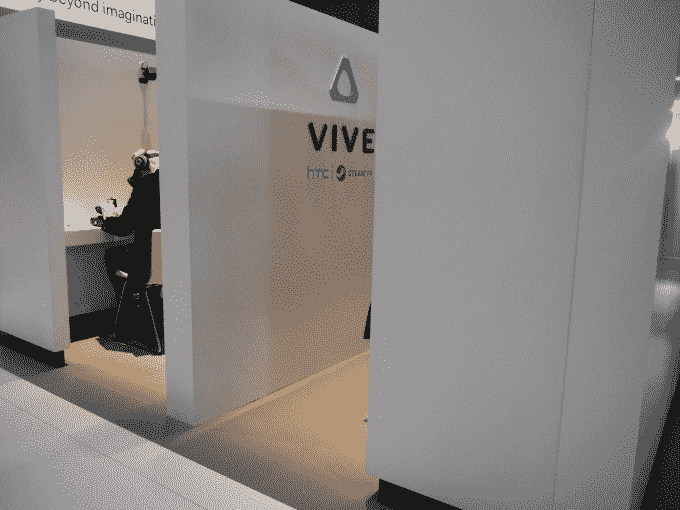
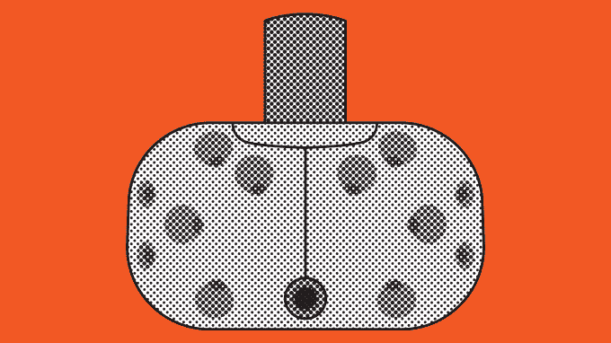
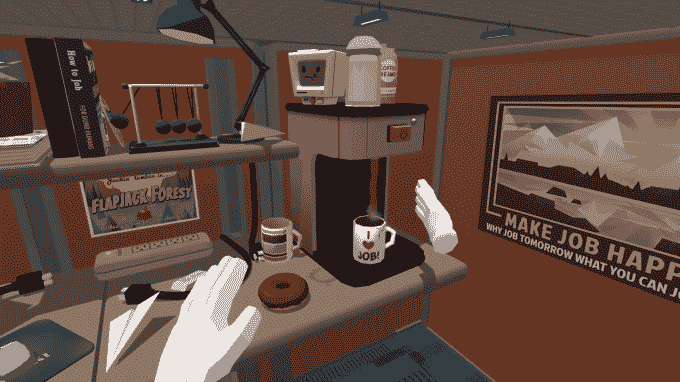
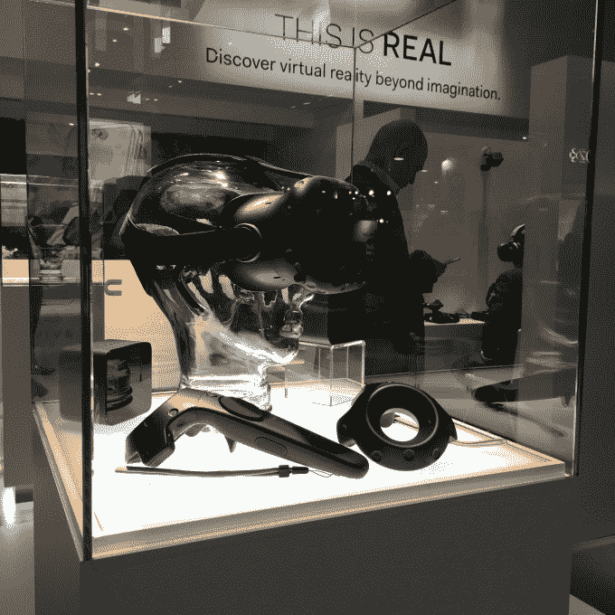

# 奇怪的感觉:HTC 勇敢的新虚拟世界

> 原文：<https://web.archive.org/web/https://techcrunch.com/2016/03/01/strange-sensations-htcs-brave-new-virtual-world/>

我注意到的第一件事是脸上有一种重量感。随之而来的是一种站在无边无际的太空中的感觉。一个单色 360 度消失点远景闪现在眼前。我环顾四周，向远处眨着眼睛，很快我的眼睛充满了勇气…欢迎来到 21 世纪虚拟现实的怪异世界。

走进最近被大肆宣传的科技重启，感觉如何？类似于——我*想象*——如果你被一台 20 世纪 60 年代的电视机吞噬，也许是在长时间盯着粗糙的屏幕之后，你可能会体验到的那种感觉。甚至有一根电线把你拴在墙上。这里没有现实，那么，只是你看的每一个方向的像素。

感觉像未来吗？坦白说没有，感觉很奇怪的复古。

将时钟往回拨一个小时，像素从我的眼前消失，我坐在真正的沙发上，不受束缚，看着一个视网膜高清的真人——HTC 公司副总裁兼产品设计师创意实验室团队负责人德鲁·巴福特。也是一个虚拟现实的传播者，因为我即将发现。

在我承认自己对虚拟现实持怀疑态度后，他说道，“我们刚刚还在谈论你们这些人，”他会意地斜眼看着坐在我左边的公关。他们都笑了——带着一点过于强烈的热情。HTC 在很大程度上依赖于 Vive 的成功。因此通常在虚拟现实重启时。怀疑论者在这个勇敢的新世界并不受欢迎。

Bamford 当然是“虚拟现实是未来”俱乐部的付费会员，但考虑到 HTC 业务的不稳定命运，他不得不成为会员。这家移动制造商近年来在竞争激烈的 Android OEM 领域受到了打击，并指望与游戏发行商 Valve 的虚拟现实合作关系来重振其设备制造业务。随着智能手机市场达到饱和点，更广泛的消费电子行业也在寻找下一个大获成功的机会。尽管很少有其他公司像 HTC 那样早涉足 VR 领域，或者下了这么大的赌注。

因此，我们来到了 HTC Vive，它将于下个月 4 月 5 日(T1 日)发货给买家，售价为 800 美元，加上驱动 VR 体验所需的足够强大的 PC 的价格。毫无疑问，这款时尚又复古的耳机是我在[世界移动通信大会](https://web.archive.org/web/20230403120211/https://techcrunch.com/tag/mwc16/)上获得半小时巴福特时间的原因。不断的技术公关鼓点告诉我们，虚拟现实将成为 2016 年的大事。HTC 是明确的信仰者；相对而言，是少数几家在这一新生阶段将耳机投入虚拟现实领域的公司之一。尽管越来越多的人参与进来——至少是在预算更高的智能手机驱动的移动虚拟现实(T4)领域。

但考虑到如今智能手机领域(iPhones 除外)的拥挤和利润的极度微薄，虚拟现实的贫瘠腹地可能会让 HTC 的管理层感到如释重负。他们很可能会想，在这个领域，我们终于可以脱颖而出，而不需要动用三星规模的营销预算。

可以肯定地说，“厌倦了智能手机”可能是最近试图点燃主流虚拟现实市场的更简洁的解释之一。这一次虚拟现实是真实的！或者说他们想让我们相信。

“我的背景是消费电子产品，主要是设计。所以我做过很多不同的产品，但是自从我九年前加入 HTC 以来，我几乎只做手机。所以对我来说，这有点像回到我的根本，致力于不同类型的消费者体验，”Bamford 说，他谈到了自己对 VR 的兴奋，因此也谈到了 HTC 的 Vive。(言外之意是，他对手机的厌倦。)

“但对于团队中的一些人来说，这是一种新事物——他们被聘为电话人员，现在他们喜欢学习设计你穿在身上的东西，或者让人们沉浸在虚拟现实中。

“对我来说，这有点像回到 2006 年，当时我们是智能手机体验设计的先驱，有机会建立新的模式。去发现新的互动方式。我们正在积极地这样做，尤其是现在的虚拟现实——这很有趣。”

“我们在虚拟现实中创造了一个完全不同的现实。“还有很多事情要做，”他补充道，“有很多问题需要解决。但我们要一步一步来，对吧。我毫不怀疑我们今天设计的东西在几年后会显得很过时。但这就是流程的运作方式。”

> 我们今天设计的东西在几年后会显得很过时。

在 MWC，世界上最大的移动行业会议上，HTC 的展台象征性地一分为二，被一条铺着地毯的大道分开，这条大道上来回穿梭着一排排西装。展台的一半展示了各种各样的移动硬件:不同的智能手机和联网设备(比如 HTC 与安德玛合作生产的可穿戴设备)组成了一个展览，展示了制作精良但令人遗憾的不受重视的硬件。

另一方面，它是纯粹的极简虚拟现实。在这里，Vive 品牌赫然在目，被 HTC 的绿色霓虹灯字随处可见。在为期四天的会议中，络绎不绝的人排队等待戴上耳机，坐在椅子上，在部分屏蔽的展位上播放虚拟内容，或者在铺着地毯的展示室里蹦蹦跳跳，用绘画般的背景探索 Vive 的房间级声明。任何路过的人都可以看到这些测试舱。

那么，HTC 勇敢的新公众形象就是西装革履的家伙对着稀薄的空气盲目打着手势的奇怪景象。为疯狂干杯，真的。

HTC 走到这一步已经花了很长时间。在去年的 MWC 上，HTC 的 Peter Chou 宣布了与 Valve 的合作，并首次正式展示了 Vive 带有明显酒窝的耳机。此后，周董离开了公司，将首席执行官的角色移交给董事长王雪红，今年早些时候，将虚拟现实描述为公司的首要任务。言下之意是，智能手机现在正在成为它希望用 Valve 构建的虚拟未来的副手。然而，在这个刚刚起步的阶段，虚拟现实的传播者只能梦想一个由像素化的“体验”组成的有利可图的业务。毫无疑问，炒作是真实的。利润——就目前而言——是诱人的想象。

那么，Bamford 的工作就是宣传虚拟现实的潜力。他确实会说话。

“我相信在游戏之外，这项技术还有各种各样令人难以置信的应用，”他告诉 TechCrunch。“例如，我们做了大量工作的一个领域是为设计师和工程师提供工具。因此，我们正在与法国达索系统公司等合作伙伴合作，研究如何让汽车设计师在虚拟现实中可视化汽车。这样他们就不用做这些全尺寸的粘土模型了。因为能够对产品的规模有所了解是非常重要的。看到不同的视线之类的东西，这不是你能在显示器上轻易做到的。许多汽车公司已经建造了这些巨大的洞穴系统，花费数百万美元来安装。现在他们基本上可以用 799 美元的 Vive 来代替它。

“太令人兴奋了。当然，从设计和工程的角度来看，另一个有趣的领域是建筑。因为它更多的是关于居住在一个空间里。还有感觉…不同的视线，感受在空间中移动是什么感觉，这对于 Vive 这样的房间尺度设备来说是再合适不过的应用了。这不是你能在显示器上真正体验到的东西。”

“我们正在与外科手术室等医疗合作伙伴合作，”他继续说道。“为脑外科医生做肿瘤的预可视化。这种应用——这是外科医生通常得不到的信息；他们通常得不到的肿瘤的 3D 视图。所以把这个东西戴在头上可能不太方便，或者有点傻，但在那样的环境下，你当然愿意这么做。”

专业企业用例是一回事，虚拟现实可以作为另一种特定任务的工作工具融入其中。但这不是一个能与智能手机的巨大吸引力相媲美的主流市场，而智能手机的巨大吸引力当然是每个手机制造商都渴望能够重复的技巧。然而，智能手机的巨大成功是很难效仿的。

真的会有人愿意整天待在 VR 里吗？那不就是反位吗？“不要把它排除在外，”Bamford 说，他建议某些类型的信息密集型办公室工作——比如金融工作者——可以用虚拟现实耳机取代他们的显示器。“当然，在办公室里，我可以看到许多人整天在办公桌前戴着虚拟现实耳机。”

> 当然，在办公室里，我可以看到许多人整天在办公桌前戴着虚拟现实耳机。

这听起来像是办公室无人机逃离可怕隔间的一种方式——在几乎*矩阵*风格的真实世界虚拟现实情节扭曲中…

【T2

“我个人感到非常兴奋的一件事是，你可以说这不是一个真正的游戏，而是为人们提供他们在现实世界中通常无法获得的体验的内容，”Bamford 继续说道。“例如，我们最受欢迎的演示之一是 Wevr 的 Blu……这是一种有蓝鲸的水下体验。所以这实际上并不是一个游戏，只是你在水下经历了一个大多数人在现实生活中从未见过的环境。我认为有一个巨大的机会去做更多这样的体验。例如，你可以参观珠穆朗玛峰的顶峰，或者回到罗马竞技场。只是在一个地方，探索一个我认为可以在 VR 中真正引人注目的地方。”

“我同意智能手机是一种更日常的产品，这是肯定的，”他补充道，重拾之前的思路。“这是一种你可以随身携带的东西，你可以在公共场合轻松使用，而不会看起来像一个电子人……但我不会忽视这样一个事实，即最终某些类型的人会用虚拟现实耳机取代他们的桌面显示器。取决于你在做什么。我们已经有了像 Envelop 这样的合作伙伴，他们正在构建允许 VR 开发人员在 VR 中开发的系统，因此他们不必有显示器，他们只需要使用一个耳机。

“虚拟现实行业的人肯定会这么做，但我认为即使在这之外，你也会看到——你可以想象金融业的人。这些人现在在他们的办公桌前有六个彭博屏幕。他们可以很容易地用 HMD[头戴式显示器]取代它，以便看到更多的数据——这就是它的全部意义。

“除此之外，我认为随着技术的小型化，随着 VR 和 AR(增强现实)的融合，你将获得类似 VR 的体验，而物理体验明显不那么疏远，对吧。你不必为了体验 3D 内容而把 HMD 放在你的眼前…从 AR 方面来说，将会有这种便携式 VR，可能不那么侵入，只是看起来像眼镜或什么的。但当然在办公室里，我可以看到许多人整天在办公桌前戴着虚拟现实耳机。”

他是否设想将来会有更轻的可穿戴设备？还是别的？“你将拥有全息显示器，”他建议道。“在那里你可以获得相似的内容体验。我们正在做的所有软件工作都可以转化为硬件，但随着时间的推移，这将是一个完全不同的硬件交付系统。我的意思是这是多年以后的事了，但也许不会太久。也许五年后你会做类似的事情。”

在我看来，不需要戴耳机的虚拟现实开始听起来不像是一个独立的行业，而更像是智能手机市场的附属品。毕竟，全息智能手机仍然是智能手机，只是增加了虚拟现实智能。就像几年前手机制造商试图推出 3D 屏幕一样。(这一努力也很快失败了。)

当然，这并不是说 HTC 在虚拟现实领域是一个纯粹的虚拟现实主义者；它只需要销售产品——不管采取什么样的形式。因此，它已经通过在 Vive 耳机上添加一个前置摄像头来跨越 VR/AR 流，允许一些现实世界的“内容”流入佩戴者的虚拟世界。在某种程度上，这是一个有益的安全功能，因此用户可以切换到 Vive 的旋转镜风格的视图，看看他们周围的房间里到底发生了什么——比如说，避免踩到留在地毯上的尖锐物体。或者偷偷看一眼他们的朋友在做什么。因此，AR/VR 混合的一个元素可能也有助于减少 VR FOMO。

对错过的担心明确推动了 Vive 的另一项功能:电话服务，这将使用户能够在 VR 中接听和拨打电话。Bamford 表示，在测试人员的反馈发现人们担心他们无法与朋友进行真实世界的交流后，增加了这一功能。考虑到人们有多爱他们的智能手机，消息和社交媒体应用程序可能已经非常明显了。即使是纯粹的现实生活的逃避也需要被淡化，以适应不断的连接需求——所以 Vive 既关注又回到现实世界。

> 当他们在那里呆了一段时间后，我们发现人们开始怀疑他们是否遗漏了什么。

“我们在研究中发现的一件事是，人们喜欢沉浸在虚拟现实中的想法，感觉好像他们在一个完全不同的地方，不用担心现实世界。但与此同时，当他们在那里呆了一段时间后，我们发现人们开始怀疑他们是否遗漏了什么。他们漏接电话了吗？他们是否错过了朋友的消息，等等。所以电话连接是解决这个问题的一种尝试。所以当你在虚拟现实中的时候，你可以打电话——你可以打电话。你可以收到短信，回复短信——这样你就可以享受虚拟现实，而不用担心错过现实生活中正在发生的事情。”

确保虚拟现实用户在进入虚拟世界时仍能感受到与现实世界关系的联系，这一需求提出了一个具体的设计挑战，Bamford 表示，HTC 仍在努力解决这个问题:如何将现实世界的信件/通知注入虚拟现实，而又不像人们所知的那样“破坏存在”。(简短的 VR 词汇表见本帖末尾。)

“我们不想打破现状。那是 VR 的中心租户。你不想把人们排除在体验之外。所以我们尽量做到不打扰，”他解释道。“现在它的工作方式是，你可以在任何虚拟现实体验中，你会在 3D 空间中收到通知，告诉你有电话或短信。然后，如果你想对通知采取行动，你可以打开一个非常标准的用户界面，让你做一些事情，如接听电话或发送一条短信的录音回复。”

我开玩笑地建议，也许电子邮件应该看起来像跳进视野的白兔。“这可能是下一个版本——所以是爱丽丝梦游仙境的风格，”巴福特笑着说。“不同的动物可以快步进入场景…”

“我认为，这是我们最终将实现的原生虚拟现实集成。但目前情况要简单得多，”他补充道。“这是一个极具挑战性的设计部分。坦率地说，我们仍在进行调整，以使其尽可能无缝。但我们正在努力。”

标准 UI 元素可以作为线框界面出现在 Vive 的虚拟空间中，使它们在更丰富的渲染环境中脱颖而出。使用这些菜单意味着使用捆绑的控制器来指向、滑动和点击。这些双棒——每只手握一个——有多个按钮和一个滑动垫，允许它们在某一时刻充当虚拟的手或枪或盾牌，然后在下一时刻充当点击设备来导航菜单。控制器重量轻，符合人体工程学，有时你可能会忘记你正拿着几块形状奇怪的黑色塑料，并相信你真的在举起半透明的盾牌或一对枪。

当然，这取决于内容的质量。

正如你所料，HTC 的精选演示在展示虚拟现实的沉浸式潜力方面做得最好，但我不太相信 Vive 将捆绑的一些内容。在一款名为 Job Simulator 的游戏中，控制者表现为一双卡通化的白手——试图用这双手套在虚拟办公室环境中拿起物品时，感觉笨拙得无可救药。但也许这才是重点？玩一个游戏，在这个游戏中，你假装自己在模拟一份虚假的办公室工作中无能为力，所有的事情都显得滑稽可笑，而且没有什么真正需要做的事情，这大概是某个人、某个地方的有趣想法。

尽管如此，在内容方面，虚拟现实提供了比轻度乏味更糟糕的前景——彻头彻尾的恶心。关于这种风险，Bamford 说:“我们非常有信心，我们的技术将使你在任何虚拟现实体验中最少生病。”

> 我们非常有信心，我们的技术将使你最少生病的任何虚拟现实体验。

在我自己的半小时左右的 Vive 演示中，这种说法至少站得住脚。我离开时没有感到恶心。但我确实感受到了眼睛里的砂砾感，就像你一直在努力看质量差的屏幕，或者试图在黑暗中阅读，或者花了太多时间暴露在紫外线下。我也很注意自己的移动方式——避免做出任何快速或不平稳的动作。在我看来，说到虚拟现实，FON(害怕恶心)和 FOLLAD(害怕看起来像个傻瓜)至少和 FOMO 一样强大。

Bamford 说:“我们确实考虑了 90fps，非常低的延迟，低持续显示，毫米精度跟踪，我们提供的 Vive 不太可能让你生病，”尽管他很快补充道，“如果内容设计正确”。

在测试 Vive 时，他个人有没有感到恶心？他说，只有在出了问题的时候——比如当使用一个不能正常工作的开发原型的时候。然后他感到“头晕”。

即便如此，他也承认有很多变量在起作用——其中一些是 HTC/Valve 无法控制的，因为他们依赖“数百名”开发者来创造吸引人们进入他们的虚拟空间所需的“令人兴奋”的内容。

“在你如何设计体验的过程中，有很多可变因素。而且有些经历比其他的更容易让你难受。因此，我们讨论和辩论的一个问题是，是否应该有某种评级系统，来衡量从特定类型的内容中得病的倾向。但这很有争议，因为你不想让人们对某些内容失去兴趣，每个人对他们的反应都有非常独特的感觉，所以我们还没有在这方面走得太远。但我认为这是可能发生的，我认为可能会有一个评级系统，在一到五的范围内，这或多或少会让你感觉不那么恶心。”

“这就是为什么我们真的需要一种方法来过滤我们体验中的最佳内容，并确保不良内容不会进入市场，因为它可能会毒害水井，”他补充道。

除了眼睛疲劳，我在试用 Vive(应该强调的是，在 HTC 自己控制的演示环境中，向他们展示他们选择的演示内容)时体验到的最强烈的负面感觉是一种被约束的感觉。但鉴于这种(第一代)虚拟现实体验需要在你的眼睛上戴着沉重的耳机，同时在一个小空间里行走，拴着一根很容易与你的脚纠缠在一起的电缆，所以毫不奇怪，离开时感觉更多的是束缚而不是解放。那么，房间规模的虚拟现实，就意味着能够在一个给定的方向上迈出试探性的几步。只要没有一堵墙挡住去路。

另一个演示——谷歌的 Tilt Brush，一个让你在空中画出虚拟颜料轨迹的绘画程序，它也将与 Vive 免费捆绑在一起——最终让我感到有点幽闭恐惧症，因为我最终把自己画进了一个由发光的橙色条纹组成的笼子里。问题是，你在虚拟现实中看到的元素总是有侵犯你个人空间的风险；因为这里当然没有屏幕障碍，你就在内容之中——所以有可能，你最终会感到被像素包围和/或包围，而不是在无限的虚拟空间中获得解放。当然，你总是可以直接穿过第四堵墙(可以这么说)，穿过这些虚拟物体，因为它们不是——哈哈！—真实。但是因为它们看起来是实心的，并且是设计来欺骗你的大脑去相信，那么你对你有多少活动空间的感知就会缩小以适应它们。

在另一点上，在我的 Vive 演示中，我部分物化在一个漂浮在头顶的月亮里。不安可能是最恰当的词。颇具讽刺意味的是，我不得不采取一些辅助措施，试图在虚拟的无限外太空中找到一点个人空间……被困在虚拟无限中的感觉？是的，当你写虚拟现实的时候，这些是你最后输入的奇怪的句子。

谈到四处移动，Bamford 表示，HTC 的 Vive 可能会让用户根据他们对虚拟现实中更快的动画的敏感程度来打开和关闭定制元素之一，这是一种心灵传输功能，让人们从不同的位置“zap 自己”(正如他所说的那样)，以避免需要实际步行到他们的(物理)游戏空间有一些硬限制的地方。(Vive 的跟踪系统在 15 英尺乘 15 英尺的空间达到最大值。)

“最安全的方法是把你的位置闪烁到一个新的地方。你瞬间被传送了。但实际上有些人的偏好——包括我的偏好——是做真正快速的过渡，动画过渡……有些人称之为可笑的速度，所以这是真正快速的动画。这一点也不困扰我。实际上对我来说，我相信它给你提供了更多的背景，因为你在移动的时候不会迷失方向。你知道你是怎么做到的。但对一些人来说，这实际上让他们非常恶心。”

“这就是我们正在研究的方法，让人们根据他们的敏感程度来开关这些东西。这需要是个人偏好，”他补充道。

根据 Bamford 的说法，HTC 内部也有很多关于虚拟现实设计的另一个元素的辩论:人们是否希望拥有逼真的(即自拍风格)头像。或者他们是否想成为成熟的幻想角色 stylee——看起来像一只卡通狗或什么的。这个问题在单人游戏中不会出现，但在社交虚拟现实中会出现 Bamford 相信社交虚拟现实会成为现实。他断言，当人们实际上不在一起时，他们会希望虚拟地聚在一起。

> 尽管你认为虚拟现实是一件非常孤独的事情，你只是在地下室戴着耳机，但人们希望进入虚拟世界，然后与其他人互动。

“人们确实希望在虚拟现实中进行社交。尽管你认为虚拟现实是一件非常孤独的事情，你只是在地下室戴着耳机，但人们希望进入虚拟世界，然后与其他人互动，所以这对我们来说是一个巨大的调查领域。

“社交元素有点滑稽。但是我们已经研究过这样的场景，例如，坐在你的另一半旁边的沙发上，你们都戴着耳机看虚拟现实电影。我认为这将会发生，”他继续说道。“你仍然可以和那个人互动，只不过你是在虚拟现实中。”

当然，只是不要俯身亲吻。把 VR 耳机砸在一起听起来一点都不好玩。

VR 要毁掉多少婚姻，我开玩笑。"与此同时，有多少人会在虚拟现实中相遇并非常快乐？"他反驳道。所以也许虚拟现实也能拯救第二人生。(是的，[林登实验室已经对这项技术产生了浓厚的兴趣。)](https://web.archive.org/web/20230403120211/http://www.roadtovr.com/project-sansar-screenshots-linden-lab-virtual-world-next-gen-second-life/)

或者，它可能会推动网上约会的下一件大事。(尽管如此，接下来最紧迫的问题是:在虚拟现实中，会有人知道你在现实生活中是否也是个呆子吗？)

关于虚拟形象的设计，Bamford 说内部的争论还在继续。“例如，我们已经研究了一些技术，可以让你轻松扫描自己的脸，创造一个看起来像你的化身。但是不清楚是否有人真的想这么做。或者当然，如果你扫描你自己，每个人都会同意你想要改进/润色你的头像。所以它看起来有点像你，但却是你的更好的版本。”

以目前的技术，虚拟现实头像能做到多逼真？“它可以看起来像你，但挑战在于制作眼睛以及眼睛和嘴巴周围的表情的动画，这样它看起来就很真实，”他说，承认仍然存在“恐怖谷问题”。

“很可能你会看起来像一个令人毛骨悚然的你，”他承认道。

我观察到，你在这里建立的世界非常奇怪。“好吧，总得有人去做，”他说，然后更强调地断言:“随着时间的推移，它会显著改善。我认为改进会很快。例如，我们已经与合作伙伴合作，从你的声音中提取音频流，并自动让你的嘴动起来，以匹配你所说的话。它看起来仍然有点滑稽，但最终随着角色的操纵变得更好，随着语音识别变得更好，它可能会变得可行。”

那么，人们会对 Vive 的第一代虚拟现实体验感到惊叹吗？还是会经历几次迭代——以及 Bamford 一直在谈论的一些改进——来磨练硬件和软件，使体验更加逼真，不再像在恐怖的山谷中那样模糊/令人毛骨悚然？

“我绝对认为人们会惊叹不已，”巴福特说。“我已经在技术领域工作了很长时间——20 年。我做了很多当时人们认为是开创性的东西，但我从来没有做过像虚拟现实那样引起反响的东西。我的意思是，我见过很多人做演示，真的不得不坐下来，因为感觉超负荷。

“你从这件事中得到的反应令人印象深刻。实际上，我从来没有见过任何人在演示后不是这样——这并不是说它在某种程度上令人兴奋。”

和平蓝鲸的演示带来的感官超负荷是一回事，但当涉及到某些类型的虚拟现实游戏和体验时，可能会有更敏感的考虑。关于这一点，Bamford 讲了一个他第一次在 VR 中玩僵尸游戏《亚利桑那阳光》的趣闻。

“没有人告诉我如何拿起枪并使用它，所以我不知道如何保护自己。这些僵尸向你扑来，然后开始用四肢攻击你。实际上，这很可怕。

> 我认为确实需要根据内容类型给出某种警告——“这会严重扰乱你的精神”。

“所以你可以想象人们真的很害怕玩这些东西，所以我认为确实需要根据内容类型发出某种警告——“这可能会严重扰乱你的精神”。如果你没有准备好内容。所以你必须知道你将要面对的是什么。我认为必须围绕什么样的内容适合不同的人进行一些教育。”

“但对于想要害怕的人来说——有很多人都想害怕，这将是你能想象到的最令人满意的可怕经历，”他补充道。

Bamford 不会留下来看我做现场演示。但是他确实给了我一些建议，如果我觉得自己有点变绿了，我该怎么办。

“记住，”他告诉我，“你可以随时闭上眼睛。”

阿门。

当天晚些时候离开会议时，我的虚拟现实体验消失在巴塞罗纳的阳光下，一个残留的想法从我的大脑深处浮出水面:哇，*现实—* 现在看起来真的很棒…

## **怪异世界的怪异词汇:虚拟现实词汇表**

**HMD**–*头戴显示器。又名虚拟现实耳机*

**鼻垫**–*Vive 耳机内部的可互换插件，旨在确保其紧贴用户的面部/鼻子*

**360 度头部追踪**——一个可以追踪用户头部的虚拟现实系统，无论它如何移动

**房间大小的虚拟现实**——在虚拟现实中行走并被跟踪的能力，而不需要坐着或站着不动。仍然需要将耳机连接到为 VR 供电的 PC 上

**灯塔**–Vive 的双基站内的发光系统，通过确定佩戴者头部的位置为其 360 度头部跟踪提供动力。基站用激光扫描房间，而耳机上的多个光电传感器记录光扫描之间的时间——使用这些数字来计算用户头部的位置

**伴侣**-Vive 中的一项安全功能，可以将现实世界物体的线框视图输入到 Vive 的虚拟世界中，以帮助防止用户伤害自己，例如，撞到墙上

**低余辉显示**–一种减少 VR 中感知到的运动模糊/抖动的技术，当像素与用户的视点正确对齐时，仅短时间照亮像素，并在视点移动时立即关闭像素

**临场感**——虚拟现实用户体验到的沉浸感；设计师的目标是永远不要“打破现状”，就像他们所说的那样

**体验**–虚拟现实内容的设计本身并不是为了游戏，而是为了唤起用户体验中的场景/遭遇的感受或情绪

**恐怖谷**——制作人形虚拟角色动画的挑战，让它们看起来逼真，而不是令人毛骨悚然，例如制作眼睛或嘴唇周围的表情动画，以与口语同步

**社交虚拟现实**——在虚拟环境中与其他虚拟现实用户交往，而不是逃避到一个孤独的世界虚拟现实体验中

**预可视化**——在现实生活中实际查看对象之前，在虚拟现实中查看模拟 3D 内容的能力

**可笑的速度**——一种移动机制，可以让虚拟现实用户在游戏世界中从一个地方转移到另一个地方，以帮助保留位置背景并减少迷失方向。会引起恶心