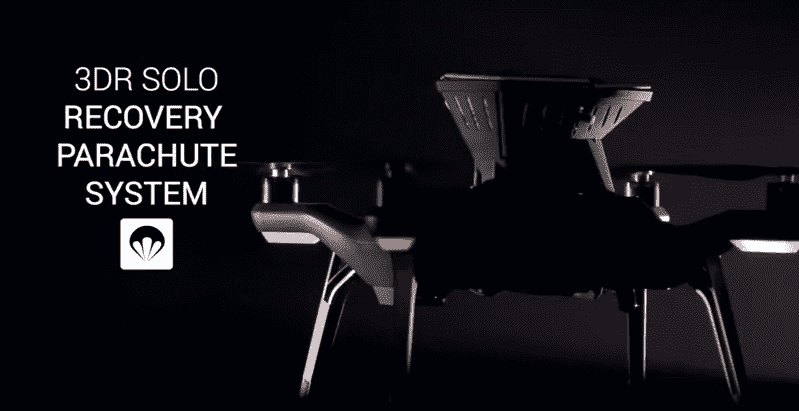
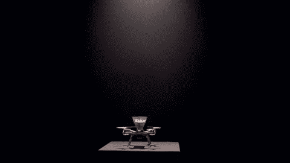

# 使用 para zero safe air TechCrunch 为您的无人机系上降落伞

> 原文：<https://web.archive.org/web/https://techcrunch.com/2016/03/14/strap-a-parachute-onto-your-drone-with-the-parazero-safeair/>

# 用 ParaZero SafeAir 给你的无人机系上降落伞

无人机价格昂贵，坠毁在所难免。ParaZero 有一个解决方案:降落伞。有了 [ParaZero](https://web.archive.org/web/20221210051913/http://parazero.com/) SafeAir 产品，一架无人机安装了一个包含降落伞的太空舱，该降落伞在非常低的高度有效，并在不到一秒钟内展开。该公司表示，该系统在没有用户干预的情况下工作，因此当你的无人机决定在街区周围兜风并突然耗尽电池时，它应该会展开。

目前，该系统是为业余无人机爱好者设计的，第一款上市的 SafeAir 产品将用于 3DR Solo。该公司过去也曾与 DJI 合作，最终希望将其产品扩展到高端和专业市场。它把这个系统看作是天空中的一种安全气囊。

该公司由一群航空电子专业人士于 2012 年成立，旨在解决无人机安全问题。ParaZero 的首席执行官 Eden Attias 告诉 TechCrunch，该公司开发了一种降落伞部署平台，可以与小型业余无人机和重达数百公斤的大型商用无人机一起工作。ParaZero 甚至为马丁喷气背包开发了一个系统。

“很明显，无人机将在我们的未来发挥重要作用，无论是用作航空相机、快速运输系统，还是用于私人享受。有鉴于此，确保这些设备安全运行，保护地面上的人员和财产是最重要的，”阿提亚斯说。“我们的系统为行业提供了一个可靠的解决方案，就像一个安全气囊，无论出现严重故障还是断电，它都会自动动作。最重要的是，我们的系统工作迅速，在非常低的高度确保最大的效率。”

ParaZero 大约三个月前开始筹集资金，以扩大业务规模。这显然是对的，飞行大型和非常昂贵的无人机的公司可能会期待类似的系统，以增加对损失或坠毁的保险。

https://www.youtube.com/watch?v=ME8AP4E3v80