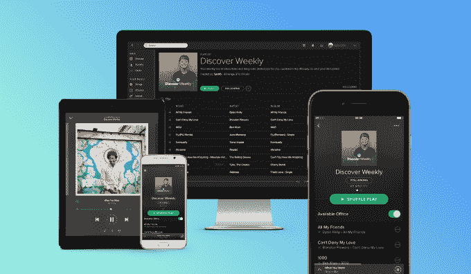

# Spotify 以邪恶的条款筹集了 10 亿美元的债务来对抗苹果音乐 

> 原文：<https://web.archive.org/web/https://techcrunch.com/2016/03/29/stream-with-the-devil/>

点播流媒体音乐是不可避免的，因此 Spotify 正在竭尽全力赢得与苹果的竞争。谁能更快地与客户签约，消费他们的数据和网络效应，谁就能在很长很长一段时间里从他们身上赚钱。因此，Spotify 现在愿意以丑陋的、剥削性的条件筹集资金，以获得以后赚取这些财富的更好机会，这是有道理的。

今天，Spotify 从 TPG、Dragoneer 和高盛的客户那里筹集了 10 亿美元的可转换债券，这是华尔街日报的 Douglas MacMillan 最先报道的。通过增加债务而不是股权，它不必担心以低于 2015 年 6 月设定的 85 亿美元的估值进行的下一轮融资发出不良信号。

Spotify 证实了这一消息，TPG 告诉我“这笔融资给了他们进一步加强领导地位的战略资源。”这笔钱将用于增长和营销。

**但是这里有一个问题。**

如果 Spotify 表现不佳，一些激进的交易条款可能会让它损失惨重。

TPG 和 Dragoneer 将以 Spotify 最终 IPO 设定的股价的 20%折价将债务转换为股权。如果它在接下来的一年内没有上市，这个折扣每隔六个月就会增加 2.5%。

Spotify 还必须为这笔债务支付 5%的年息，每六个月增加 1%，总计 10%。最后，TPG 和 Dragoneer 可以在 IPO 后仅 90 天，Spotify 员工和其他投资者的 180 天锁定期结束之前出售股票。

如果 Spotify 相对于 Apple Music 表现不佳，这一切都可能让员工感到不安，因为这笔交易让这些后期投资者获得了更便宜的股票和早期销售优势。话说回来，员工的股票只有在 Spotify 成功时才有价值，它需要这笔现金来这样做。

【更新:如果 Spotify 能够大幅增长其价值，并且 IPO 进展顺利，折扣和早期销售条款也不会那么糟糕。可以说，这比现在通过股权融资要好，如果 Spotify 表现良好，以后股权融资的价值会高得多。

一位熟悉 Spotify 财务状况的消息人士告诉我，Spotify 的银行账户上仍有€5.7 亿英镑的资金，因此它没有必要去筹集这笔资金。显然，该公司希望通过债务融资，因为它相信今年会很顺利。

债务确实给 Spotify 提供了进行收购的机会。随着 SoundCloud 和 Pandora 陷入困境，Spotify 有可能将更多独立音乐或广播听众带入其音乐帝国。]

Spotify 为什么会同意这些咄咄逼人的条款？因为它在和历史上资金最雄厚的公司竞争:苹果。

世界上许多人甚至不知道点播流媒体的存在。销售这种产品的公司将不得不进行昂贵的广告宣传来教育消费者，抢在别人之前与他们签约。他们还必须与顶级艺术家建立关系并达成协议，以独家或提前获得他们的音乐。此外，拥有潜在收购 SoundCloud 或 Pandora 等其他音乐公司的资金可能会让 Spotify 在这场斗争中占据优势。

然而，这些都不便宜。因此，Spotify 签署了一项可怕的协议。