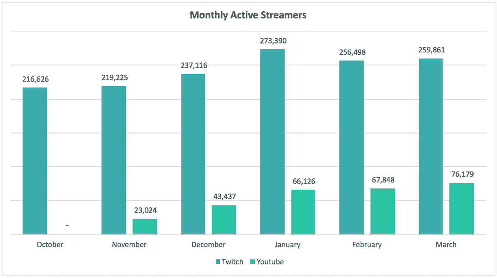

# 视频流涌向 YouTube Live，但是钱(和人群)仍然在 Twitch 

> 原文：<https://web.archive.org/web/https://techcrunch.com/2017/04/18/streamers-flock-to-youtube-live-but-the-money-and-crowd-is-still-at-twitch/>

YouTube Live 在追赶现有的 Twitch 方面取得了令人印象深刻的进展，但它还有很长的路要走。从好的方面来看，看起来他们不会无路可走:流媒体看起来是一个相当可持续的业务，来自 [Streamlabs 最新报告](https://web.archive.org/web/20230405030430/https://blog.streamlabs.com/livestreaming-q117-twitch-vs-youtube-avg-spend-ltv-and-tip-volumes-8263c6a9f99e)的数据显示。

根据 Streamlabs 的流媒体助手应用收集的数据，YouTube Live 在过去六个月的增长速度超过了 Twitch。对于一个强大的竞争对手提供的新服务来说，这是可以预料的，但像这样的挑战者根本没有获得真正的牵引力也并不少见。

 如今，Twitch 的月活跃用户超过 25 万，而且还在断断续续地增长；这个月 5000，下个月 15000。YouTube 第一个月增加了 23，000 人，现在已经增长到 75，000 人左右(同样是月活跃用户)。这是健康的增长，其势头似乎远未消失。

也就是说，Twitch 仍然产生了 Streamlabs(被大量流媒体工具使用)直接观察到的 96%的小费收入。

最新报道的一个令人惊喜的统计数据是，老观众给的小费比新观众多得多。两年前的账户平均每年的小费总额超过 80 美元，而新账户的小费约为 23 美元。这些数字在这两个极端之间平稳增长，这意味着人们正把它作为一种常规爱好，就像其他任何事情一样，并相应地花钱。

这支持了流媒体本身，他们越来越有可能从他们的频道中获得实际收入。非赞助横幅的数量也在增加。

我与 Streamlabs 的首席执行官阿里·莫伊兹(Ali Moiz)简单聊了聊这个行业的现状。特别是，我担心随着 Twitch 不再像杂草一样生长(仅仅像普通植物一样)，这可能会对流媒体业务的未来的疯狂猜测产生一些影响。

Moiz 承认 Twitch 的增长已经放缓，但指出这更多是由于良性竞争。

“与几年前相比，今天开始的新 streamer 有了更多的选择。当时，基本上任何对直播感兴趣的人都必须去 Twitch，”他说。现在你有了 YouTube、脸书、Instagram 和其他六个网站。"

但是，我问，更多的选择并不意味着更多的彩带或更多的观众。未来五年的增长将来自哪里？

“在我看来，最大的增长将来自游戏之外。移动广播才刚刚起步，”Moiz 说。“旅游、时尚、美容、演唱会、美食(那在韩国是大的)。博彩业将会有不错的增量增长，但不会像过去那样增长两倍或三倍。”

你可以在 Streamlabs 的 Medium post 上阅读完整的报告(他们现在每季度出版一期，因为第一期是在一月份)。