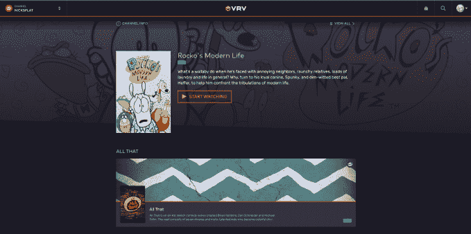

# 流媒体服务 VRV 增加了 NickSplat，这是一个以经典的 90 年代 Nickelodeon TV TechCrunch 为特色的频道

> 原文：<https://web.archive.org/web/https://techcrunch.com/2018/08/28/streaming-service-vrv-adds-nicksplat-a-channel-featuring-classic-90s-nickelodeon-tv/>

专注于粉丝的数字流媒体服务公司 VRV 与维亚康姆和 Nickelodeon 签署了一项协议，将推出一个新的流媒体频道，专门播放尼克的 90 年代经典节目等。该公司表示，新频道名为 [NickSplat](https://web.archive.org/web/20230123125344/https://vrv.co/nicksplatguide/index.html) (是的，真的)，将作为一项顶级服务通过 VRV 播放，并将为粉丝提供近 30 部经典剧集。

它的阵容包括像“啊啊啊！！！《真正的怪物》、《猫狗》、《道格》、《洛科的现代生活》、《所有那些》、《你害怕黑暗吗？、“克拉丽莎解释了一切”、“凯南&凯尔”、“隐藏神庙的传说”、“愤怒的海狸”、“野生荆棘”等等。

VRV 说，以后还会增加更多的节目。

该频道还将提供每月 5.99 美元的单点订阅，并将包含在每月 9.99 美元的 VRV 高级捆绑包中。从某种意义上来说，单点选择相当于它是自己的流媒体服务，但没有自己的独立平台，就像维亚康姆的 [Noggin，](https://web.archive.org/web/20230123125344/http://www.noggin.com/)针对学龄前儿童。

除了 NickSplat，VRV 的优质套餐还提供各种频道，包括 Ellation 的动漫流媒体服务 Crunchyroll、Funimation、Rooster Teeth、schill 等，以及《HarmonQuest》、《Killjoys》、《Thundercats》和《加里和他的恶魔》等独家系列

维亚康姆负责分销和业务发展伙伴关系的执行副总裁萨姆·库珀(Sam Cooper)在一份关于此次发布的声明中表示:“VRV 拥有热爱动画的成熟用户群，是推出我们 NickSplat 频道的完美平台。”。

“维亚康姆的内容——包括我们丰富的定义类型的电视节目库——需求量很大，我们的观众总是在寻找新的和创新的方式来享受我们的节目。我们致力于寻找最佳合作伙伴，将我们的个人品牌直接带给消费者，与 VRV 的这种关系是我们战略中令人兴奋的一步，”库珀补充道。

[VRV 于 2016 年进入市场](https://web.archive.org/web/20230123125344/https://techcrunch.com/2016/06/14/crunchyroll-owner-ellation-announces-vrv-a-multi-channel-streaming-video-service/),成为亚马逊 Prime 视频频道的竞争对手，后者也在一个目的地提供利基数字流媒体内容。然而，VRV [向](https://web.archive.org/web/20230123125344/https://help.vrv.co/hc/en-us/articles/215116623-VRV-Premium-and-FAQ-Details)会员提供超过 20，000 小时的免费内容，可以选择升级到高级等级以获得更多内容，以及独家内容。另一方面，亚马逊的频道只是一种点菜服务，会员可以挑选他们想要的频道。目前没有任何可用的频道包。

此外，与亚马逊渠道不同，VRV 并不针对主流用户群，而是更专注于服务各种粉丝——动漫迷、游戏玩家、漫画迷、科幻和奇幻迷等。

有了 NickSplat，它现在的目标人群略有不同——从小看着线性电视上的 Nickelodeon 长大的孩子，他们怀念那些老节目。也许他们现在甚至想为自己的孩子播放这些视频。

对于维亚康姆来说，与 VRV 的合作让它有机会以不同的方式将旧的图书馆内容货币化，而不是将其扔在更大的平台上，如网飞(坦率地说，在那里会有更多的观众看到)。然而，VRV 并不是唯一可以找到这些老节目的地方——在其他服务上还有[和【Nick classic 系列，如](https://web.archive.org/web/20230123125344/https://nerdist.com/9-best-90s-nicktoons-currently-streaming/) [Hulu](https://web.archive.org/web/20230123125344/https://www.hulu.com/series/doug-248d614e-04eb-487d-b1d9-8a3c529c355a) 和亚马逊——后者可以按集或季购买。换句话说，如果你对一两个老尼克秀有点着迷，你可能会想去别的地方找。NickSplat 只有在你想要一大本经典 Nickelodeon 的背景目录时才有意义。

《VRV》可以在线下载，也可以在 Xbox One、PS4、Apple TV、Roku、Fire TV、Android TV、Chromecast、Android 和 iOS 上作为应用程序下载。这项服务的运营商 Ellation 现在完全由 at 所有，因为 AT 已经买下了 Chernin Group 在 Ellation 母公司 Otter Media 的控股权。