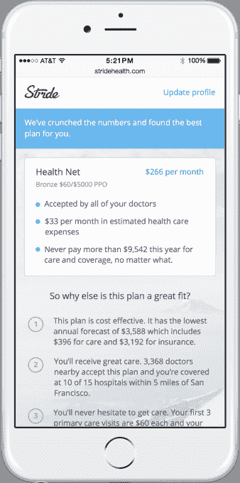

# Stride Health 为其医疗保健推荐服务 推出新的移动应用程序

> 原文：<https://web.archive.org/web/http://techcrunch.com/2015/01/16/stride-health-launches-a-new-mobile-app-for-its-healthcare-recommendation-service/>

Stride Health 推出了一个新的专注于移动的医疗保健推荐引擎版本，目标是[陷入困境的工人](https://web.archive.org/web/20230315104459/http://nymag.com/daily/intelligencer/2014/09/silicon-valleys-contract-worker-problem.html)，他们组成了全国 [1099 名劳动者](https://web.archive.org/web/20230315104459/http://www.thenation.com/blog/194041/crowdsourcing-bad-workers)。

本质上，Stride 是联邦资助的 healthcare.gov 的私人竞争者。该公司表示，他们的服务为医疗保险提供了一个高科技的推荐引擎，可以满足那些寻找新保险计划的人的个人需求。

该公司的主要业务是新的流动劳动力。根据该公司的数据，大约 60%的用户在移动设备上开始搜索医疗保险。其中近一半(约 45%)最终通过移动设备实际加入了健康计划。

抛开关于新契约经济的争论(要么代表硅谷最新一代的农奴，要么代表自由职业的未来，对那些想自己当老板的人来说是一个福音)，患者保护与平价医疗法案要求个人寻求保险，否则将面临处罚——而 Stride Health 让这个过程变得更容易。

随着越来越多的美国人转向契约经济，这也变得更加必要。根据 Stride 的数据，美国有超过 5000 万名自由职业者，约占总人口的 34%。

[在](https://web.archive.org/web/20230315104459/http://healthdata.gov/blog/striding-better-health-plan-thanks-hhs-data-sets.%20%20We've%20since%20added%20private%20expenditure%20data%20sets%20and%20real-time%20drug%20pricing%20for%20every%20major%20pharmacy%20in%20the%20US,%20but%20we%20couldn't%20have%20gotten%20off%20the%20ground%20pre-Seed%20without%20HHS'%20Health%20Data%20Initiative.)成立不到一年后，该公司已将其业务从加州扩展到佛罗里达州、伊利诺伊州、宾夕法尼亚州、纽约州和得克萨斯州，并在由富达生物科学公司和 NEA 公司牵头的一轮种子融资中正式披露了 240 万美元。之前的投资者包括 Kleiner Perkins cau field&Byers、DCM、 Mayo Clinic 和医疗保健种子基金 Rock Health 也参与其中。

该公司还签约成为按需服务公司优步和 TaskRabbit 的官方合作伙伴，预装在这些公司提供给合同工的设备中。该公司将在 11 月 15 日开始的公开注册周期中向承包商提供保险建议。

“你可以快速建立自己的健康档案，”Stride Health 的联合创始人 Noah Lang 说。对于大多数美国人来说，政府网站很难理解，也很难在网上浏览，更不用说在移动设备上了。

Stride 的推荐服务要求用户填写一份简短的问卷，内容包括病史、所在地、家庭、先存疾病、处方和当前医生等信息。正如郎在一封电子邮件中所写的，“Stride Health 从为你全年的潜在健康投资生成财务预测开始，然后根据你对医生、药物和护理质量的偏好，缩小到你的个性化计划建议。”

郎说，这比依赖政府网站要简单得多。“从州或联邦交易所购买保险有很多障碍，”他说。“他们不支持手机，而且说的是保险公司的语言。”

Lang 说，在一个大约 11%的人口没有保险，52%的保险人口正在转换的国家，保持低转换成本和让用户知情是关键。

Stride 通过从用户最终购买的医疗保险中收取佣金来赚钱。“只有你买了我们才赚钱，而且消费者一分钱都不用花，”他说。

郎和他的联合创始人马特·布特纳都是健身迷，马特·布特纳是一名数据科学家和工程师，曾为网飞和 Priceline 等公司从事个性化项目，他们在攀登惠特尼山时相遇。

事实上，该公司吹嘘其服务不仅对合同工来说是理想的，而且对非传统的个体户来说也是理想的，如极限运动运动员和目前政府网站无法满足其需求的人群(如美国说西班牙语的人群)。

