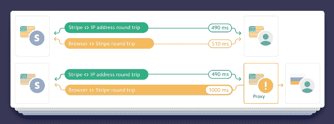

# Stripe 首次推出面向大企业的雷达反欺诈人工智能工具，称迄今已阻止了 40 亿美元的欺诈

> 原文：<https://web.archive.org/web/https://techcrunch.com/2018/04/18/stripe-debuts-radar-anti-fraud-ai-tools-for-big-businesses-says-it-has-halted-4b-in-fraud-to-date/>

网络安全继续成为数字世界中越来越多的焦点和问题，现在 Stripe 正在推出一款新的付费产品，希望能够帮助其客户更好地应对数据泄露的一个更大的副作用:在线支付欺诈。今天，Stripe 宣布推出欺诈团队雷达(Radar for Fraud Teams)，这是其免费的基于人工智能的雷达服务的扩展，与 Stripe 的核心支付 API 一起运行，以帮助识别和阻止欺诈交易。

Stripe 还计划在未来几个月进行进一步的努力。Stripe 负责雷达和机器学习的工程经理迈克尔·马纳帕特(Michael Manapat)表示，该公司将很快推出一个“动态认证”的私人测试版，该测试版将引入双因素认证。这是 Stripe 通过苹果和谷歌等合作伙伴首次尝试在支付中使用生物识别因素。通过这些和其他方式，指纹和其他物理属性已经成为越来越受欢迎的识别手机和其他用户的方式。

Radar 的初始版本于 2016 年 10 月在发布，从那时起，Manapat 告诉我，它已经为其“数十万”客户防止了 40 亿美元的欺诈。

考虑到电子商务受欺诈影响的范围更广——一项[研究](https://web.archive.org/web/20230322103414/https://www.signifyd.com/blog/2017/10/26/new-study-reports-57-8-billion-ecommerce-fraud-losses-across-eight-major-industries/)估计，在 2016 年至 2017 年的一年时间里，八个主要垂直行业的电子商务欺诈总额为 578 亿美元——这是一个不错的下降，但还有很多工作要做。Stripe 知道全球五分之四的支付卡号(因为它的支付 API 无处不在)，这使它有能力解决这个问题。

新的付费产品伴随着核心免费产品的更新，Stripe 将其命名为 Radar 2.0，Stripe 声称它将内置更先进的机器学习，因此可以将其欺诈检测能力比前一版本提高约 25%。

整个产品的新功能(免费和付费)将包括能够检测代理 VPN 何时被使用(欺诈者可能会使用代理 VPN 来假装他们在一个国家，而实际上他们在另一个国家)，并摄取数十亿个数据点来训练其模型，该模型现在每天自动更新——这本身是对 Manapat 表示 Stripe 在过去几年中一直使用的较慢且更手动的系统的改进。

同时，付费产品是一个有趣的发展。

在最初推出时，Stripe 的联合创始人约翰·科利森暗示，该公司将考虑未来推出付费产品。Stripe 多次表示，它不急于上市——一位发言人本周重申了这一声明——但值得注意的是，付费层是一个迹象，表明 Stripe 正在慢慢建立更多的货币化和创收。

截至 2016 年最后一轮大融资，Stripe 的估值约为 92 亿美元。最近，它[在 2016 年 11 月的那轮融资中筹集了 1.5 亿美元](https://web.archive.org/web/20230322103414/https://techcrunch.com/2016/11/25/payments-provider-stripe-has-raised-another-150-at-a-9b-valuation/)。[宣传手册](https://web.archive.org/web/20230322103414/https://my.pitchbook.com/profile/54782-29/company/profile#board-members)指出，今年 3 月的 4400 万美元实际上与发行股票有关，该股票与该月悄悄收购[销售点支付初创指数](https://web.archive.org/web/20230322103414/https://www.pymnts.com/news/partnerships-acquisitions/2018/stripe-pos-software-startup-index-acquisition/)有关——顺便提一下，这是 Stripe 扩大其在支付生态系统中的地位和位置的又一有趣举措。Stripe 总共筹集了大约 4.5 亿美元。

Teams 产品针对的是规模足够大、有专门欺诈检测人员的企业，每笔交易的价格将增加 0.02 美元，此外 Stripe 的基本交易费用为 2.9%的佣金，外加每成功一笔卡收费 30 美分(美国为)(其他市场的费用有所不同)。

使用付费产品的主要好处是，团队可以定制雷达如何处理他们自己的事务。

这将包括为审查交易的团队提供一套更完整的数据，以及一套更精细的工具来确定何时何地审查销售，例如根据使用模式或交易规模。当一张卡在不同的地理位置频繁连续使用时，已经有一组标志需要注意；但 Manapat 表示，新的细节，如分析支付细节的输入速度和购买速度，现在也将成为它如何标记交易以供审查的因素。

类似地，团队将能够确定交易需要标记的值。这在网上相当于某些购买要求或免除您输入 PIN 或提供签名以完成交易。(有趣的是，一些电子商务运营可能会允许一些欺诈销售发生，只是为了维持大多数合法交易的用户体验。)

付费产品的用户现在还可以使用雷达来帮助他们全面管理如何处理欺诈。这将包括能够保留被审查的属性、名称和数字的列表，并使用 Stripe 创建的分析来检查它们，以帮助确定趋势问题，并规划未来的反欺诈活动。

*更新了关于 Stripe 资金的更多细节。*