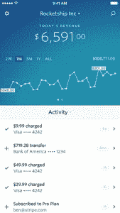

# Stripe 推出 iPhone 应用程序来监控支付

> 原文：<https://web.archive.org/web/https://techcrunch.com/2015/06/09/stripe-now-has-an-iphone-app-for-monitoring-payment-activity/>

# Stripe 现在有一个用于监控支付活动的 iPhone 应用程序

公司可以用来接受支付的服务 Stripe ，为企业追踪购买和用户活动提供了一种新的方式——[一款 iPhone 应用](https://web.archive.org/web/20221205122603/https://itunes.apple.com/us/app/stripe-dashboard/id978516833?mt=8)。

新的 iPhone 应用程序基本上完成了现有在线仪表盘的所有功能，但它的界面更适合移动设备。企业还可以设置支付或购买时的通知，或者设置每日摘要。Stripe 的 iPhone 应用也有搜索功能。

但是有一个移动应用自然是好的。对于一个被困在出租车、优步或 Lyft(请不要在开车时看手机)或乘坐某种公共交通工具的企业主来说，这是一个快速了解最新情况的好方法。

该公司正在迅速向国际市场扩张，而这些市场中有许多是由手机用户主导的。即使有人可能通过桌面设备在线经营业务，他们也可能只是更喜欢使用移动应用程序。

Stripe 也是最受欢迎的支付方式之一，因为它易于实施和使用，可以帮助企业在很短的时间内开始接受购买或订阅的付款。这种受欢迎程度使 Stripe 成为一个 35 亿美元的生意。Stripe 在去年 12 月筹集了 7000 万美元，使其总额超过 2 亿美元。

该应用程序[现已面向所有 Stripe 客户](https://web.archive.org/web/20221205122603/https://stripe.com/dashboard/iphone)。