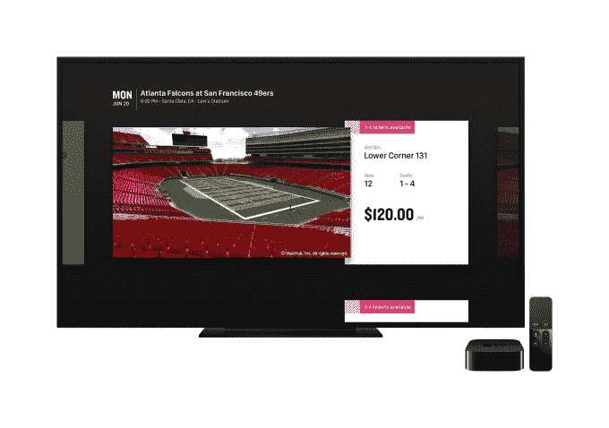

# StubHub 推出首款 Apple TV 票务应用 

> 原文：<https://web.archive.org/web/https://techcrunch.com/2016/10/03/stubhub-launches-the-first-ticketing-app-for-apple-tv/>

# StubHub 推出首款苹果电视票务应用

苹果电视今天推出了第一个票务应用程序 [StubHub](https://web.archive.org/web/20221006132536/http://www.stubhub.com/) ，它将允许第四代苹果电视设备的所有者搜索音乐会门票，甚至可以看到特定座位区的视图。然而，当真正进行购买时，Apple TV 应用程序会将您重定向回您的手机以完成该过程。

虽然从电视的大屏幕上寻找音乐会门票似乎是一个奇怪的想法，但 StubHub 一直在努力利用这种格式的特点，如其横向滚动的用户界面，使用事件图像来吸引用户的兴趣，以及高分辨率的座位地图，帮助你感受观看该区域的事件会是什么样子。

该公司表示，其目标是通过设计一种鼓励浏览和发现的应用程序来激励人们寻找事情做。这就是为什么音乐会或活动的座位图和照片等功能优先于搜索等更实用的功能，甚至是结账过程，这些都可以通过手机完成。

当你找到一个你想参加的活动时，你可以通过发送到你智能手机上的短信链接进行购买。当你点击链接时，你将被直接带到移动应用程序中的结账流程，或者如果你还没有安装应用程序，则被带到 App Store 或 Play Store 下载应用程序。这可能是一种有点脱节的体验，但 StubHub 希望将人们推向移动设备，因为几年后大多数门票销售将在移动设备上进行，它引用了自己的研究和第三方数据。

这家易贝拥有的公司今天与 MLB、NBA、NHL、MLS 和 NCAA、AEG、AXS 的 60 多支球队合作，并与 Spectra 票务和球迷合作。T2 最近还以 1 . 65 亿美元收购了西班牙的 Ticketbits，向欧洲、拉丁美洲和亚洲扩张。

除了 Apple TV，StubHub 还有适用于 iPhone、iPad、Apple Watch 和 Android 的应用。