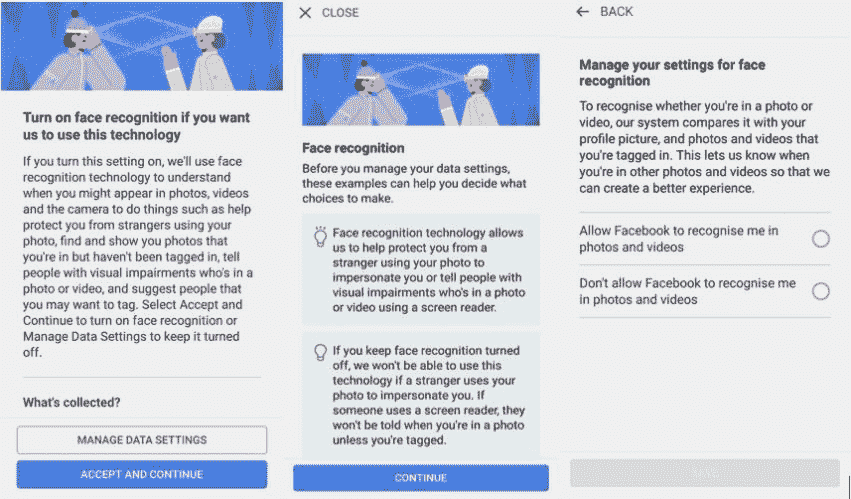

# 研究指出脸书和谷歌的“黑暗模式”将用户推向更少的隐私

> 原文：<https://web.archive.org/web/https://techcrunch.com/2018/06/27/study-calls-out-dark-patterns-in-facebook-and-google-that-push-users-towards-less-privacy/>

对科技行业的审查比以往任何时候都多，虽然像马克·扎克伯格出现在立法者面前这样的高调案件占据了头条，但还有更微妙的力量在起作用。来自挪威监察组织的这项研究雄辩地、煞费苦心地描述了脸书和谷歌这样的公司是如何迫使用户做出对自己隐私有负面影响的选择的。

像许多其他新的调查一样，它是由欧洲的 [GDPR](https://web.archive.org/web/20230126022852/https://techcrunch.com/2018/01/20/wtf-is-gdpr/) 发起的，这在那些以收集和利用用户数据为主要收入来源的公司中引起了不小的恐慌。

[这份报告(PDF)](https://web.archive.org/web/20230126022852/https://fil.forbrukerradet.no/wp-content/uploads/2018/06/2018-06-27-deceived-by-design-final.pdf) 详细描述了这些公司如何制造一种控制你数据的假象，同时促使你做出限制这种控制的选择。

尽管这些公司及其产品会很快指出它们符合 GDPR 的要求，但它们仍有很多地方对消费者不友好。

在浏览脸书、谷歌和微软 5 月份发布的一组隐私弹出窗口时，研究人员发现，前两个特别突出“界面设计的黑暗模式、技术和功能意味着操纵用户……用于将用户推向隐私侵入选项。”

说明脸书隐私选项流程的流程图——绿色方框是“简单”路线。

这不是显而易见的事情——事实上，这就是这些“黑暗模式”的要点:它们是小而微妙但有效的方式，引导人们走向设计师喜欢的结果。

例如，在脸书和谷歌的隐私设置过程中，更多隐私选项在默认情况下被禁用，不密切关注的用户不会知道一开始就有选择。你总是选择*退出*事情，而不是加入。启用这些选项也是一个相当长的过程:13 次点击或轻敲，而在脸书的情况下是 4 次。

当这些公司还强迫这种行为在他们选择的时间发生时，而不是在你选择的时间发生时，这就特别麻烦了。脸书在顶部添加了一个樱桃，几乎是字面上的意思，隐私弹出窗口后面出现的假红点表明用户有消息和通知在等着他们，即使事实并非如此。

当选择隐私增强选项时，例如禁用面部识别，用户会看到一系列定制的后果:“如果一个陌生人用你的照片冒充你，我们将无法使用这项技术，”例如，吓唬用户启用它。但没有说你将选择什么，比如你的肖像如何用于广告定位或自动匹配他人拍摄的照片。

与此同时，在谷歌上禁用广告定位会警告你，以后你将无法屏蔽一些广告。不了解这里提到的静音机制的人会害怕这种可能性——如果在工作或演出期间弹出一个广告，而我不能静音它怎么办？所以他们同意分享他们的数据。

在你做出选择之前，你必须听听脸书的情况。

通过这种方式，用户因为选择隐私而不是分享而受到惩罚，并且总是只能看到一组精心策划的利弊，旨在提示用户决定支持分享。“你在控制中，”用户不断被告知，尽管那些控制是故意设计来破坏你所拥有和发挥的控制。

微软虽然犯了措辞偏颇的错误，但在报告中却得到了更好的评价。它的隐私设置过程将越来越少的隐私选项放在一起，将它们作为同等有效的选择，而不是一些乏味的配置工具，如果你不小心，可能会破坏一些东西。微妙的线索确实会促使用户分享更多数据或启用语音识别，但用户不会像在其他地方那样受到惩罚或欺骗。

你可能和我一样已经意识到了其中的一些策略，但是它仍然是一本有趣的读物。当这些事情只是在这里或那里的一个屏幕上出现时，我们往往会忽视它们，但是看到它们都在一起，并冷静地解释它们为什么会这样，就很明显这里有一些阴险的东西在起作用。