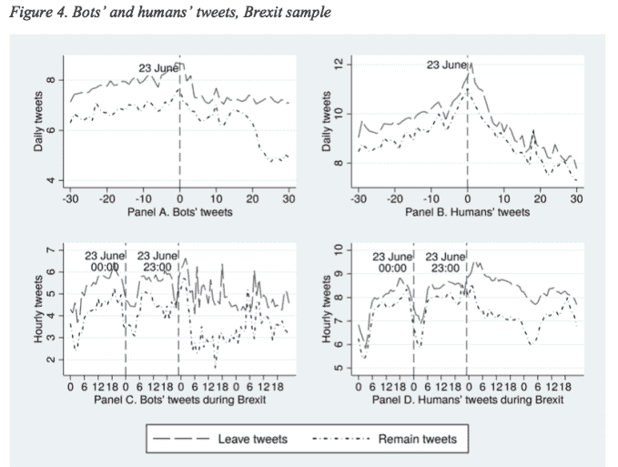
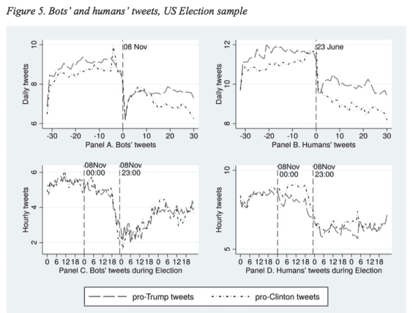

# 研究:俄罗斯推特机器人在投票前发送了 4.5 万条英国退出欧盟推文

> 原文：<https://web.archive.org/web/https://techcrunch.com/2017/11/15/study-russian-twitter-bots-sent-45k-brexit-tweets-close-to-vote/>

俄罗斯支持的代理人在多大程度上——有多成功——利用社交媒体来影响英国[英国退出欧盟](https://web.archive.org/web/20230316161012/https://techcrunch.com/2016/12/18/wtf-is-brexit/)的投票？[昨天](https://web.archive.org/web/20230316161012/https://techcrunch.com/2017/11/14/facebook-says-russia-did-try-to-meddle-in-brexit-vote/)脸书承认，它已经将一些俄罗斯账户与英国退出欧盟相关的广告购买和/或在其平台上传播政治错误信息联系起来，尽管它尚未披露涉及多少账户或花费了多少卢布。

今天 [*《泰晤士报》*](https://web.archive.org/web/20230316161012/https://www.thetimes.co.uk/edition/news/russia-used-web-posts-to-disrupt-brexit-vote-h9nv5zg6c) 报道了一组美国和英国的数据科学家进行的研究，研究 2016 年 6 月欧盟公投和 2016 年美国总统大选前后信息是如何在推特上传播的。

《泰晤士报》报道称，该研究追踪了 156252 个提到#英国退出欧盟的俄罗斯账户，还发现俄罗斯账户在投票前后的 48 小时内发布了近 45000 条与欧盟公投有关的信息。

尽管该报告的作者之一 Tho Pham 在一封电子邮件中向我们证实，英国退出欧盟的大多数推文是在 2016 年 6 月 24 日，即投票后的第二天发布的——根据分析，当时大约有 3.9 万条英国退出欧盟推文是由俄罗斯账户发布的。

但在公投投票之前，他们还普遍发现，人类推特用户更有可能通过转发传播支持离开俄罗斯的机器人内容(而不是支持留在欧盟的内容)——放大了其潜在影响。

从研究论文来看:

> 在公投日期间，有迹象表明，随着当天积极情绪的离开推文数量急剧增加，机器人试图传播更多积极情绪的离开消息。
> 
> 更具体地说，每 100 条机器人的推文被转发，大约 80-90 条推文是由人类发出的。此外，在公投日之前，在这些来自机器人的人类转发中，左派的推文占转发的 50%，而只有近 20%的转发有支持留欧的内容。换句话说，有迹象表明，在事件发生前，人类倾向于传播最初由机器人生成的离开消息。在美国选举样本中也观察到了类似的趋势。在选举日之前，大约 80%的转发量支持特朗普，而只有 20%的转发量支持克林顿。

你不得不怀疑，在几个月后的美国大选之前，英国退出欧盟是否是俄罗斯机器人的虚假信息演习。

这篇名为*社交媒体、情绪和公众意见:来自#英国退出欧盟和# u section*的证据的研究论文由来自斯旺西大学和加州大学伯克利分校的三名数据科学家撰写，使用 Twitter 的 API 来获取相关的推文数据集进行分析。

经过筛选，他们的欧盟公投数据集包含约 2860 万条推文，而美国总统大选样本包含约 1.816 亿条推文。

研究人员表示，如果一个推特账户的简介语言是俄语，但英国退出欧盟的推文是英语，他们就认定这个账户与俄语相关。

当他们检测机器人账户(他们定义为表现出“机器人般”行为的 Twitter 用户)时，使用的方法包括根据一系列因素对每个账户进行评分，例如它是否在不寻常的时间发微博；包括 vs 账号年龄在内的推文量；以及是否每天发布相同的内容。

在美国大选前后，研究人员普遍发现，在欧盟公投投票前后，出于政治动机的机器人的使用更持久(当机器人推文在非常接近投票本身时达到峰值)。

他们写道:

> 首先，英国退出欧盟样本和美国选举样本中与俄罗斯相关的推文数量存在明显差异。就公投而言，大量与俄罗斯相关的推文仅在投票日前几天创建，在投票期间达到高峰，结果出来后立即下降。相比之下，与俄罗斯相关的推文在选举日之前和之后都存在。第二，在竞选期间，机器人发布的与俄罗斯相关的推文数量占据了人类发布的推文数量，而在其他时间，这一差异并不显著。第三，选举后，在新一波推文产生之前，机器人的俄罗斯相关推文急剧下降。这些观察表明，机器人可能在高影响事件中用于特定目的。

在每个数据集中，他们发现机器人通常更经常在推特上发布支持特朗普和支持离开的观点，而不是支持克林顿和支持留欧的观点。

他们还表示，他们在这两个事件的信息传播速度以及人类 Twitter 用户与机器人的互动方式方面发现了相似之处——人类用户倾向于转发表达他们也支持的观点的机器人。研究人员表示，这支持了 Twitter 创建意见网络回音室的观点，因为用户只关注和放大与自己一致的意见，避免与不同的观点接触。

他们认为，将回音室效应与有政治动机 bot 帐户和平台的故意部署结合起来，可以用来加强社会分裂。

来自报纸:

> 这些结果支持了 echo chambers 的观点，即 Twitter 为分享相似政治信仰的个人创建了网络。结果，他们倾向于与来自同一社区的其他人互动，从而加强了他们的信仰。相比之下，来自外部的信息更容易被忽视。这一点，加上在高影响力事件期间对 Twitter 机器人的积极使用，导致机器人被用来为人类提供与其政治观点密切匹配的信息的可能性。因此，Twitter 等社交媒体的意识形态两极分化加剧。更有趣的是，我们观察到支持离开的机器人的影响力比支持留在的机器人的影响力更大。同样，支持特朗普的机器人比支持克林顿的机器人更有影响力。因此，在某种程度上，社交机器人的使用可能会左右英国退出欧盟和美国大选的结果。
> 
> 总之，社交媒体确实能以新的方式影响公众意见。具体来说，社交机器人可以传播和放大错误信息，从而影响人类对特定问题的看法。此外，社交媒体用户更有可能相信(甚至拥抱)假新闻或与他们观点一致的不可靠信息。与此同时，这些用户远离报道与他们的信仰相矛盾的新闻的可靠信息来源。结果，信息两极分化加剧，这使得在重要的公共问题上达成共识变得更加困难。

在讨论这项研究的关键意义时，他们将社交媒体描述为“政府和公民之间的沟通平台”，并表示它可以作为政府收集公众意见以供决策的一个层面。

然而，他们也警告说，“谎言和操纵”被倾倒在这些平台上，故意试图误导公众，扭曲观点和民主结果的风险——这表明防止滥用机器人的监管可能是必要的。

他们得出结论:

> 最近的政治事件(英国退出欧盟公投和美国总统大选)观察到社交机器人在传播假新闻和错误信息方面的使用。这一点，加上社交媒体的回音室性质，可能会导致机器人以负面方式塑造公众舆论。如果是这样的话，政策制定者应该考虑未来防止机器人被滥用的机制。

推特的一位发言人在一份声明中对这项研究进行了评论，他告诉我们:“推特认识到选举过程本身的完整性对于一个民主国家的健康发展是不可或缺的。因此，我们将继续支持政府当局在必要时对选举干预进行正式调查。”

它对通过从其 API 中提取的数据进行的外部 bot 分析的一般批评是，研究人员不了解全貌，因为数据流不提供其执法行动的可见性，也不了解可能出现或抑制某些内容的个人用户的设置。

该公司还指出，它一直在调整其自动化系统，以发现可疑的行为模式，并声称这些系统现在每周在全球范围内捕获超过 320 万个可疑账户。

自 2017 年 6 月以来，它还声称每天平均能够检测到 13 万个试图操纵趋势的账户，并表示已采取措施防止这种影响。(尽管还不清楚具体是什么强制行动。)

自 6 月以来，该公司还表示，已暂停超过 11.7 万个滥用其 API 的恶意应用程序，并表示这些应用程序今年共对超过 15 亿条“低质量推文”负责。

它还表示，它已经建立了识别可疑登录 Twitter 尝试的系统，包括登录可能是自动或脚本化的迹象——据称这些技术现在每天帮助它捕捉大约 45 万次可疑登录。

Twitter 发言人提到了一系列其他变化，称其正在努力解决自动化的负面形式，包括垃圾邮件。尽管他也指出并非所有的机器人都是坏的。例如，有些人可能正在分发公共安全信息。

即便如此，毫无疑问，Twitter 和社交媒体巨头总体上仍然是政治热点，Twitter、脸书和谷歌面临着美国立法者提出的一连串尴尬问题，这是国会调查 2016 年美国总统大选操纵行为的一部分。

一个英国议会委员会目前也在调查假新闻的问题，领导这项调查的议员最近写信给脸书和推特，要求他们提供关于英国退出欧盟投票前后他们平台上活动的数据。

虽然技术平台最终似乎意识到他们的技术一直在促成的虚假信息问题是一件好事，但在这两个重大政治事件——英国退出欧盟和 2016 年美国大选——中，他们此后采取的任何试图减轻机器人推动的虚假信息的行动显然都太迟了。

而美国和英国的公民不得不忍受投票结果，这些结果似乎受到了使用美国技术工具的俄罗斯特工的直接影响。

今天，英国国家网络安全中心(NCSC)——国内安全机构 GCHQ 的一个分支——的首席执行官恰兰·马丁发表公开评论，称俄罗斯网络特工在过去一年中攻击了英国的媒体、电信和能源部门。

此前，英国首相特里萨·梅(Theresa May)昨日发表公开言论，直接指责俄罗斯弗拉基米尔·普京寻求“信息武器化”并编造虚假故事。

马丁补充道，NCSC 正“积极与国际伙伴、工业和民间社会合作”以应对来自俄国的威胁。

当被问及如果机器人被积极用于推动社会分裂，政府是否应该考虑监管机器人时，东安格利亚大学信息技术讲师保罗·伯纳尔表示，自上而下的监管可能是不可避免的。

“我一直在想那个确切的问题。最终，我认为我们可能需要这样做，”他告诉 TechCrunch。“Twitter 需要找到一种方法来给机器人贴上机器人的标签——但这意味着他们必须首先识别它们，而这并不像看起来那么容易。

“我想知道你是否可以在 twitter 上拥有一个有时是机器人，有时是人类的 ID。巨魔农场让不同的人在不同的时间操作一个 ID——这些会被覆盖吗？最终，如果 Twitter 自己找不到解决方案，我怀疑监管无论如何都会发生。”