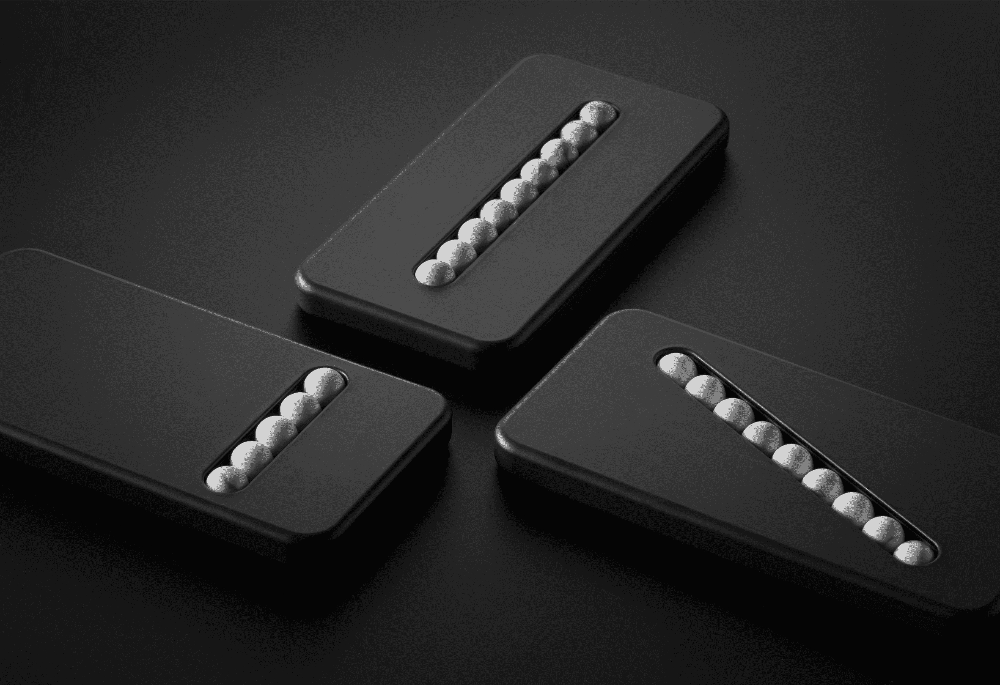
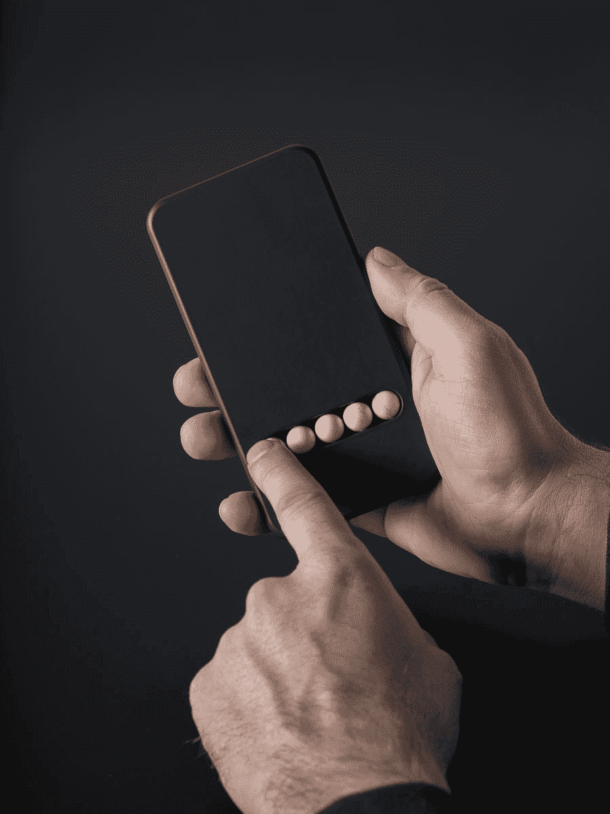

# “替代手机”巧妙地满足了你滑动和滚动的冲动 

> 原文：<https://web.archive.org/web/https://techcrunch.com/2017/11/25/substitute-phone-artfully-satisfies-your-compulsion-to-swipe-and-scroll/>

# “替代手机”巧妙地满足了你滑动和滚动的冲动

毫无疑问，智能手机是一类容易让人上瘾的设备，这不仅仅是因为它们让你随手就能获得无穷无尽的信息。握着手机并触摸它的体验本身就与这种快感相关联——以至于你可能会希望自己正在这么做，即使你并不想真的使用手机。这时你就需要一部克莱门斯·希林格的“替代手机”

这些设备，如果你真的可以这样称呼它们的话，是沉重的高质量塑料的惰性部件，其中嵌入了石头珠子，让你可以用手指沿着它们移动来模拟各种手势。珠子滚到位，给人一种类似的无摩擦感，但(我想)也是一种令人愉快的小指按摩。

 无论你是一个强迫性的偷窃者、吝啬鬼还是 zoomer，总有一款适合你。

 “这个物体，我们中的一些人把它描述为一个假体，被简化成除了运动之外什么也不是，”席林杰解释道。“这种平静的限制为智能手机上瘾者应对戒断症状提供了帮助。作为一种治疗方法。”

在接受 Dezeen 采访时，Schillinger 补充说，他不仅被他和其他人频繁查阅智能设备的令人不安的频率所启发(通常没有特别的原因)，还被作家安伯托·艾柯所启发，他在试图戒烟时，用一根简单的棍子代替了烟斗。

“这是一样的，”他说，“但是没有尼古丁，只有身体刺激。我想起了这一点，并想到要制造能提供物理刺激但不能提供连接的手机。

替代手机是 Schillinger 正在研究的一系列产品中的第二款，它与我们和设备的关系有关。第一个是[离线灯](https://web.archive.org/web/20221226010241/http://www.klemensschillinger.com/portfolio/offline-lamp/)，只有当你把一个智能手机大小的物体放入抽屉时，它才会亮起。这两件作品都是为今年早些时候的维也纳设计周创作的。