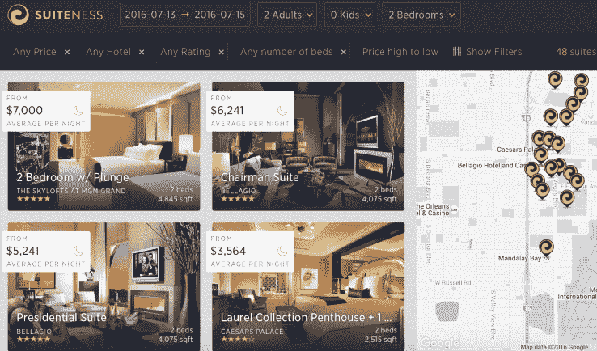

# Suiteness 希望您入住套房，而不是普通的酒店房间 

> 原文：<https://web.archive.org/web/https://techcrunch.com/2016/07/05/suiteness-wants-you-to-stay-in-suites-instead-of-regular-hotel-rooms/>

在酒店业，套房是一个奇怪的东西。虽然世界上有成千上万的套房，但大多数只有 20%的时间被占用，一年中的其他时间都是空着的。

此外，最好的酒店也不会在酒店网站上列出，甚至无法预订。品牌害怕展示他们独特的库存，并认为套房将由不会在网上预订的忠诚贵宾入住。

结果是酒店(和预订服务)错过了大量的潜在收入。

进入 [Suiteness](https://web.archive.org/web/20230217163831/https://www.suiteness.com/) ，Y Combinator 2016 年夏季班的一部分。该预订网站在拉斯维加斯、纽约、洛杉矶、迈阿密、伦敦推出，不久将在旧金山推出，客人可以在线预订数千套房。从比标准房稍大的标准套房到每晚高达数万美元的超豪华套房，应有尽有。

虽然该平台听起来很小众，但 Suiteness 的联合创始人 Robbie Bhathal 和 Kyle Killion 解释说，套房实际上比传统的酒店住宿更实用。例如，许多家庭需要多个卧室，但希望住在一起并共享一个公共区域。事实上，现在超过 60%的 Airbnb 房源都是拥有多间卧室的整栋房子，这进一步证明了这一点。

对于这些客人来说，套房是一个合理的选择，尤其是那些住在别人家里感觉不舒服，想要酒店提供的额外便利设施和客户服务的客人。

它们甚至可以很划算——在 Airbnb 上租一间容纳 10+客人的房子往往要花上几千美元一晚，而一间豪华套房可能价格相当。

那么这个平台到底是如何运作的呢？

Suiteness 与酒店合作，列出他们的套房，并特别关注添加每个套房的大量细节和照片。虽然这听起来很简单，但这是一个巨大的突破——大多数酒店预订平台只是设计来处理国王或王后的指定，即使他们列出了套房，也很少或没有你将入住的实际房间的细节或照片。相比之下，Suiteness 的照片非常棒，浏览网站上的套房本身几乎就是一种体验。

suite 上的房间可以立即预订，也可以通过向酒店提出请求来预订。这是因为一些酒店仍然希望在让客人入住他们的高价套房之前人工批准客人。

对于这种推荐，Suiteness 会从预订中提成，并从对预订套房感兴趣的客户那里获取数据。这些数据让该平台开发了一个系统，帮助酒店了解对套房的需求，这是酒店以前从未有过的。了解套房需求有助于动态定价算法——这是航空业的标准，但在酒店中仍不普遍——尤其是在套房方面。

Suiteness 还提供礼宾计划，帮助客人预订体验和活动，这一功能让他们即使在使用 Suiteness 平台后也能保持与客户的关系。