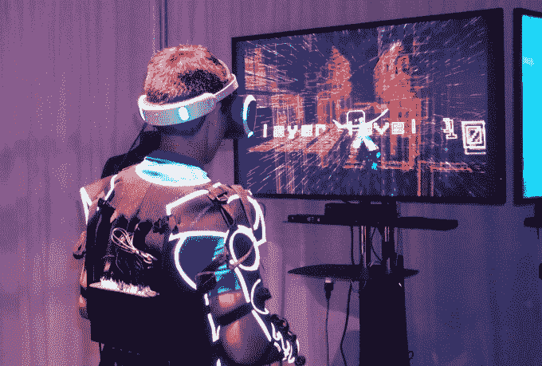
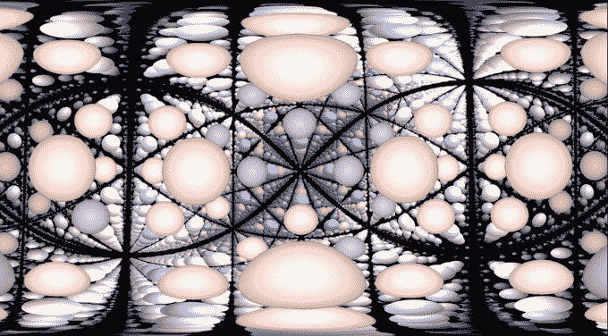
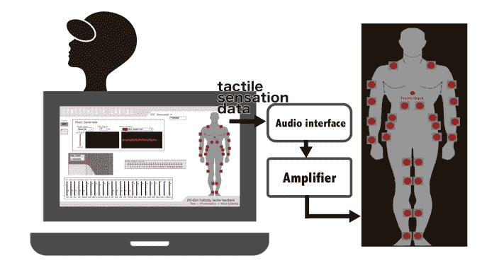
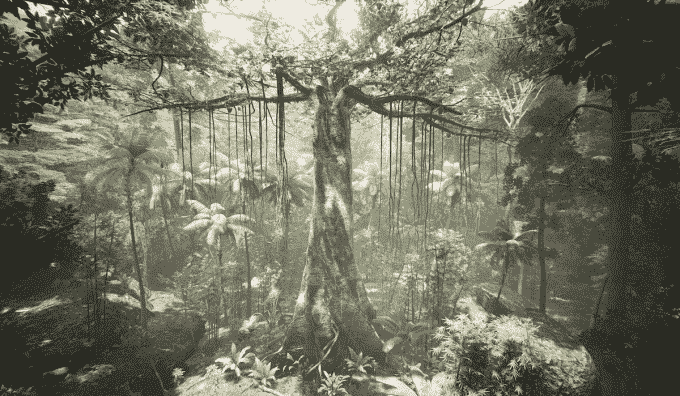
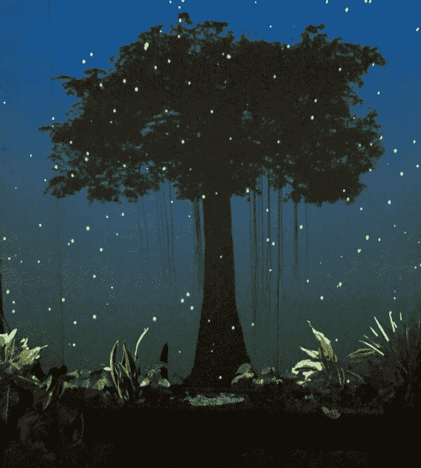
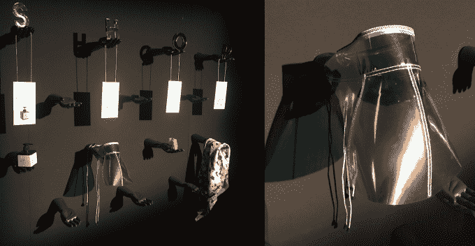
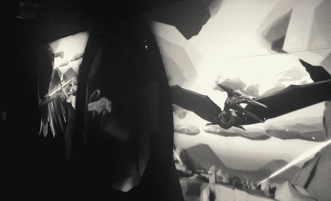
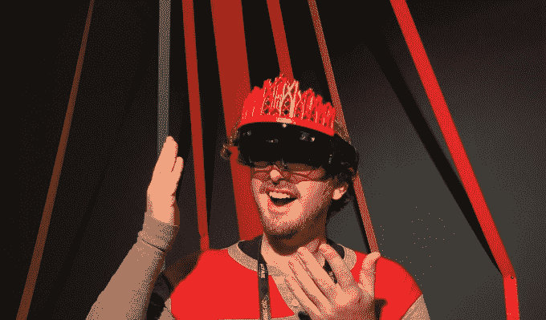
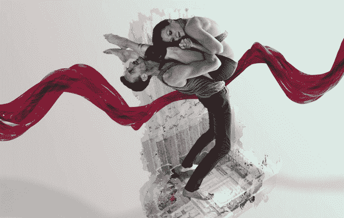

# Sundance 通过道具、AR 和振动服将 VR 与现实生活融合在一起 

> 原文：<https://web.archive.org/web/https://techcrunch.com/2017/01/20/sundance-new-frontier/>

你不能在家里尝试这个，即使你想尝试。今天，2017 年圣丹斯电影节新前沿展览的首映证明，除了有线和移动，还有第三种虚拟现实的生动机会:虚拟现实装置。在耳机之外，定制的艺术和物理效果在你进入之前设置场景，在你沉浸在 VR 中时加深沉浸感，并在你出现后巩固记忆。

这就是 VR 的进化。头戴式电视屏幕让位于运动追踪和四处走动的能力。触觉控制器让我们看到并感觉到我们的手。但是现在，振动服、精致的设置、梦幻道具、投影、增强现实和你表演的场景将虚拟现实体验推向了肉空间。

下面是下一代讲故事的人如何把现实放回到虚拟现实中。

## 水晶振动、Rez Infinite 和全身联觉套装

VR 与我们传统存在平面最发自内心的碰撞，来自于将一件覆盖着 26 个振动致动器的连体衣绑在你的身上。突然，你可以感觉到你所看到的和听到的比两个触觉控制器所能提供的更清晰。

由日本媒体实验室团队和小川哲也·水口设计的[联觉套装](https://web.archive.org/web/20230130225027/http://s2016.siggraph.org/poster_pdfs/Poster_32_-_0231.pdf)太贵了，卖不出去，但对于像圣丹斯这样的展览来说是完美的，在那里展出了两款为该套装制作的游戏。

15 年前，水口为他世嘉 DreamCast 游戏 Rez 制作了一个单独的“恍惚振动器”配件。《增强游戏》的新续集[Rez Infinite](https://web.archive.org/web/20230130225027/http://enhancegames.com/)让你在网络空间中随着震撼的电子音乐飞翔，你可以感觉到它遍布你的皮肤。你击落病毒，飞过闪闪发光的多边形，通过套装的力反馈，你的成功或失败变得更加重要。

穿着联觉服的无限玩家

为了给虚拟联觉一个不那么狂热但疯狂迷幻的介绍，本杰明·奥特兰博士设计了[水晶振动](https://web.archive.org/web/20230130225027/http://embodiedmedia.org/project/crystal-vibes/)。“超越虚拟现实的是这些具体化的体验，不仅仅是你的眼睛或耳朵，而是你的整个身体”Outran 告诉我。

各种颜色的彩色球体向四面八方蔓延，就像《黑客帝国》中的“枪，很多枪”混合了黄色潜水艇和相当大剂量的酸来构建场景。你可以挤压和拍打果冻泡泡，它们令人满意地在你的衣服上荡漾。

水晶振动

奥特兰告诉我，“人们想要体验他们以前没有经历过的事情”。“也许这是一种廉价而简单的方法，但仅仅是用明亮的颜色和联觉来淹没人们的感官就是实现这一目标的一种方法。”

虽然 Rez Infinite 和 Crystal Vibes 都是相当生硬的攻击，但 Outran 相信，随着时间的推移，艺术家们会找到方法通过触觉反馈来“微妙”地创造“更成熟”的叙事。

联觉套装图

## 树、AfroFeminism、我们的生活和作为剧场的虚拟现实

将你的大脑传送到一个虚拟空间会感觉如此不和谐，以至于在它结束之前你还没有适应你的新现实。因此，就像你可能会读一本书或在手机上使用夜班红光过滤器来获得睡觉的心情一样，VR 创作者正在寻求在将你的脸绑在屏幕上之前让你处于正确的心态。然后，利用物理效果，艺术家可以欺骗你更多的感官，让你感觉身临其境。

在[树](https://web.archive.org/web/20230130225027/http://chickeneggpics.org/grantee/tree/)中，你通过在一盒土壤中种植一颗真正的种子来开始你的经历。戴着低音炮背包，在耳机里，你变成了那颗种子，看着并感受着你从地下长出来，长成一棵雨林树苗。当你冲出座舱盖时，一个真实世界的风扇将冷空气吹到你的脸上，模拟你正在进入的雾蒙蒙的天空。但是随着人类入侵森林，电锯嗡嗡作响，大火熊熊燃烧，直到你看到自己倒下，而触觉地板震动你的腿，不，根。

您在树上成长为什么，第一人称

一旦你摘下头盔，你会发现你变成的树的一个光投影已经从你开始播种的地方开花了。我看到一个女人哭着从虚拟现实中走出来，完全认同现在倒下的树，因为正如奥特兰所描述的，“振动对移情有非常强大的影响。”

你甚至会得到另一颗种子带回家。“我们真的很喜欢播种的想法。树的共同创造者温斯洛·波特说:“那么人们就有一定的责任。“当他们拿回种子时，它就成了你可以随身携带的东西，时刻提醒你正在经历的事情。”

首先你在真正的土壤里种下一颗真正的种子，然后你虚拟地长成一棵树，最后你会看到你的树从种子中长出的光投影。

[神经推测学 AfroFeminism](https://web.archive.org/web/20230130225027/http://www.sundance.org/projects/neurospeculative-afrofeminism) 建立了一个完整的物理场景，让你相信你实际上是在一个太空时代的发廊里。一个由不同的工程师、科学家和建筑师组成的团队被称为 Hyphen Labs，他们制造了挂在墙上的功能性产品，比如针对高黑色素皮肤的防晒霜，以及一个你可以看到外面但别人看不到里面的 ScatterViz hater-blocking 遮阳板。

一旦你习惯了这个场景，你坐在造型师的椅子上，沉浸在虚拟现实中，你会发现自己在一个装饰相似的数码美容师办公室里。在那里，你沉浸在第一修正案被废除的未来的黑人公共知识中，在你的大脑被清洗之前，你可以更好地与认知的暴政作战。回到现实世界，你可以在沙龙里细读神经认知影响研究，以保持当前的战斗，并带着一些美味的小“大脑糖果”离开。

有形的产品装饰着布景，让你沉浸在神经投机的恐惧中

共同创作者 Ashley Baccus-Clark 告诉我，神经投机 AfroFeminism 是模块化的，可以纯粹作为一个耳机艺术作品来呈现，没有实物和教育。但她指出，“虚拟现实是一个如此新奇的地方，让有形的产品摆在你面前会给你更深刻的体验”。

除了将观众带入虚拟现实剧场，创作者还为这些临时演员提供了自己的观众。如果你不是耳机里的那个人，大多数虚拟现实应用都很无聊。但是，要推动这种媒体成为主流，并使装置虚拟现实更适合公共展览，必须有一个公共消费元素。

在(前身为 VRSE)中领导[的虚拟现实导演兼创意总监克里斯·米尔克](https://web.archive.org/web/20230130225027/http://with.in/)，将他的《我们的生活》圣丹斯展览分成了三个房间。参与者在两个独立的虚拟现实隔间中体验人类从原生动物到蝌蚪，从恐龙到大猩猩，从上班族到机器人的进化。异想天开的第一人称旅程让你疯狂地向对方挥手示意，甚至交谈，软件将你的声音调制成像水中的海洋生物或蠢朋克机器人一样。

但特别的是，当你出现时，你会加入一群人，观看从一个巨大的鸡蛋旁边的两台黑白投影仪以第三人称重播的场景。如果你疯狂地将攻击你的猴子从身上扯下来，或者随着法瑞尔的原创歌曲表达你内心的机器人舞者，你会在屏幕上看到这些动作，而观众会咯咯地笑。

在《我们的生活》中表演后，你加入人群，在巨大的投影屏幕上观看你的表演

“传统媒体是一个讲述故事的人，讲述一个我们见证的故事，”米尔克说，但这可能会在虚拟现实中孤立。他抱怨说，大多数虚拟现实展示的是“一堆黑色盒子，里面装着黑色耳机。”我们试图建立一些更具公共性的东西，人们聚集在它周围。"

## 英雄将 VR 和 AR 混合

在 Sundance New Frontier 上抢尽风头的是一件始于虚拟现实的艺术作品，然后使用微软的 HoloLens 打开了增强现实。它展示了如何将多种媒体结合起来，为一个主题提供一组更强大的视角。

在大卫·鲍依同名歌曲的背景下，[英雄](https://web.archive.org/web/20230130225027/http://www.sundance.org/projects/heroes)将你带到一个虚拟现实舞台上，两名高空瑜伽舞者在他们长到哥斯拉大小之前互相举起和攀爬，以在城市中传播爱。然后，你被放入一个经过特殊装饰的全息透镜中，它将图形投射在透明的护目镜上，这样它们就好像出现在你周围的现实世界中一样。

你忠实的作者戴着英雄定制装饰套装中的全息透镜

当你在一个定制设计的道具房间里走动时，手掌大小的相同舞者在空中腾跃，在歌剧院的数字立体布景中昂首阔步。每次你大声说“然后”，舞者就会解散，出现在房间的另一个角落，培养一种探索感。

《英雄》的创意总监梅丽莎·佩因特说:“AR 最令人兴奋的事情是它让我们能够把自己放回自己的身体里。”。音乐纯粹存在于我们的头脑中。当我们一动不动地坐在黑暗的房间里时，电影征服了我们的身体，要求我们保持安静。而 VR 甚至让我们看不到自己的物理形态。但是 AR 把我们，而不是我们的化身或我们希望成为的角色，放在舞台中央。当与虚拟现实混合时，我们可以实现一个完整的幻想，并将这种幻想渗透到我们自己的现实中，就像一个梦后面跟着一个幻觉。

《英雄》中的舞者在虚拟现实中看起来和真人一样大，在现实中则只有手掌大小

## 什么更真实？

新边疆博物馆的首席策展人 Shari Frilot 称今年的新边疆展览为“人类 3.0”，并将其与总统就职典礼并列，称之为“另一个关于未来如何展开的故事”

在 New Frontier 或 Sundance，没有人真正谈论华盛顿正在发生的事情。艺术有望成为一种逃避，但创意社区也将比以往任何时候都更加团结，为当前事件提供见解和背景。对于一些艺术家来说，这意味着模仿药物的效果或重新想象我们作为一个物种的进步，而其他人则试图通过给我们一双不同的眼睛来揭示严峻的事实。

VR 装置艺术的兴起之所以如此引人注目，是因为它如何暴露了我们操纵原子的能力的局限性，这种能力跟不上我们对比特日益增长的掌握。

在多雪的犹他州北部的一栋黑暗的建筑里，一面古色古香的苔藓墙和一个小小的花坛正努力让我们成为一棵树。然后我们戴上耳机，我们的整个视野都被雨林吞噬了。联觉服对我们身体的振动感觉就像物理噪音，直到它们与想象的声音和视觉同步。

就在几年前，万圣节鬼屋或像《不再睡觉》这样的沉浸式戏剧——充满演员和道具，没有屏幕——最生动地传输了我们的思想和身体。现在，戏剧和表演艺术的整个历史已经仅仅成为使虚拟世界更加真实的伴奏。

*图片鸣谢:圣丹斯，乔希·孔斯蒂内*