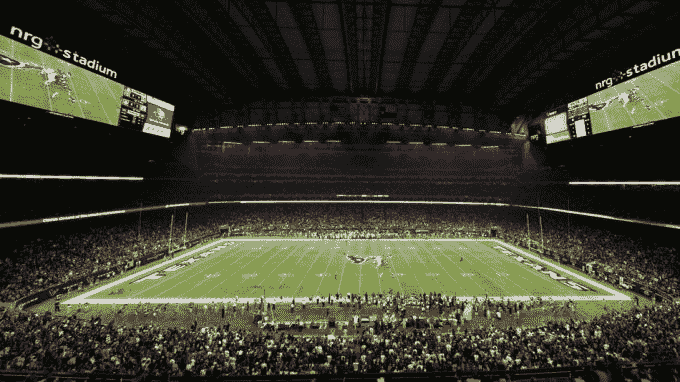
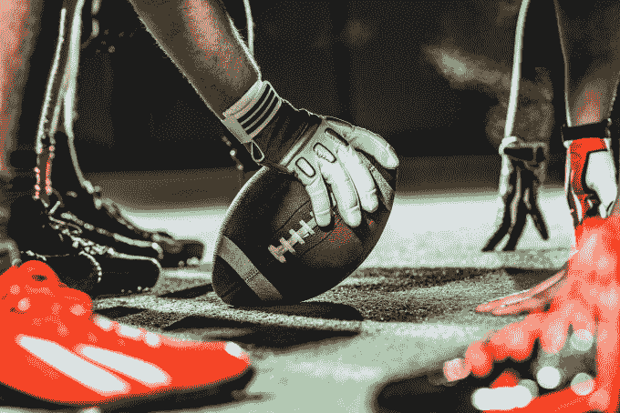
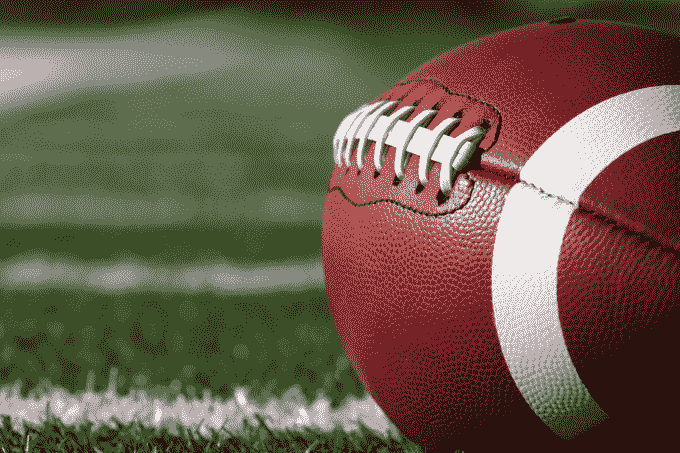

# 超级碗门票显示票务是一个超级混乱-技术可以帮助 

> 原文：<https://web.archive.org/web/https://techcrunch.com/2017/01/27/super-bowl-tickets-show-that-ticketing-is-a-super-mess-tech-can-help/>

杰西·劳伦斯撰稿人

杰西·劳伦斯已经在媒体和技术领域工作了 20 年。在…以前

[TicketIQ](https://web.archive.org/web/20221205150600/http://www.tiqiq.com/)

他在 MediaMath 和 IAC 工作。他开始了他的作家生涯。

More posts by this contributor

2017 年超级碗赛季本周正式拉开帷幕。在接下来的两周里，市场营销、宣传、聚会，当然还有门票，将会是一场疯狂的争夺。它将带动数十亿的国民生产总值，这一切将在足球六十分钟中达到高潮。

超过 1 亿人将通过电视观看比赛，对于那些想亲自观看的人来说，[第 51 届超级碗目前的平均挂牌价是 5889 美元。这是我们追踪的冠军赛周日之后的周一超级碗最贵的平均价格。](https://web.archive.org/web/20221205150600/https://www.tiqiq.com/nfl/super-bowl-tickets)

按照这个价格，NRG 体育场今年的 71，795 个座位的市值超过 4 亿美元。不管价格在接下来的一周如何上涨或下跌，这是地球上存在的最大的单一事件市场。这也是门票行业最引人注目的事件，这使得修复它变得更加重要。

到开球时，1 万至 2 万张门票将通过 TicketIQ、StubHub、Seatgeek 和 NFL Ticket Exchange 等网站的在线或应用程序售出。NRG 体育场共有 71，795 个座位，[剩余的 50，000 个座位中的许多座位](https://web.archive.org/web/20221205150600/http://blog.tiqiq.com/2017/01/super-bowl-li-tickets-buying-guide/)将属于基于纸张、现金和信封的供应链，这在 30 年内几乎没有变化。在 2016 年，像这样大的大宗商品市场能够以如此不透明的方式运营，似乎是不可想象的。

然而，由于两大原因，一个更加光明的未来可能即将到来。

首先是 NFL 对包括门票在内的运营各个方面的长期价值观。第二个是 NFL 拥有的现场体验超级碗的到来。

进入 2017 年市场的第一天，他们似乎已经产生了影响，[昨晚 ESPN](https://web.archive.org/web/20221205150600/http://www.espn.com/nfl/story/_/id/18535249/super-bowl-ticket-allotment-shifts-cause-slowing-sales-conference-championships) 报道。截至今天上午，TicketIQ 正在跟踪我们收集的所有网站上的 1500 张门票，这些门票来自 SeatSmart 和 NFL Ticket Exchange。

冠军赛周日结束后的周一的可用数量的前一个低点是 2012 年巨人队和爱国者队之间的比赛的 3025。这个数字已经高达 6500，因为海鹰和野马的比赛是 2015 年。虽然 NFL 和 OLE 管理的超级碗对消费者的整体影响可能在几年内还不清楚，但早期迹象表明，我们应该期待一个更小的“开放”门票市场。

虽然许多人会抱怨，On Location 和 NFL 更严格的供应管理将推高价格(确实会)，但他们忽略了它带来的更大的市场价值，即急需的市场基础，如购买特定座位的能力，OLE 和 Ticketmaster 今年合作推出了这一功能……这是有史以来的第一次。

过去超级碗市场的混乱很大程度上是由所谓的投机性销售造成的，经纪人在主要市场上列出了待售的门票，但实际上并不知道他们在卖什么座位。这些“基于区域的列表”具有不确定的名称，如“上层 EndZone，N/A”和“TBD 300s 层角落”

今年，许多在“开放”市场网站或应用程序中出售的门票将是基于区域的列表。

为了避免我在 2015 年报道的那种市场崩盘，投机性抛售需要完全消除。

这将创造一个比我们在 2015 年看到的完全混乱更好的画面，当时成千上万的粉丝在活动开始前 10 天购买了门票，但到达亚利桑那州时却发现他们的门票已经消失在沙漠空气中，更换他们 2500 美元的门票的费用是 1 万美元。

一个正常运转的门票市场意味着超高需求的赛事会有超高的价格。在我看来，这是供求关系的基础，也是所有商品市场的基础。作为欺诈、诉讼和心碎的替代，这是显而易见的。

100 年后，当经济学家回顾过去 25 年的票务市场时，这将是一个有趣的案例，研究技术打破经济学基本定律的力量，以及各种行为者——好的、坏的和丑陋的——重写被打破的定律的努力。

对粉丝和团队来说，好消息是 Ticketmaster、SeatGeek 和 Eventbrite 等公司的最优秀人才专注于技术，以释放一级市场供应，就像 TicketNetwork 和 Stubhub 在 25 年前互联网出现时为经纪人所做的那样。

根据 Ticketmaster 的说法，作为进步的衡量标准，使用他们大约两年前推出的 API 的开发者数量已经从推出时的 200 名增加到今天的 2000 多名，TicketIQ 是其中之一。Seatgeek 将在他们新的主要票务平台 Open 上推出他们的第一个客户 Sporting Kansas City。

对于消费者来说，所有这些访问将意味着类别体验的显著改善。对于一些赛事，如超级碗，这将意味着更高的价格。然而，对于许多其他事件和类别，它将意味着相反。

百老汇就是一个恰当的例子。今天，几乎每一个主要的零售门票市场都列出了一个版本的未售完的百老汇演出的投机门票。这些票通常比票房最高价的票贵 50%。这是一种只能在消费者信息空白中生存的商业行为，当未售出的票房门票在各大市场都能买到时，它就消亡了。

超级碗发生的投机性抛售可能需要更长时间才能清除，因为它植根于更复杂的市场动态。底线是，对于一个定义为 1%的事件来说，门票价格上涨 25%不会产生任何影响。

谁去看比赛和不去看比赛没什么区别，人们对门票的总体看法也没什么区别。

出于上面列出的所有原因，版权所有者驱动的市场是将门票永久移出街头阴影的唯一途径，许多消费者仍然将街头阴影与购买门票联系在一起。

要做好这件事，需要有长远的眼光，这是 NFL 和 OLE 等权利持有者比其他任何潜在的选择都要多的东西。这也是一个机会，让同样敢于冒险的权利持有者为日常爱好者扩展他们对消费者价值的定义。

这种价值重构将提供一个接触和体验的机会，而二级市场以其短期视野根本无法提供这种机会。它还将允许团队在数字市场中有效竞争。作为一个购票者和球迷，这也让我有所期待，尤其是 99.99%的赛事都不是超级碗。对于那个游戏，我的沙发工作得很好。