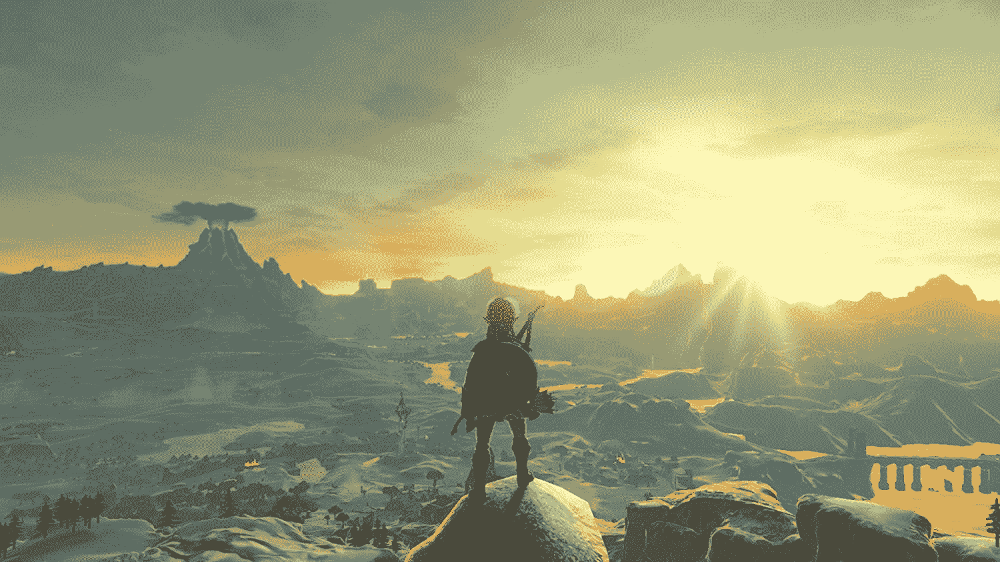
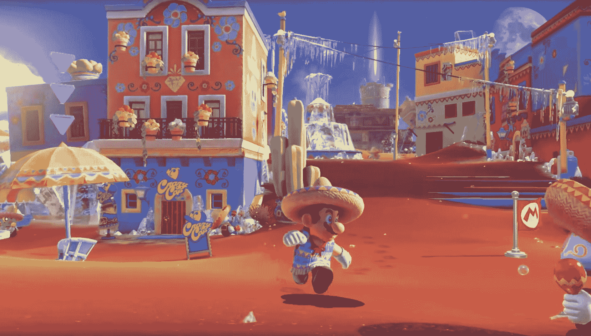

# 超级马里奥奥德赛是一波三折的杰作

> 原文：<https://web.archive.org/web/https://techcrunch.com/2017/10/26/super-mario-odyssey-review-a-masterpiece-of-twists-and-turns/>

任天堂的工作做得有多好，这几乎令人不安——至少，当那里的巫师们选择全力以赴的时候。超级马里奥奥德赛是一个财富的尴尬，永远不会失败的惊喜，并保持始终积极的感觉。这是所有 Switch 拥有者的必备，强烈推荐给任何有心有记忆的游戏玩家。

## 超级种源

今年早些时候，当游戏玩家争相购买 Switch 时，至少在短期内，这是因为塞尔达游戏的承诺，这款游戏看起来是多年来最新鲜的，但同时又回归了该系列的根源。它毫无疑问做到了这一点，将最近的塞尔达和 AAA 开放世界游戏远远甩在身后。它主要是通过给玩家自由去他们想去的任何地方，做他们想做的任何事情，并确保他们去的任何地方和做的任何事情都是有趣和有益的。

 在某种程度上[它让我想起了最初的塞尔达](https://web.archive.org/web/20230324074215/https://techcrunch.com/2017/03/02/breath-of-the-wild-review-a-link-to-the-past/)而不是它的任何继任者；在第一个游戏中给予玩家的极度自由被证明是一个超前的概念。

超级马里奥奥德赛以非常相似的方式获得成功，感觉既全新又舒适熟悉，同时为系统上的游戏设定了标准。然而，它做到这一点，不是通过追溯到 NES(至少，不是大部分时间)，甚至是 SNES，而是 N64。

玩过《马里奥 64》的人可能还记得当时这是一个多么大的发现。不仅仅是控制，这是第一个真正让 3D 运动正确的(可以说仍然是最好的)，而是游戏创意的密度:位置，敌人，障碍，以及结合这些东西的方法，让每个阶段都感觉新鲜。

它收集的迷你世界，每一个都隐藏了一些允许进一步发展的星星，为未来的 3D 马里奥游戏奠定了基础，特别是超级马里奥银河及其续集。但这些更像是超级马里奥世界和马里奥 64 的混合体，而不是真正的继任者。他们的主题世界，每个阶段都有其独特的挑战，或多或少以线性顺序解决——这是一个成功的公式，他们本身就是伟大的游戏。《超级马里奥 3D 陆地和世界》也获得了类似的赞誉，它非常青睐家族中的 SMW 一方。

现在，任天堂可以自豪地说，它已经推出了《马里奥 64》(Mario 64)的真正续作，虽然游戏的总体结构和风格没有什么令人惊讶的地方，但从每时每刻来看，它比近年来的任何游戏都更令人惊讶。(这也是为什么这篇评论缺少截图和视频的部分原因；我不想破坏任何东西。)

## 又是一个新的马里奥

不过，首先，让我们抛开普通的复习材料。

在《超级马里奥奥德赛》中，你环游世界追逐布瑟和被绑架多年的桃子，收集“能量卫星”来为你的帽子形状的飞行器“奥德赛”提供燃料。有硬币、食人鱼植物、蟾蜍和所有常见的装饰品。

游戏控制就像一场梦，虽然可能需要一点时间来掌握所有新的帽子相关的控制。众所周知的三级跳、跳远、蹲起跳等等都有，还有十几个其他动作。当你第一次访问动作目录并想，等等，这不是一个马里奥游戏吗？那是在你开始戴帽子之前！

它的核心玩法噱头，虽然它很快就不再觉得像一个，是让你接管游戏中各种敌人和物品的魔法帽伴侣。当你拥有它们时，它们会戴着一顶马里奥帽，并倾向于留小胡子，你被赋予了它们的能力——通常是让你与附近的环境互动或导航，这通常是为它们量身定制的。

 帽子，你直接扔在你前面，或上面，或周围(运动控制完成这些相当无痛)，取代了普通的攻击。这里有一个小小的失误，因为有时帽子对敌人是致命的，有时它拥有他们，有时它没有效果。出于本能的自卫扔帽子，结果却意外拥有了一个古姆巴，这很烦人。这需要在行动之前先思考，马里奥游戏通常是这样构建的，正确的行动通常是你想到的第一个。不过，这只是一个小问题，你很快就会了解情况。

死亡相对频繁；一般来说，你只有 3 张红心可以输，而且像往常一样，这里不缺无底洞。但是死亡仅仅意味着失去 10 个硬币，并从最近的检查站开始。作为惩罚，它是如此之轻，我不知道他们为什么要这样做。我已经积累了成千上万的硬币，所以我从来不会考虑从悬崖上跳下去，看看深渊中是否隐藏着一个看不见的平台或秘密世界。

奥德赛与塞尔达在成为系统上最好看的游戏方面展开了激烈的竞争，就像那个游戏一样，这是因为艺术指导和对细节的关注，而不是纯粹的图形能力(这是一种切换相当短的资源)。人物和物体的纹理受到了特别的关注——你踩在云上的轻微绒毛，覆盖布瑟的桃红色绒毛(很奇怪，但很有效)，你所参观的世界的许多服装、植物和动物。

不得不说，马里奥绝对没有挪用当地文化的问题。

每一个似乎都有其标志性的视觉元素，没有一个仅仅是“森林”或“雪”:森林是一个杂草丛生的工业设施，例如，将生锈的金属和卡住的机械装置与溪流和鲜花并列。

虽然每个世界都是新的，但每个世界都有重复出现的特征，例如帽子店和一些拥有相似获取方式的卫星。在过去的几十年里，长期玩马里奥的玩家也会认识到一些微妙的倒退:人物、主题曲和一般情况，这些都是 2D 马里奥最常见的倒退。找到并认出这些点头给人一种温暖模糊的感觉。(最后一句也有 SNES 点头。)

但这些都不是《奥德赛》如此优秀的原因。

## 永不停止探索

奥德赛团队的领导写了一封信，附在我的游戏评论副本上。其部分内容如下:

> 对于这款游戏，我们选择了以相当微妙的惊喜感为主题，并在讨论和制作上花费了无数的时间。据说你不能用同样的东西给别人两次惊喜。这就是为什么我们努力让《超级马里奥奥德赛》充满尽可能多的惊喜，以便人们可以玩和体验他们从未见过的马里奥游戏。
> 
> 在整个游戏开发过程中，我们想象着当玩家真正来玩的时候会有什么样的惊喜。

像这样的设计声明，人们永远无法确定它是任天堂通常的“我们希望你会喜欢这个”的套话，几乎伴随着每一个游戏，还是一个真正的选择，告知游戏的基本基础。我很高兴地说，这次肯定是后者。

 《奥德赛》就像它的同名英雄奥德修斯一样，是一场“曲折的游戏”(正如费格斯渲染的πολύτροπον).出于这个原因，我避免谈论细节，因为这是真的，游戏的乐趣在于第一次发现那些曲折。

游戏在不断地欺骗你，但从来不是以恶意的方式。你所到之处，看不见的地方，都是硬币、月亮和秘密世界。令人惊讶的是任天堂的关卡设计师有多么有先见之明，他们准确地预测了玩家将如何移动，他们将如何环顾四周，他们将看到什么以及他们将如何追求它。他们预测每一个行动，然后在你采取行动时对你隐瞒一些事情。我不知道有多少次我做了一些事情，想着“他们不可能知道我会这样做”，结果却被愉快地反驳了。

每当我发现一个新的生物或物品时，我都陶醉于设计者融入其中的乐趣，向某个方向伸展或射击，或自由游泳，或毁灭如雨般落下的快乐。每次我发现自己乘坐 2D·马里奥飞机在一个隐藏在建筑物侧面的关卡中航行时，我都在想我以前怎么会没有注意到它。

游戏的每个方面，小到最小的细节，都让人感觉是精心制作的——故意放置以吸引你的注意力，或者转移你的注意力，或者引导你，或者两者兼而有之。哇，T4，他们做了很多吗？

每个世界都充满了有趣的细节、秘密硬币、隐藏的迷你游戏、复活节彩蛋等等，这种密度让它们感觉比实际大，而且它们绝不小。

 你遇到的最早的世界之一是沙漠，我花了相当一段时间探索它，发现到处都是硬币和月亮；左上角的一组“幻影”卫星表明你需要移动多少才能打开另一个世界，尽管一开始我以为这是整个地方有多少个卫星。然后，当我发现除了我填的 12 个左右的人之外还有几个人时，我很高兴。我带着大约 24 或 25 个月亮离开了沙漠世界，心想我可能已经或多或少地清理了这个地方，除了我在周围看到的一些，我会回来的。

大约一个小时后，我发现有一个屏幕列出了每个阶段可用的卫星(显然，没有它们的名称或位置)。我根本没有找到沙漠中所有的卫星。事实上，不到一半。

我一时难以理解这一点。他们会在哪里？当我搜索沙漠时，我怎么可能没有注意到游戏的几十个主要目标呢？刚才我打开游戏一分钟来抓拍一些截图，在找到一个好的远景和调整相机时发现了三个月亮。

据我估计，我已经完成了游戏的三分之二——在与布瑟不可避免的摊牌之前，还有几个世界即将到来。我没有完成，因为我很享受，也因为游戏的密度使它比马拉松更适合短时间的会议。突然出现，几个月后，出发。有些关卡比其他的更繁忙:开阔的沙漠似乎(现在)悄悄地孕育着秘密的月亮，而在新冬克市，街道上挤满了敞开的大门和自豪地向所有来者许诺月亮的迷你游戏。但是每一个都像上一个一样精心组装。

最后，任天堂以其独一无二的方式向整个世界灌输了一种温和和积极的态度，这使得这款游戏适合所有年龄和所有玩家。你会失败，但你不会尝试，任天堂会为你加油。几乎没有暴力和卡通；最终，《奥德赛》不是一款动作游戏，而是一款包含动作元素的探索游戏。你最常面临的挑战是发现那些不那么敏锐的眼睛也无法发现的东西；当你的直觉告诉你值得爬上那棵树，或者拥有那只小动物，或者走到那堵破墙后面，你就要跟着直觉走，因为它几乎总是值得的。

如果要进行批评的话，那就是第二次或第三次经历游戏可能不会像第一次那样有趣，因为发现的兴奋对体验来说是如此重要。但是有几个游戏是不能说的。在更抽象的层面上，我只担心游戏设计得太好了，不会像《马里奥 64》那样被打破；这些世界是开放的，但是它们被小心翼翼地平衡着，因此除了它们的创造者设想在其中进行的(无可否认的无数)行动之外，几乎没有什么可能。我们很快就会知道，当速度赛跑者开始戳戳他们。

超级马里奥奥德赛在许多方面超越了它的精神前辈，这是高度赞扬，因为它的前辈是有史以来最受欢迎的游戏之一。任何拥有交换机的人都应该拥有它，而任何没有交换机的人已经有了另一个非常非常好的理由去拥有它。